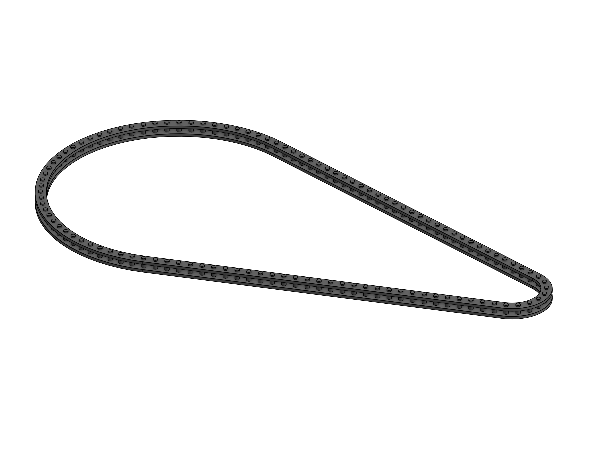
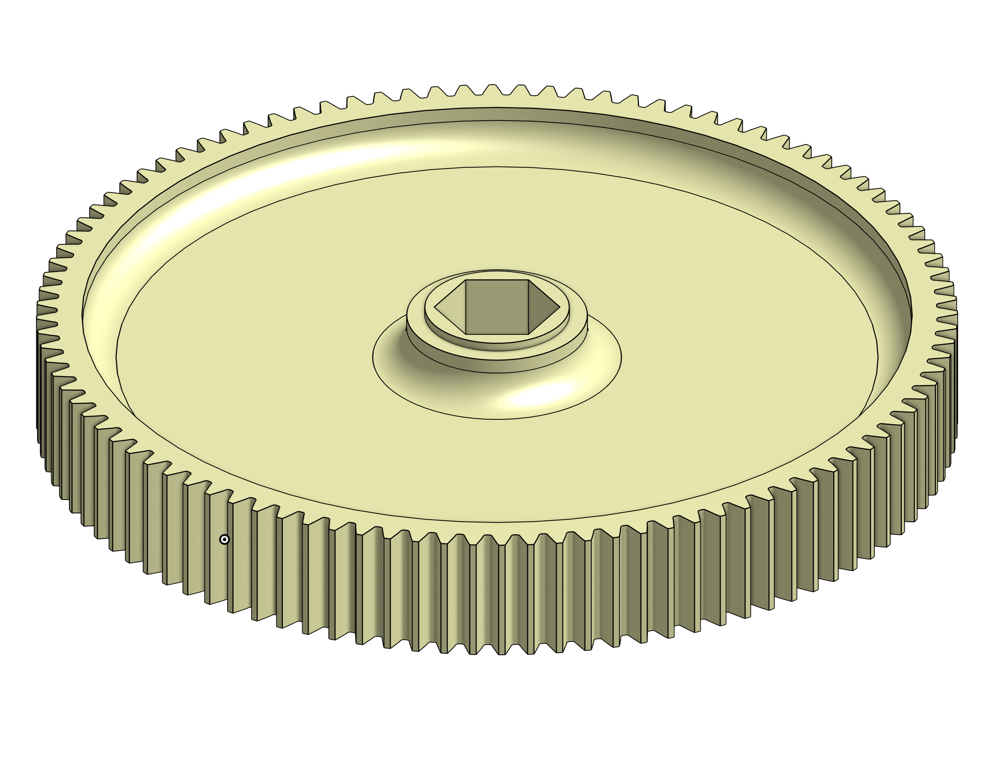
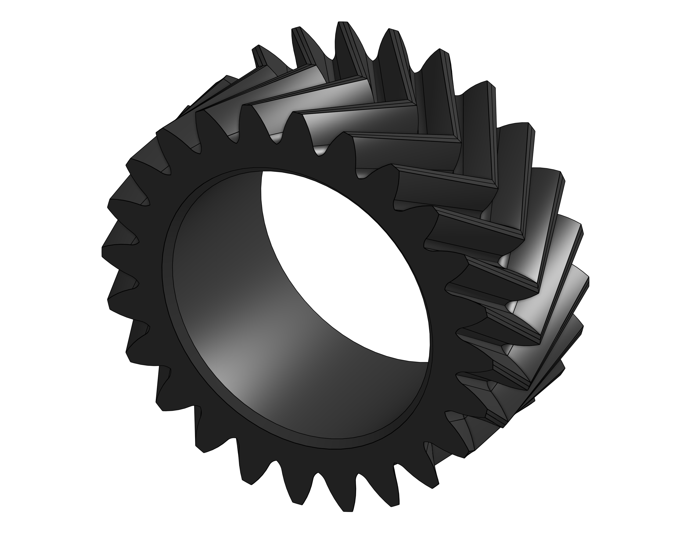
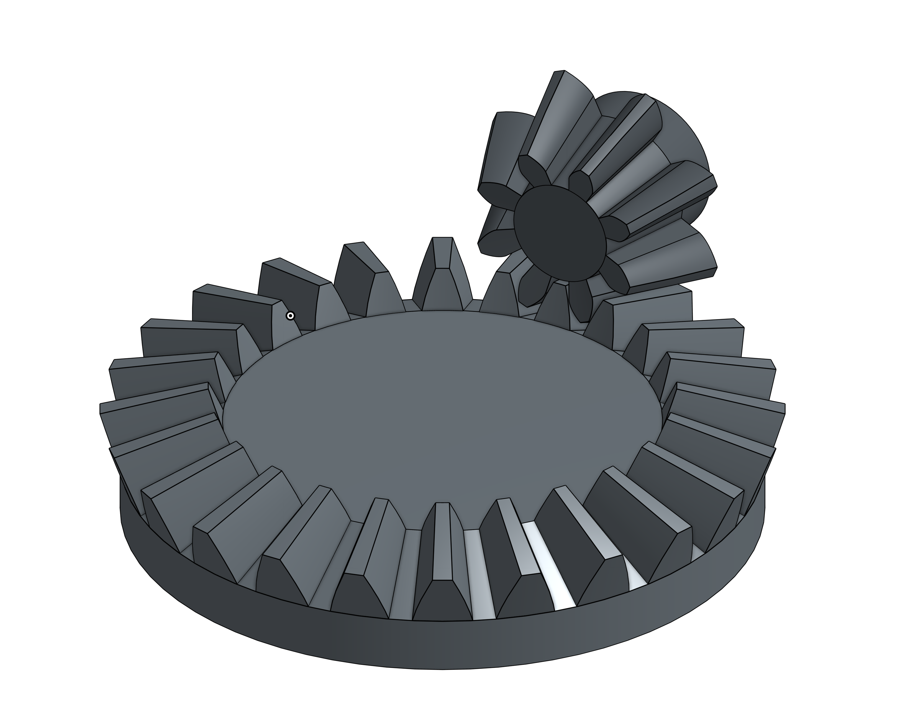
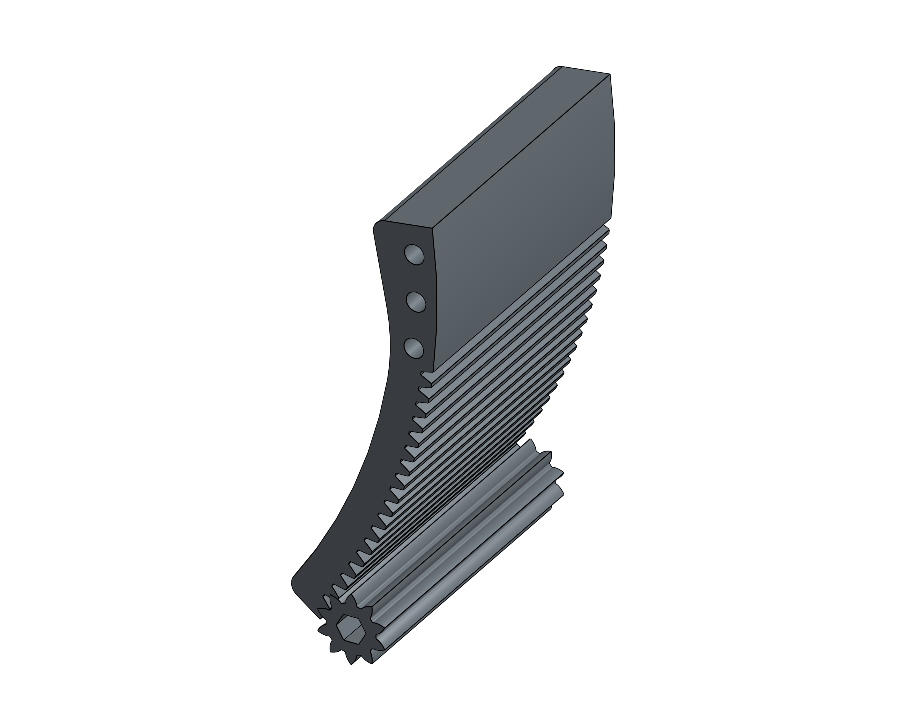

# Power Transmission Fundamentals
A power transmission is the transfer of rotational or linear motion from one system to another to transmit power. 

Belts

- Belts are lightweight and drive high speed mechanisms extremely well.
- In FRC, most common belt type is HTD5, and GT2 are the second most common.
  - Difference between the belts are the tooth profile, (GT2) has its belt teeth centers 2mm apart, while HTD5 Has their toothprofiles 5mm apart. 

<figure markdown="span">
{height=50% width=50%}
</figure>
<figcaption> Difference between GT2 and HTD5 is the tooth profile, as GT2 tooth profile has teeth that are spaced 3mm apart from each other, whereas HTD5 teeth are spaced 5mm apart. 
</figcaption>
When designing belts, you need to use a calculator such as ReCalc's [belt-calculator](https://www.reca.lc/belts) to figure out the correct belt center to center, otherwise your belts may be over tensioned, or have too much slack. 

Chain

- Chains are heavy duty and handle high torque, but need to be tensioned unlike belts.
- 3 Main Types:
    - 25:
        - While 25 chain is relatively light, it is a lot less durable than 35 or 25h Chain, which is a concern when thinking about shock loads on a pivot.
    - 25H:
        - 25H Chain stands for Hardened #25, which means that the plates on the chain are thicker.This means that its a bit stronger than the 25 chain, while staying compatible with all 25 chain hardware.
    - 35:
        - 35 Chain is the strongest chain there is, and breaking this is a bit challenging (unless you're 1119). Best use case is heavy pivots. 
<figure markdown="span">
{height=50% width=50%}
</figure>
How To Tension Chain:
    
  - Turnbuckle:
      - A turnbuckle is a device that is used to attach to two links, and tighten the chain together to keep the chain tensioned. 
<figure markdown="span">
{height=50% width=50%}
</figure>

  - Idler System:
      - Idlers are a method to ensure that there is proper chain tensioning, and it essentially either pushes the chain in or outwards to decrease the amount of slack. 

<figure markdown="span">
{height=50% width=50%}
</figure>

Gears:

- Toothed wheels that are able to transmit motion and power. Commonly used to reverse directions, build gearboxes, and many more applications. 

- Types of Gears:
    - Spur Gears:
        - 3 main types are 10 DP, 20 DP, 32 DP.  
        - 10 DP:
        - Used to drive rack and pinions and turrets 
      - 20 DP:
        - Used a lot in gearboxes due to the wide variety of gear teeth. 
      - 32 DP:
        - Used in smaller areas due its smaller size.
<figure markdown="span">
{height=50% width=50%}
</figure>
  - Herringbone
    - Also known as a double helical gear, the teeth form a V shape and are used to provide smooth and quiet operation while transmitting high torque. You can put a pretty high load on this as long as you increase the surface area and the contact between the teeth. These gears are commonly 3d printed.

|||
|:-:|:-:|
|<figure>{height=100% width=100%}</figure>|<figure markdown="span">{height=50% width=50%}</figure>|

  - Bevel Gears
    - Bevel gears are popularized with the COTS Max90 Gearbox, and are great for transmitting motion between shafts that are not parallel. They cannot handle a high load, and are used mainly for packaging.
<figure markdown="span">
{height=50% width=50%}
</figure>

Rack and Pinion:

- A rack and pinion is a system where a larger gear is driven by a smaller gear, and it is used a lot for hooded shooters like 1678 in 2022. You get a higher degree of control, but this system cannot handles a large amount of load. 

<figure markdown="span">
{height=50% width=50%}
</figure>

Winch 
  - A  winch is a mechanical device that is used to wind up or wind out ropes or cable, and typically consists of a drum or spool around which the rope is swound and a handle or a motor that is used to rotate the drum, and it is used traditionally in telescoping arms and other climbers.
<figure markdown="span">
{height=75% width=75%}
</figure>

