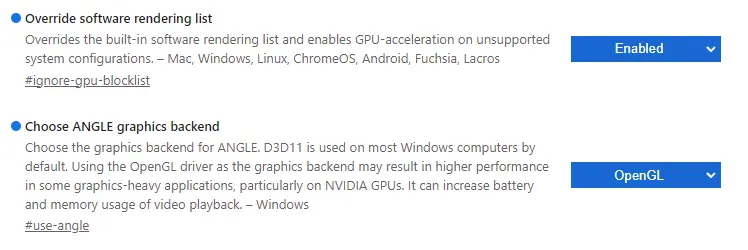

# Introduction to Onshape (stage 0)
Go to [Onshape for Education](https://onshape.com/education-plan)

Press "Create EDU ACCOUNT" 

Fill out the details in the sign up form

Fill out the rest of the details and verify your email. Say "Robotics" for reason.

Check your email, then activate your account.
Keep Units as is:

{width=500}

Use Onshape Default Controls, then update your profile as necessary.

If your team uses Onshape, contact your mentor/design lead for access to the Onshape classroom/team.

## Setting up MKCad
Go to the [MKCad App](https://appstore.onshape.com/apps/Manufacturers%20Models/2ZT7X5D646R3LM3ZND7LGBTYRVM4SVH6CDDGM6I=/description)

Press "Subscribe"

{width=500}

Press "Get for Free"

Now you can move on.
## Featurescripts
Featurescripts are handy tools that assist with the FRC design process. For now, just follow the instructions and you'll use the featurescripts in stage 1A.

Click this link for [Featurescripts](https://cad.onshape.com/documents/95c00401c440b44ad8799ef5/w/1f1ebce01a3b8eb6fa102975/e/b92d638809ae48771ecc7ad8)

Now click "Custom Features" 

{width=500}

You should see this menu now:

Click "Belts, Chain Path, FilletXpert, Gusset Generator, Shaft, Spacer, **Tube Converter** (this one is important)

Once you have done that, you are done!

## Browser Setup
If using chrome, go to chrome://flags/ and enable these:

