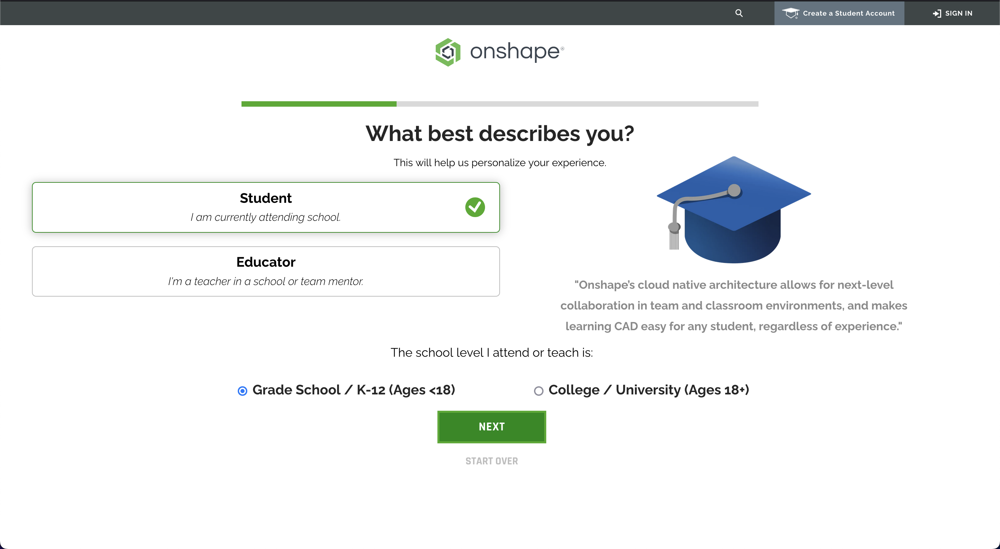
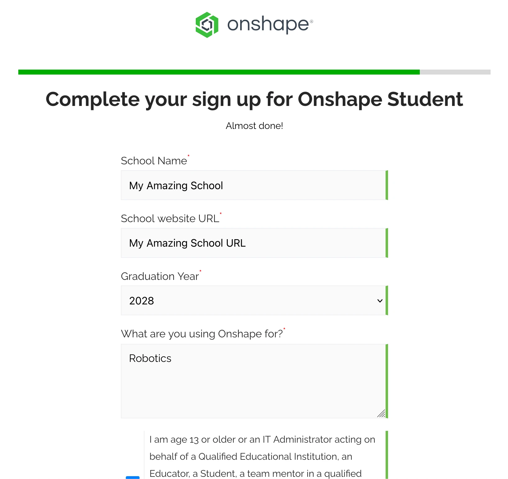

---
title: Account Setup
description: Setting up your Onshape account
---

<Aside type="tip">
Remember to take a look at the [website feature guide](/feature-guide/) to gain an understanding of the different features used throughout the learning course!
</Aside>

## Registering an Account

Onshape offers a free education license for students to use their software. It is highly recommended to use the education plan, as it allows for the creation of private documents, as well as other useful features.

To start registering, go to the [Onshape for Education](https://onshape.com/education-plan) page and select "Create EDU ACCOUNT" or click [this link](https://www.onshape.com/en/education/sign-up). Follow the slides below to finish registering.

<Slides>
  
  Fill out the details in the sign up form.

  
  On the next screen, select that you are a student and that you are in grade school.

  
  Finally, fill the form with your school information. You may enter "Robotics" as the reason for using Onshape.
</Slides>

Onshape will proceed to check your information (which may take some time), then send a verification email to activate your account. You'll be asked to set a password, then you'll enter your dashboard.

### Account Setup

The first time you enter Onshape, it will prompt you to set up your account, including the default units and mouse controls used when doing CAD. You can also set a profile picture and a nickname (we recommend keeping this as your real name).

If your team uses Onshape, contact your mentor/design lead for access to the Onshape classroom/team.

:::center
<ContentFigure src="../img/units.webp" alt="Onshape units setup" width="70%"/>
:::

## OPTIONAL: Onshape Educator Plan

Besides individual setup, if your team uses Onshape or are switching to it, one of your mentors or design leads should get the Educator plan and add all members to a "classroom". The Educator plan is free for FIRST teams and will make document management easier. It also provides a suite of features for all students added to the "classroom", such as simulation, release management, and classes/assignments.

If you are interested, direct your design lead or mentors to read the ChiefDelphi post linked below for a better overview and walkthrough to set it up for your team.

[Onshape Educator Plan: What it Means for FRC Teams](https://www.chiefdelphi.com/t/onshape-educator-plan-what-it-means-for-frc-teams/446394)
