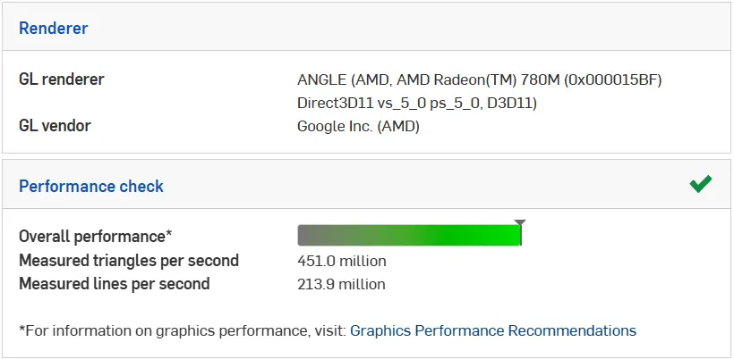
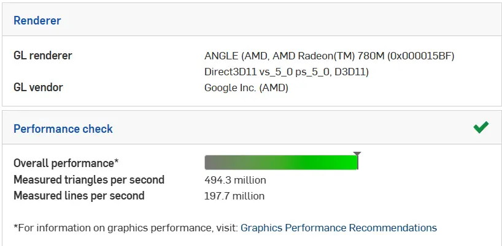

---
title: Performance Tuning
description: Optimizing Onshape performance for your system
---

## Performance Tuning

After your initial account setup, Onshape will run a browser check to ensure compatibility. Depending on your browser, additional steps can be taken to improve performance.

<Aside type="tip">
You can test your current performance at the [Onshape Compatibility Check Page](https://cad.onshape.com/check).
</Aside>

<Aside type="note">
If the browser check fails, you may want to try a different browser. Currently, chromium browsers like Chrome, Edge, Opera, and Arc are the best supported browsers for Onshape, but Firefox usually works with no issues as well. Safari is not well supported.
</Aside>

### Improving Chrome Performance

If you are using Chrome, You can try modifying the following settings to improve rendering speeds.

- First, type `chrome://settings/` in your search bar to navigate to chrome settings. Make sure that "Use graphics acceleration when available" is enabled. Relaunch chrome if you have updated it to enable it.

  <ContentFigure src="../img/performance-tuning/graphicsacceleration.webp" alt="Graphics acceleration setting" />

- Go to `chrome://flags/` and enable "Override Software Rendering List":

  <ContentFigure src="../img/performance-tuning/override-rendering-list.webp" alt="Override rendering list" />

- Finally, Try adjusting your ANGLE graphics backend:

  <ContentFigure src="../img/performance-tuning/ANGLE-backend.webp" alt="ANGLE backend" />

Please note that performance will depend on your individual computer setup. We suggest the following process:

- Choose an ANGLE graphics backend: `chrome://flags/#use-angle`
- Click the Relaunch button
- [Check your performance](https://cad.onshape.com/check)

Repeat these steps for each backend and use whichever is the most performant. Here are some examples all taken from the same machine.

<Slides>
  
  The default configuration

  
  OpenGL

  
  Direct3D 9

  
  Direct3D 11

  
  Direct3D 11 on 12
</Slides>

In the above example, Direct3D 11 narrowly beats out OpenGL, but that won't always be the case.
