---
title: "Exercise 1: Simple Gearbox"
description: Model a simple gearbox
---

## Practice Exercises
Time to practice! Start by **make a copy of the Stage 1B Exercises Document** through the button below, just like you did with the Stage 1A Exercises Document. Each exercise has a folder, a "reference" tab (a preview of what the final model should look like), and a tab or two for doing your exercise in. Solutions are also provided in the 1B Exercise Solutions Document to check your work afterwards.

<LinkButton href="https://cad.onshape.com/documents/ce41613fac38db8c00e65020/w/a65651477167d5e36fe871c0/e/755940e52d82bddfdf7be61e" external center>1B Exercises Document (COPY THIS)</LinkButton>
<LinkButton href="https://cad.onshape.com/documents/c6a8ec29479a2578841fb9f2/w/85094b3baa15a05c873920c9/e/47efe87a05a8318bffd60957" external center>1B Exercise Solutions</LinkButton>

## Exercise 1: Simple Gearbox

In this exercise, you will be modeling and assembling a simple single stage gearbox. The goal of this exercise is to introduce how to model a very simple gear transmission. Additionally, you will learn how to use the the [`Robot Shaft` and `Robot Spacer` Featurescripts](https://cad.onshape.com/documents/9cffa92db8b62219498f89af/w/06b332ccabc9d2e0aa0abf88/e/99672d1e329b38e647d90146) and the `Replicate` tool. You will also use the [FRCDesignLib part library](/learning-course/course-setup/required-course-tools/part-library) for components other than fasteners, such as gears and motors.

<Aside type="note">
Exercise 1 adds hardware (bolts and nuts) to the CAD models. You can read more about hardware standards on the [Design Handbook](/design-handbook/structure/structure/) page.
</Aside>

### Layout Sketches

A layout sketch is a sketch that captures the geometry of a design without specifying the exact details.
They are like the framing of a house, it defines the overall structure and relationships between key components, but doesn't include the finishing details like walls or paint.
Keeping the key dimensions in a layout sketch makes it easy to adjust when needed. We will utilize layout sketches for almost all designs moving forward.

<Aside type="tip" title="Motor">
The motor used in this exercise is a CIM-class motor called a Falcon 500. While discontinued for purchase, many teams still own some and they use the same 2" mounting hole pattern that most other FRC motors use, as discussed on the [Motors page](../motors).
</Aside>

### Part Studio Instructions
**Navigate to the "Exercise #1 Part Studio" tab** in your copied document and **follow the instructions in the slides** to complete the part studio.

<Slides>

  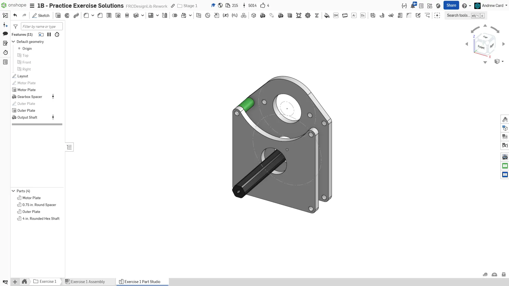
  Finished Part Studio.

  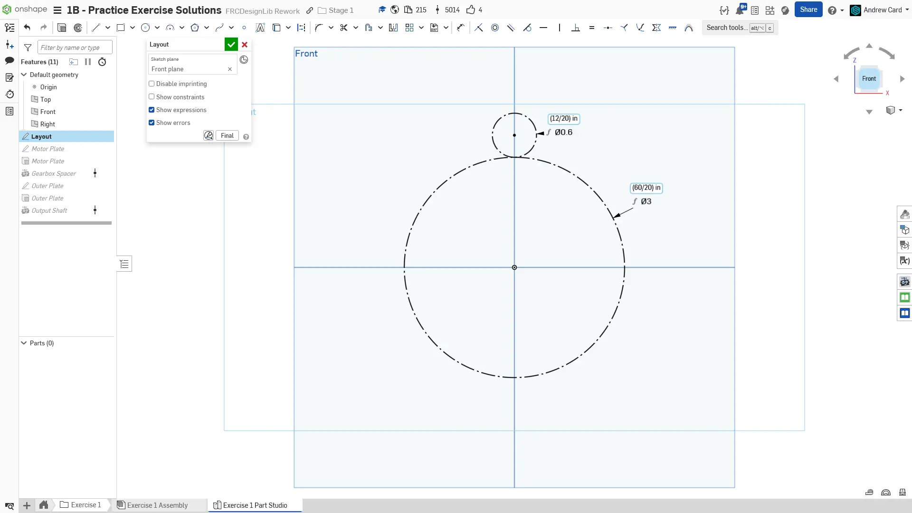
  Begin by creating the layout sketch for the gearbox. Draw the pitch circles for the 60T and 12T gears. Set the pitch circles tangent to constrain the center-to-center distance between the gears. Constrain the centers of the two gears to be vertical.

  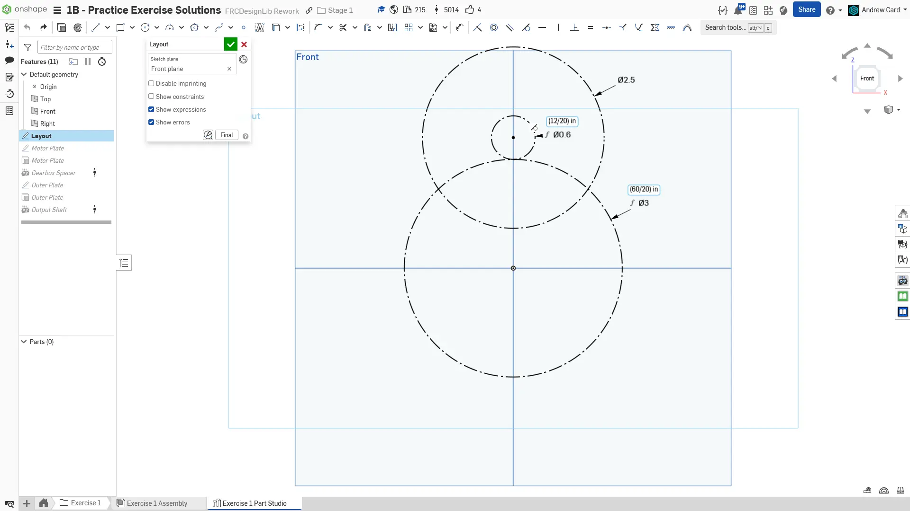
  Add the outline of the motor, a 2.5" diameter circle, around the 12T gear that the motor is attached to. The layout sketch is now finished.

  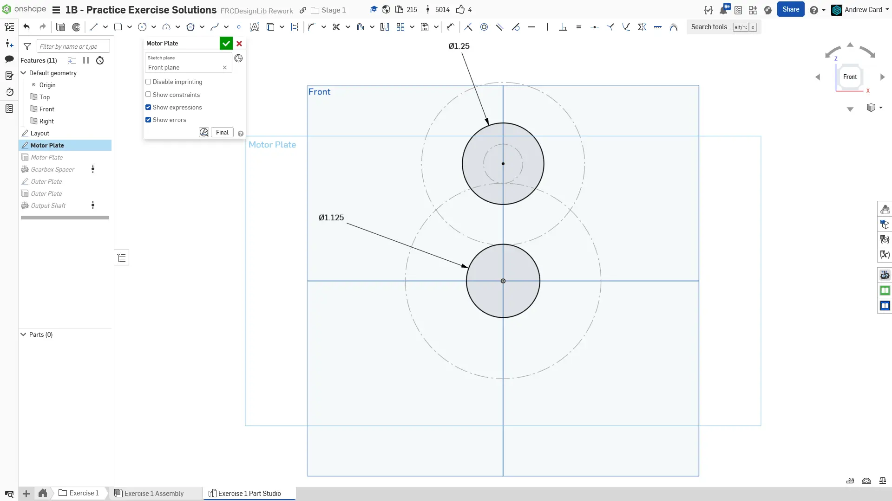
  Create a new sketch for the motor plate. Using the layout as the reference, draw a 1.125" hole for the bearing and a 1.25" hole for the motor boss (the nub that sticks out from the motor). Note that depending on your manufacturing processes and tolerances, you may need to draw your bearing holes slightly larger or smaller than nominal (1.125").

  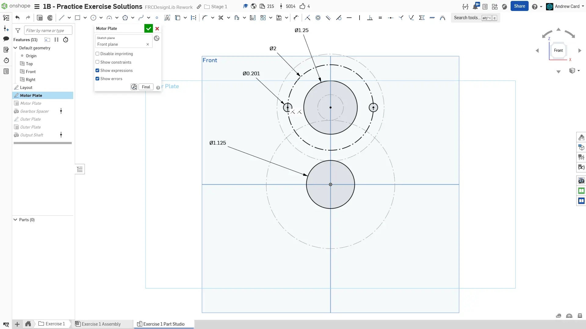
  Add two mounting holes for the motor on a 2" bolt circle. When using only two mounting holes, an alternative to using a circular pattern is to draw and dimension a 2" construction circle, then draw the holes for the bolts on the circle. Make sure to constrain the angle of the holes as well; we used a horizontal constraint.

  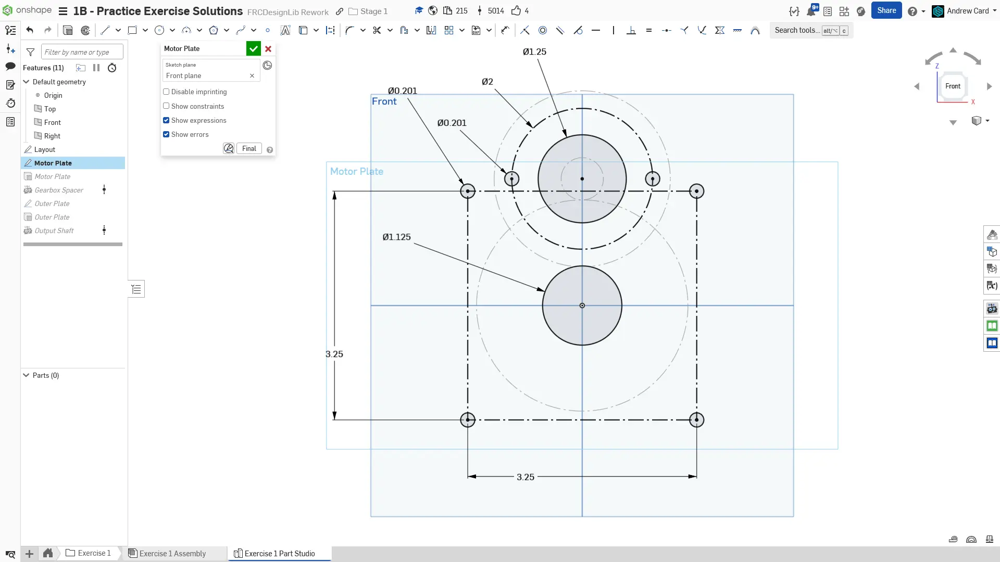
  Add the four bolt holes for connecting the two plates. Use a center rectangle to create the construction geometry so that only two dimensions are required to constrain the holes.

  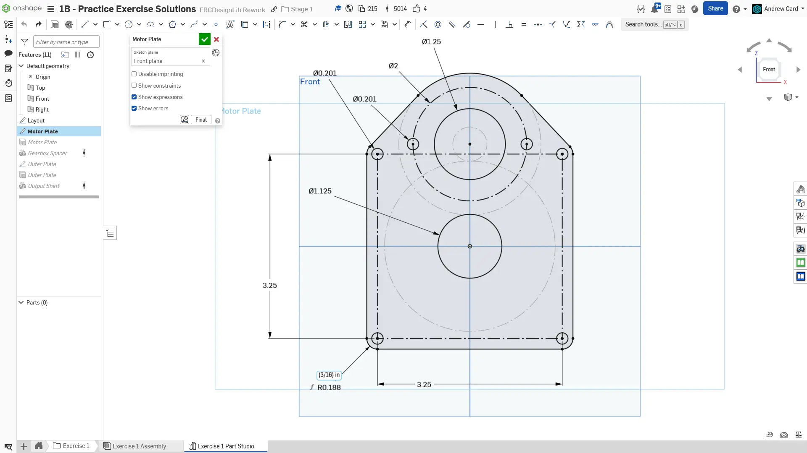
  Using centerpoint arcs, lines, and the sketch mirror tool, draw the outline for the plate around the holes and motor outline. The intelligent placement of the origin along the vertical line of symmetry allows you to use the right plane to mirror the plate outline.

  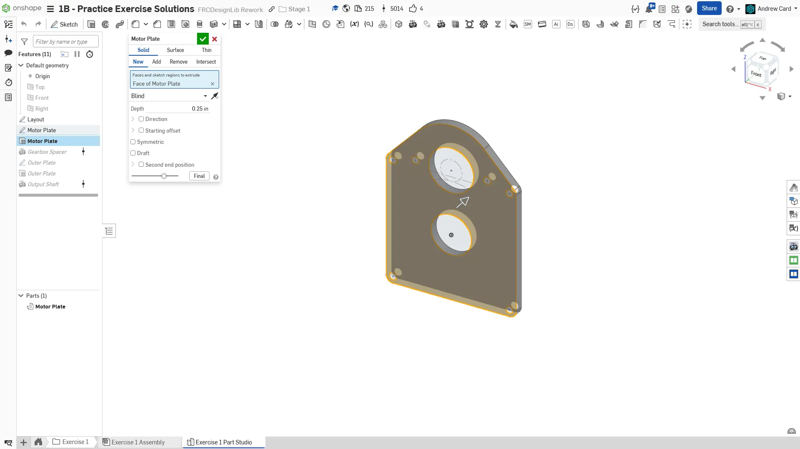
  Extrude the motor plate to be 1/4" thick.

  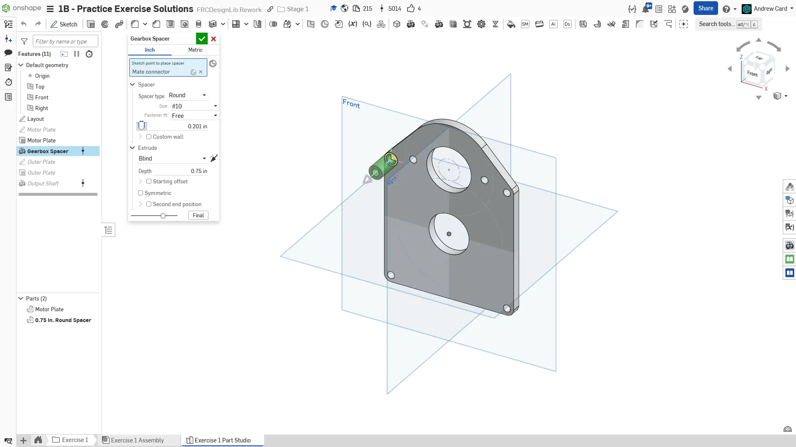
  Use the Robot Spacer Featurescript to add #10 free fit, 3/8" OD (automatic), 3/4" long spacer.

  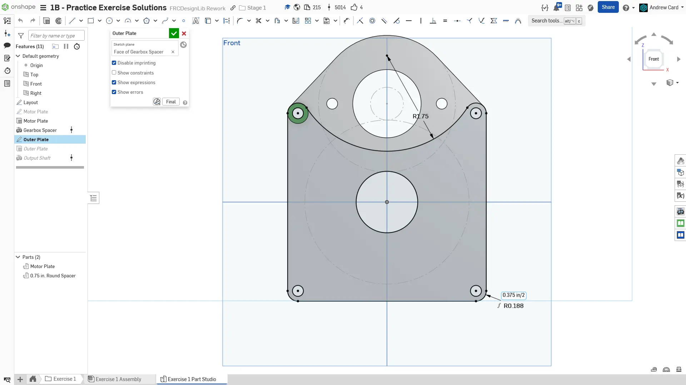
  Create the outer plate sketch on the face of the spacer. Use the Use sketch tool to project the holes and edges of the motor plate, but add a round cutout at the top using one of the arc tools. Note that the sketch can be mostly defined by using constraints such as tangent, equal, and vertical.

  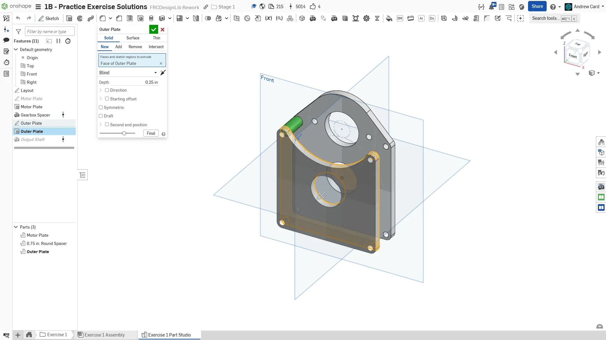
  Extrude the outer plate to be 1/4" thick.

  
  Use the Robot Shaft Featurescript to model the output shaft. Follow the settings used.

  
  Finished part studio. Name the key sketches and features. Set the name, material (6061 Aluminum), and appearance of the plates and spacer by right clicking the parts in the part list. The shaft has its material automatically determined from the Robot Shaft Featurescript.
</Slides>

### Assembly Instructions

When putting together the assembly, **you may have some difficulty mating the motor pinion gear** to the motor shaft.

You can **lock the visible mate connectors on a face by holding the `Shift` key before going to press on a mate connector** that isn't physically on the face. Watch the video below for a tutorial.

<ContentFigure src="zI8wBHeTfdc">Using the Shift key to lock mate inferences while mating</ContentFigure>

**Now navigate to the "Exercise #1 Assembly" tab** in your copied document and **follow the instructions in the slides** to complete the exercise.

<Slides>
  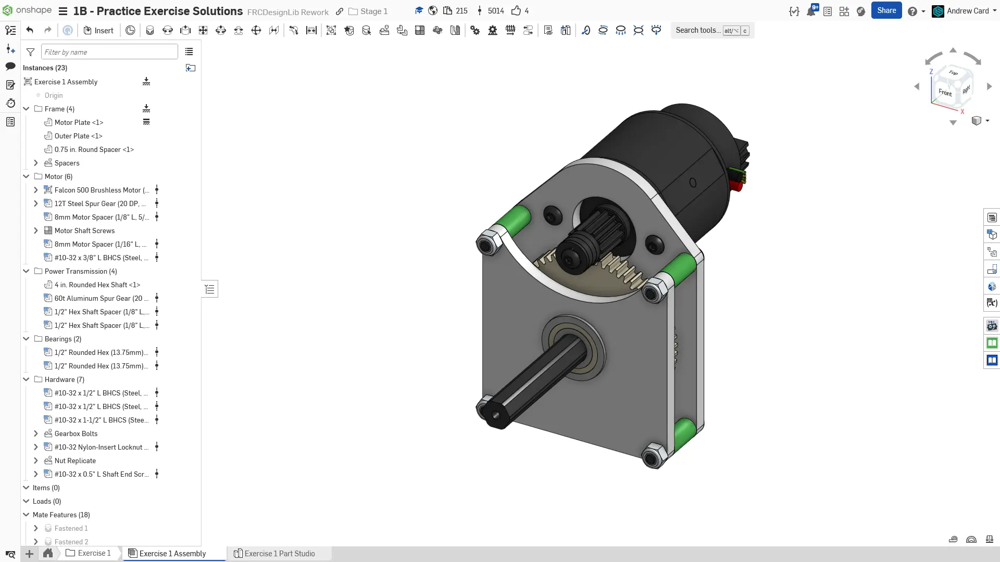
  Final assembly.

  
  Insert the part studio into the assembly and fix the gearbox plate. Group mate the two plates together and then mate the spacer to the motor plate. Then, use the Replicate tool to replicate the spacer and its associated mate onto the other spacer locations.

  
  Assemble the bearings and shaft using parts from FRCDesignLib.

  
  Assemble the motor and motor pinion gear using parts from FRCDesignLib. You will need to use mate inference locking to fasten the motor to the motor pinion: See the above drop down to learn how.

  
  Assemble the shaft spacer and gear using parts from FRCDesignLib. Configurable parts will have a blue grid icon in the instance list. Notice how you were able to change the tooth count of the gear from 40T to 60T after mating it. Using configurable components like this makes your models more parametric since you can change the component without needing to re-insert and mate.

  
  Insert the shaft retention bolts from FRCDesignLib.

  
  Add the motor bolts, gearbox bolts, and nuts using FRCDesignLib parts.

  
  Finished assembly. Make sure to sort your parts into folders and name your replicate features.
</Slides>

<Aside type="tip" title="Verification">
Make sure to have you and/or a more experienced member/mentor of your team [**review your CAD!**](/learning-course/stage1/1a/focusing-on-improvement) Your assembly should have 19 Instances and weigh approximately 2.3 lbs.
</Aside>

### Configurable Parts

In this exercise you made your first gearbox. In doing so, you also used part configurations - a powerful tool that allows for variations of the same part. The gears that you inserted from FRCDesignLib were configurable - you were able to easily change the tooth count of the gear without needing to inserting a new component. Try and use configurable parts when they are available to make your models more parametric.
