---
title: "Exercise 2: Two Stage Gearbox"
description: Model a two stage gearbox
---

## Exercise 2: Two Stage Gearbox

In this exercise, you will be modeling and assembling a two stage gearbox. The goal of this exercise is to practice modeling more advanced gearboxes. You will also learn how to use the [`Part Lighten` Featurescript](https://cad.onshape.com/documents/028ca8fb10baf53e1f6fce96/w/b1250a450d0ba88f0a8b1811/e/a8b9e45297aac9f5688c871d) used for lightening parts.

<Aside type="caution">
Though this stage will have you lighten your plates when you finish your part studio, this is not best practice. When modeling a full mechanism or robot, you should **wait to lighten plates until after all the design review and changes have been made to the mechanism or full robot**. Otherwise you end up wasting time fixing your lightening every time the plate or mechanism changes.
</Aside>

### Part Studio Instructions
**Navigate to the "Exercise #2 Part Studio" tab** in your copied document and **follow the instructions in the slides** to complete the part studio.

<Slides>
  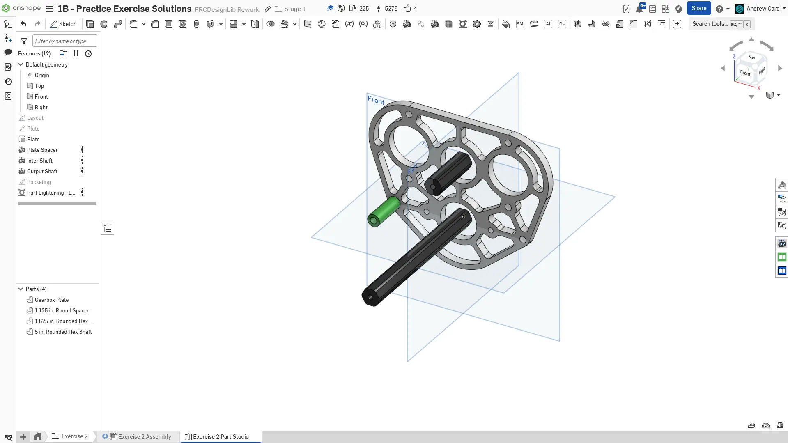
  Final Part Studio.

  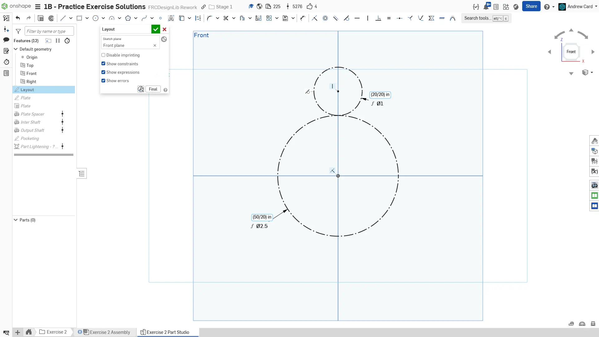
  Create the layout sketch for the gearbox. Start by drawing the 2nd stage, which is a 20T gear to a 50T gear.

  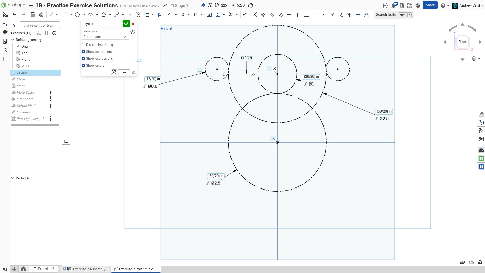
  Draw the first stage, which is a 12T motor pinion gear to a 50T gear.

  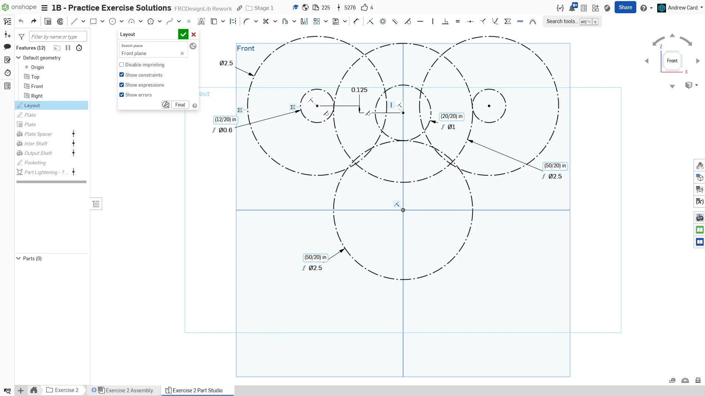
  Draw the outline of the motors as a 2.5" diameter circle. This is the finished layout sketch for the gearbox.

  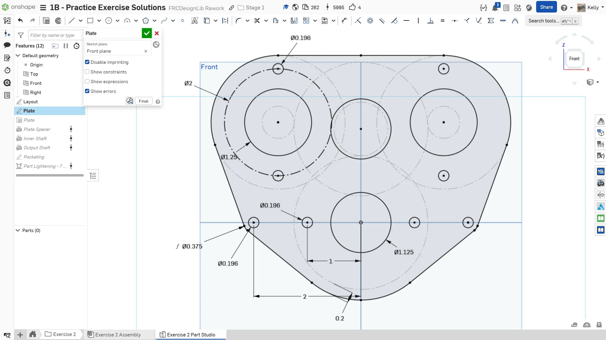
  Create a new sketch to draw the profile of the plate. While referencing the layout sketch, add the bearing holes, which are 1.125" diameter holes, as well as the motor boss holes, which are 1.25". Also add the motor mounting holes. You can utilize the Mirror sketch tool to mirror the geometry from the left side to the right side.

  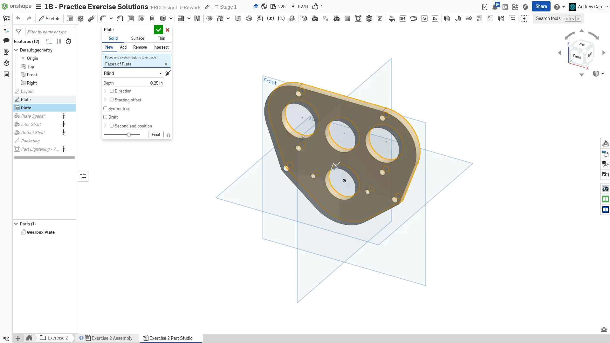
  Extrude the plate to be 1/4" thick.

  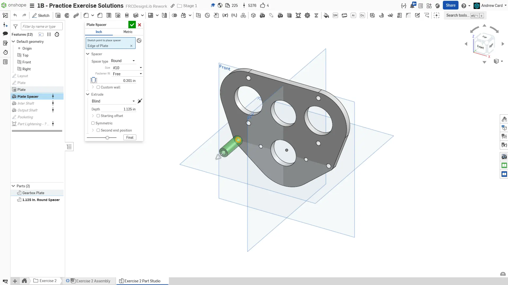
  Use the Robot Spacer Featurescript to create the gearbox spacer.

  
  Use the Robot Shaft Featurescript to create the first stage shaft.

  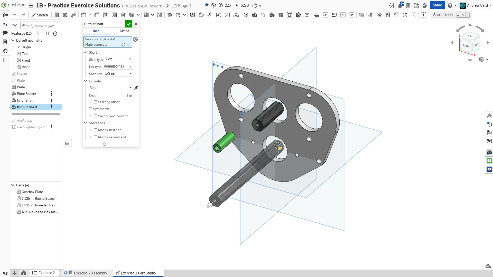
  Use the Robot Shaft Featurescript to create the output shaft.

  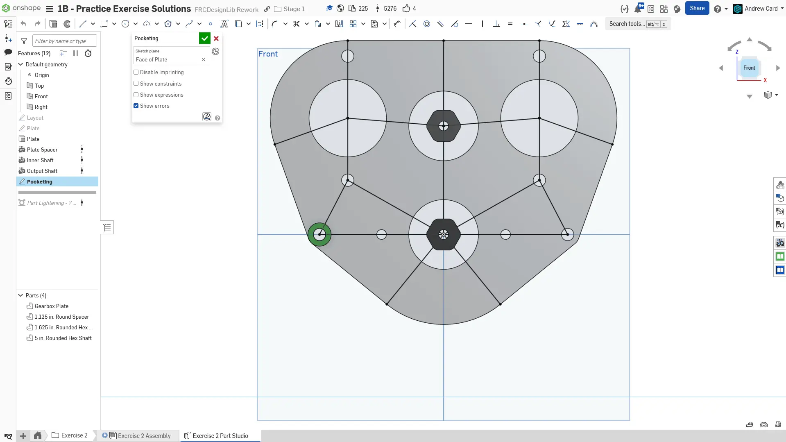
  Create a sketch on the face of the plate and draw the lines for the pocketing ribs.

  
  Use the Part Lighten Featurescript to pocket the plate by selecting the ribs created by the previous sketch.

  
  Finished part studio. Name the sketches, features and parts. Set the name, material (6061 Aluminum), and appearance of the plates and spacer.
</Slides>

### Assembly Instructions

**Next, navigate to the "Exercise #2 Assembly" tab** in your copied document and **follow the instructions in the slides** to complete this exercise.

<Slides>
  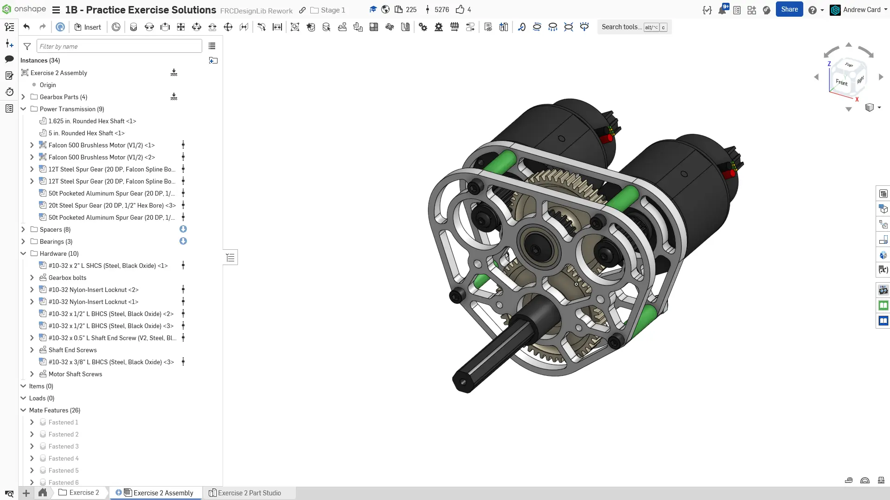
  Final assembly.

  
  Insert the part studio into the assembly and fix only the gearbox plate. Mate the spacer to the plate. Then, use the Replicate tool to replicate the spacer and its associated mate onto the other spacer locations.

  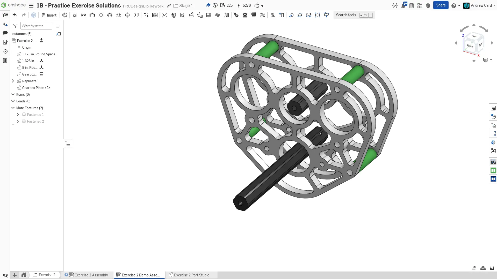
  Copy the gearbox plate and mate it into place.

  
  Assemble the bearings and shafts using parts from FRCDesignLib.

  
  Assemble the motor and motor pinion gear using parts from FRCDesignLib.

  
  Assemble the shaft spacers and gears using parts from FRCDesignLib.

  
  Assemble the shaft retention bolts, motor bolts, gearbox bolts, and nuts using FRCDesignLib parts.

  
  Finished assembly. Make sure to sort your parts into folders and name your replicate features.
</Slides>

<Aside type="tip" title="Verification">
Make sure to have you and/or a more experienced member/mentor of your team [**review your CAD!**](/learning-course/stage1/1a/focusing-on-improvement) Your assembly should have 27 instances.
</Aside>

In this exercise, you practiced more complex gearbox modeling and mating together larger assemblies.
