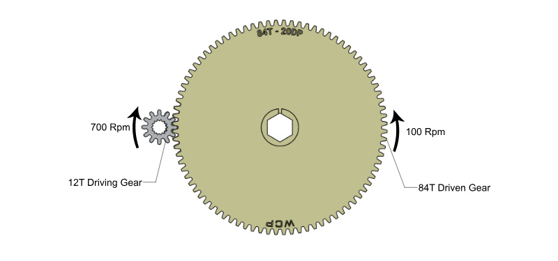
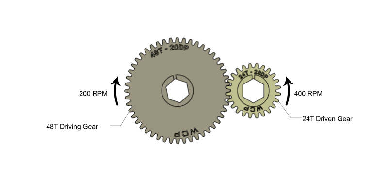
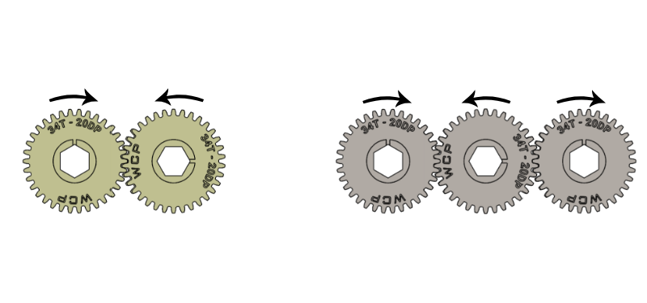

---
title: Gear Basics
description: Introduction to gears
---

import ContentRow from '@components/content/ContentRow.astro';
import ContentRowCaption from '@components/content/ContentRowCaption.astro';

## Power Transmissions
In FRC, the three most common types of power transmissions are gears, chain and sprocket, and belt and pulley. Although they all achieve the same end result of changing speed and torque, they each excel in different situations. In the following sections you'll be introduced to each of them and how to model them.

<Aside type="note">
Gears, sprockets, and pulleys all follow profile standards that specify how big the teeth are. This means that the ratio between the number of teeth and diameter of the part is a constant. There are different profile standards, but only parts of the same profile can be meshed or used together.
</Aside>

## Gear Basics

Gears are mechanical devices with teeth that mesh with each other to transmit motion or power between rotating shafts. They're like wheels with teeth that fit together, allowing them to transfer torque, change speed, and change direction of rotation.

<ContentRow mediaHeight="25rem">
  <ContentFigure src="../img/1b/gears/simple-gears.webp" gif alt="Simple gears animation" />
  <ContentFigure src="../img/1b/gears/gearbox-animated.webp" gif alt="Gearbox animation" />
  <ContentRowCaption>Animations of gears meshing. Notice that meshed gears will spin in opposite directions.</ContentRowCaption>
</ContentRow>

In order to change the torque and speed from the input to output, different sized gears must be used. Remember that the ratio is related to the number of teeth of the gears. Teeth will always mesh together one by one, but the number of teeth per revolution is different for different sized gears, causing a difference in angular speed even if the surface speed of the gear is the same. Click through the following slides to see a visualization of different gear ratios.

:::center
### **Changing Speed and Torque with Gears**
:::

<Slides>
  
  A 12T gear drives an 84T gear. The gear ratio is 84:12, which can be simplified to 7:1. The torque is increased by 7x while the speed is reduced to 1/7 of the original speed. (Image source: WCP)

  
  A 48T gear drives an 24T gear. The gear ratio is 24:48, which can be simplified to 1:2. The torque is reduced to 1/2 of the original torque while the speed is increased by 2x. (Image source: WCP)

  
  If the same size gears are used, there is no change in speed and torque. However, the direction of the rotation is flipped if there is an even number of gears from input to output. If there is an odd number of gears, the direction remains the same. (Image source: WCP)
</Slides>

### Center to Center Calculation

To calculate how far apart to space the gears, you can use the following formula to calculate the center-to-center distance:

:::center
**`C2C = 0.5 * PD1 + 0.5 * PD2`**
:::

Where `PD1` and `PD2` are the *Pitch Diameters* of the two gears. The **Pitch Diameter (PD)**  is the size of the imaginary circle that passes through the center of the gear teeth. The pitch diameters of two gears should be tangent in order for the gears to properly mesh. The equation for PD is as follows:

:::center
**`PD = (# of teeth) / DP`**
:::

Where DP stands for **diametral pitch**. For now, you can assume it to always be 20. If you're curious, you can learn more about this in the Design Handbook pages.

<ContentFigure src="../img/1b/gears/gear-diagram.webp" alt="Gear pitch diagram" width="70%">Illustration of a gear's pitch diameter and outer diameter. (Image source: WCP).</ContentFigure>

### Modeling Gear Transmissions

When modeling, an easy way to set the center-to-center distance between two gears is to draw two circles sized to the gears' pitch diameters and then set the two circles to be tangent to each other. For example, if you need to mesh a 20T gear and a 60T gear, you can draw a `20/20 = 1"` and a `60/20 = 3"` circle and add a tangent constraint between the two circles.

<ContentFigure src="../img/1b/gears/gear-cad.webp" alt="CAD gear modeling" width="60%">Modeling gear C-C distance by constraining two pitch diameter construction circles tangent. The diameters of the circle are calculated by dividing the tooth count by DP, which is 20 in this case.</ContentFigure>

It's recommended to input the pitch diameter fraction (Eg: `(60/20)"`) rather than the calculated pitch diameter (Eg: Only inputting `3"` as the dimension) so that you can easily see what the circle represents (a gear, sprocket, or pulley) and how many teeth it has.

<Aside type="tip">
You can show the expression that a dimension was evaluated from by checking the `Show Expression` checkbox on the sketch menu. The result will look like the previous image, which allowed you to easily see that the two gears were a 20T and 60T gear, both 20 DP.
</Aside>
