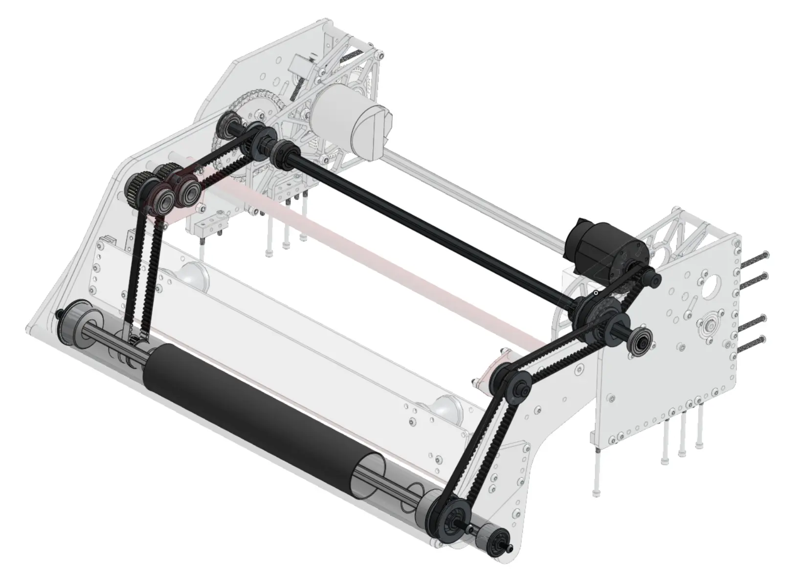
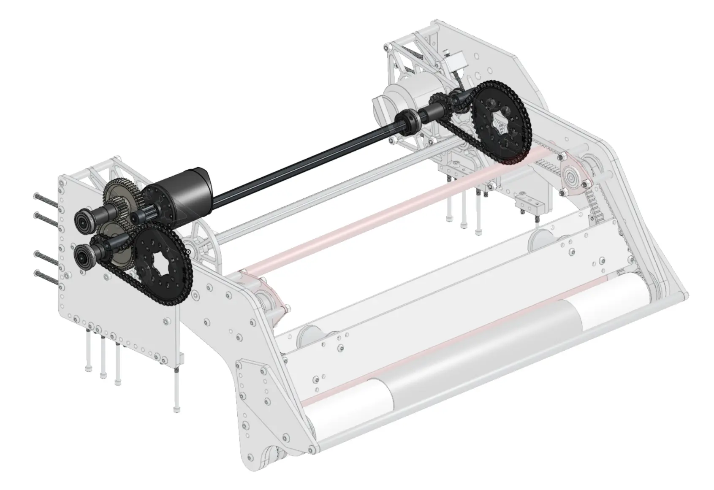
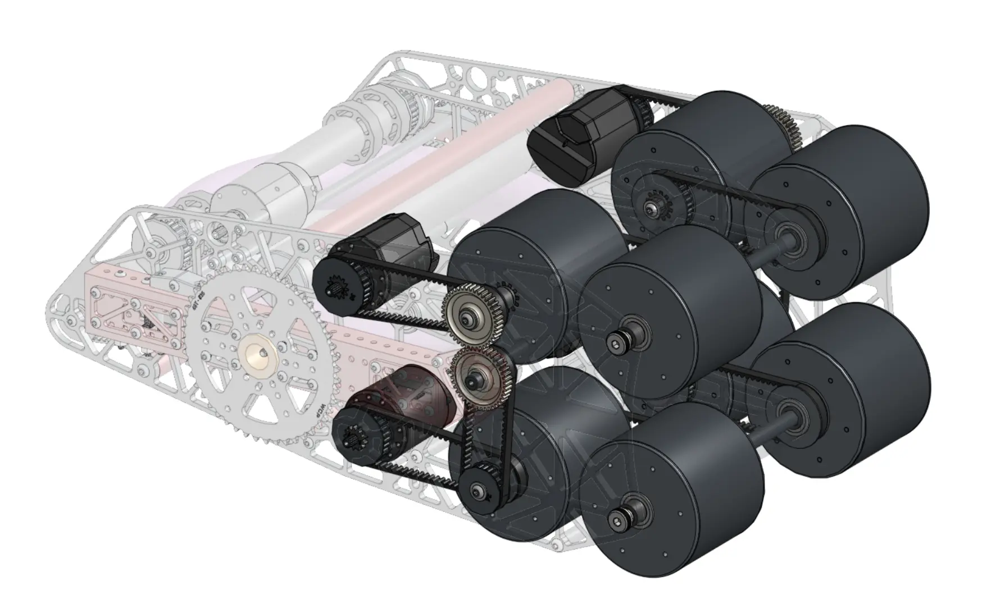
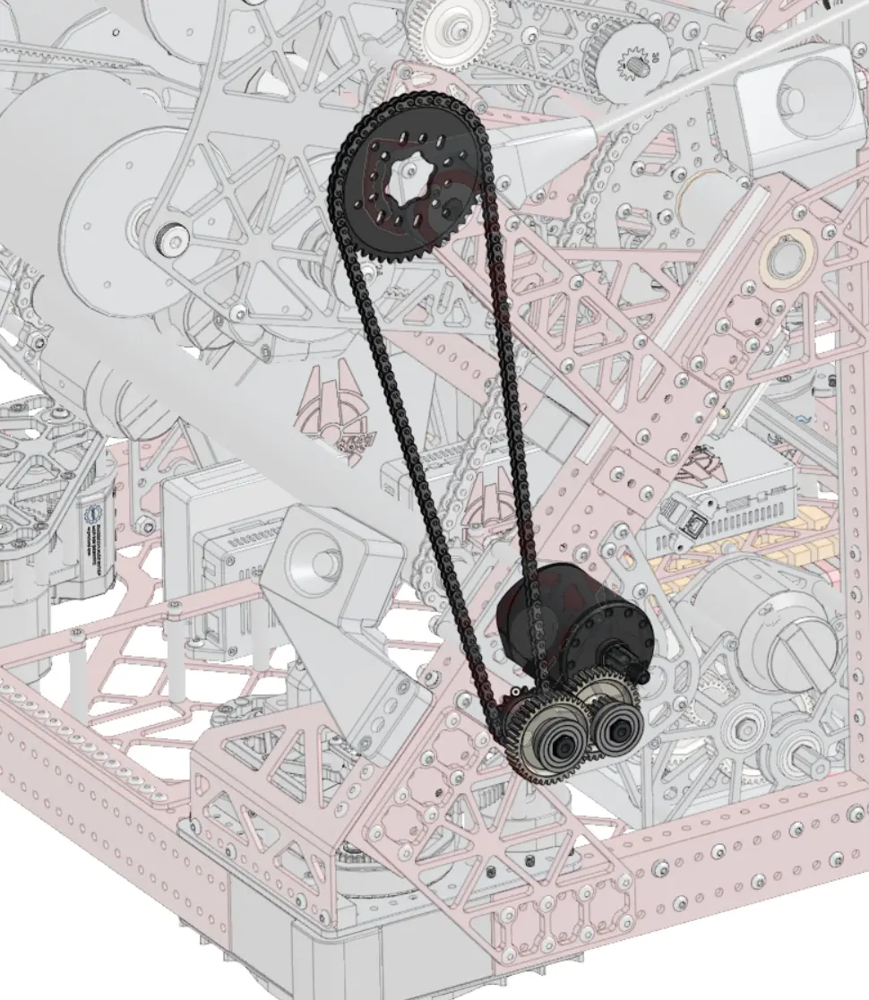
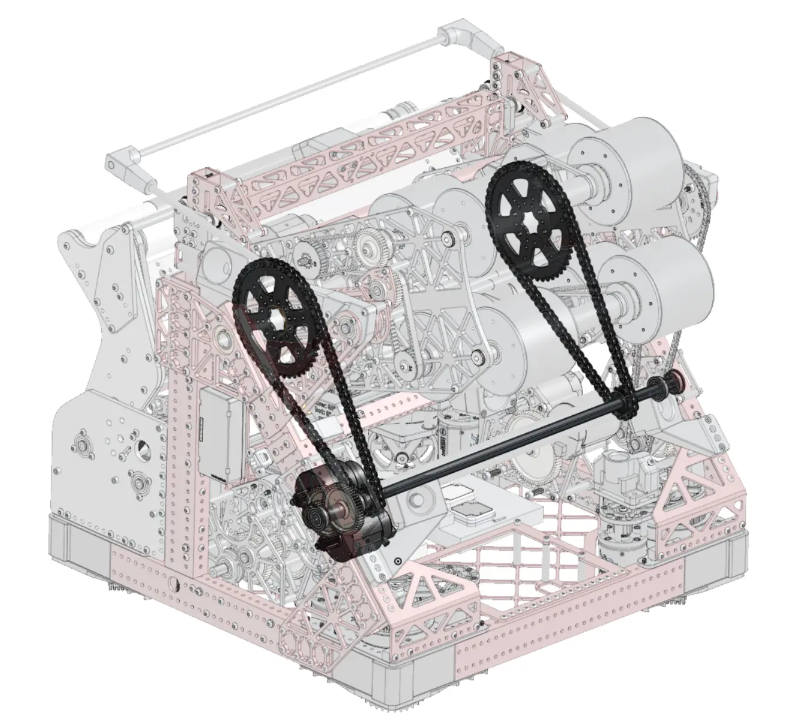

---
title: Power Transmissions Introduction
description: Introduction to power transmissions in FRC
---

So far the models you have created are all structural components, but this is only half of what makes up a robot. In order to make our robots move and score, motors that generate rotational motion are typically utilized. In Stage 1B, you'll be introduced to modeling basic *power transmissions*. Power transmissions include the motors, bearings, shafts, gears, belts, and chains that are used to transform rotational motion from a motor to do just about anything.

In this stage, you'll focus on the fundamentals of power transmissions, with an emphasis on how to model them in CAD. The process of selecting motors and calculating power transmission ratios will be explored later in Stage 2 of the guide with multiple different mechanisms.

### Examples

Take a look below at some examples of different types of power transmissions found in robots.

<Slides>
  
  Belt and gear power transmission to spin intake rollers. (Photo Credit: FRC 3647)

  
  Gear and chain power transmission to pivot the intake. (Photo Credit: FRC 3647)

  
  Belt and gear power transmission to spin shooter wheels. (Photo Credit: FRC 3647)

  
  Gear and chain power transmission to rotate a small arm. (Photo Credit: FRC 3647)

  
  Gear and chain power transmission to rotate a large arm. (Photo Credit: FRC 3647)
</Slides>

In this stage, there are exercises designed to practice modeling simple power transmissions in the form of stand alone gearboxes. In stage 2, you will begin to model power transmissions integrated within mechanisms.
