---
title: "Exercise 2: Dead Axle Rollers"
description: Model dead axle rollers
---

In this exercise, you will be modeling some dead axle rollers. To spin things, whether it be rollers, wheels, or even arms, two types of axles can be utilized: "live" and "dead" axles.

## Live and Dead Axle Rollers

You'll learn more about live and dead axle design in Stage 2, but for now, all you need know is that live axle means we power the shaft to spin our mechanism, whereas with dead axle, we directly power the spinning component.
For live axle, the shaft spins on fixed bearings, while for dead axle, the bearings are on the spinning component. Take a look at the visual below to better understand.

<Aside type="example" title="Live vs Dead Axle Rollers">
<ContentFigure src="../img/1c/dead-axle-rollers/dead-vs-live.webp" alt="Dead vs Live Axle comparison" width="40%">Section view of a dead axle (left) and live axle (right) roller. The dead axle roller sits on bearings and needs to be directly powered (in this case, through the integrated pulley). The live axle roller is powered from a pulley farther down the hex shaft.</ContentFigure>
</Aside>

## Part Studio Instructions

**Navigate to the "Exercise #2 Part Studio" tab** in your copied document and **follow the instructions in the slides** to complete the part studio for this exercise.

<Slides>
  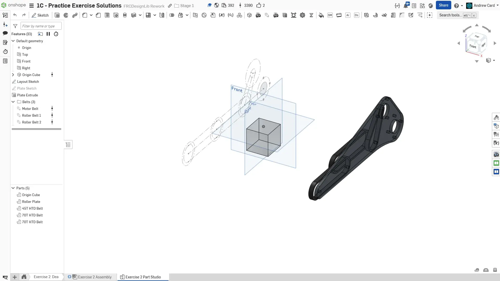
  Final Part Studio.

  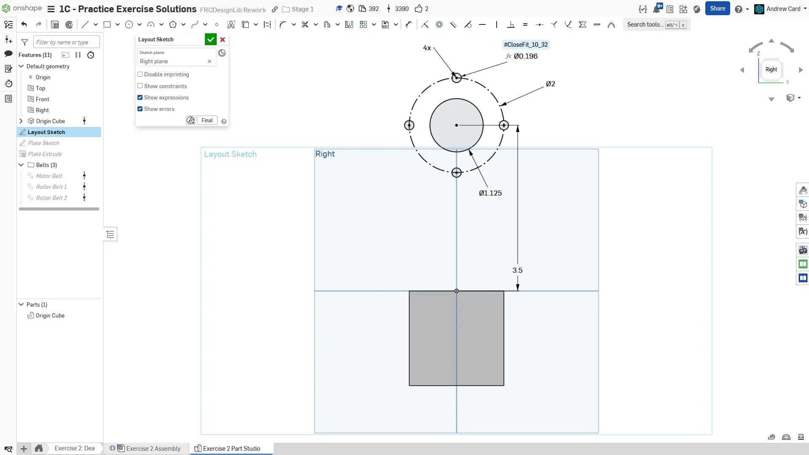
  Create a new sketch on the right plane for the Layout Sketch. Start by sketching a pivot axle hole with a bolt pattern around it.

  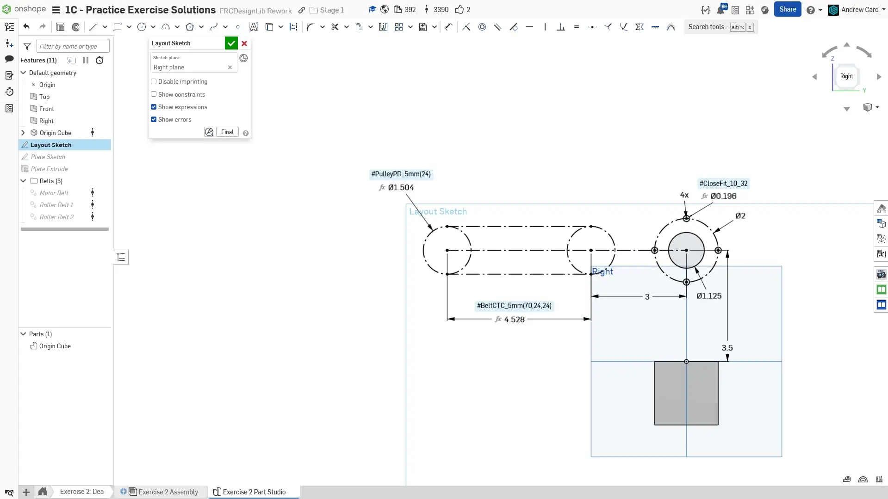
  Sketch the first belt run between rollers to the left of the pivot hole.

  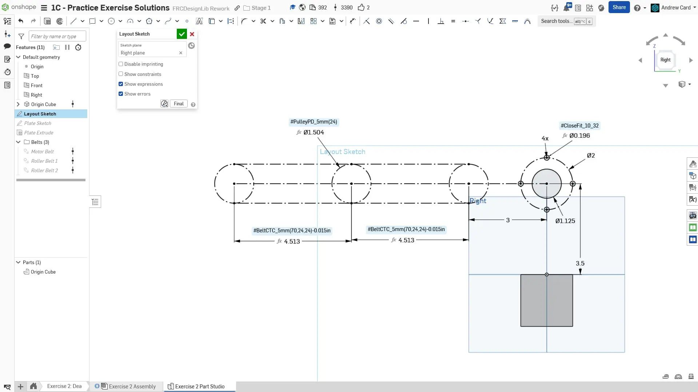
  Create a second belt run of the same length as the first.

  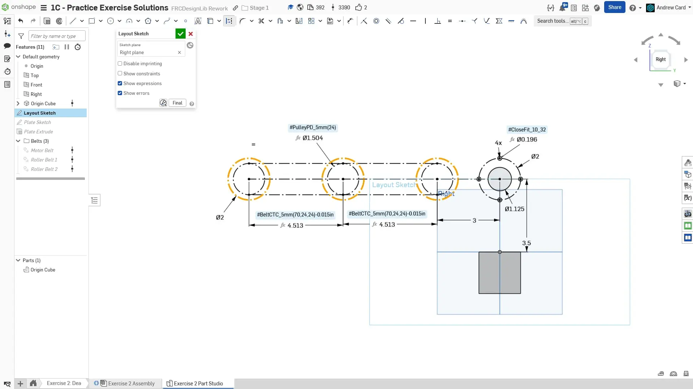
  Add 2" circles around the ends of the belt runs to represent the rollers.

  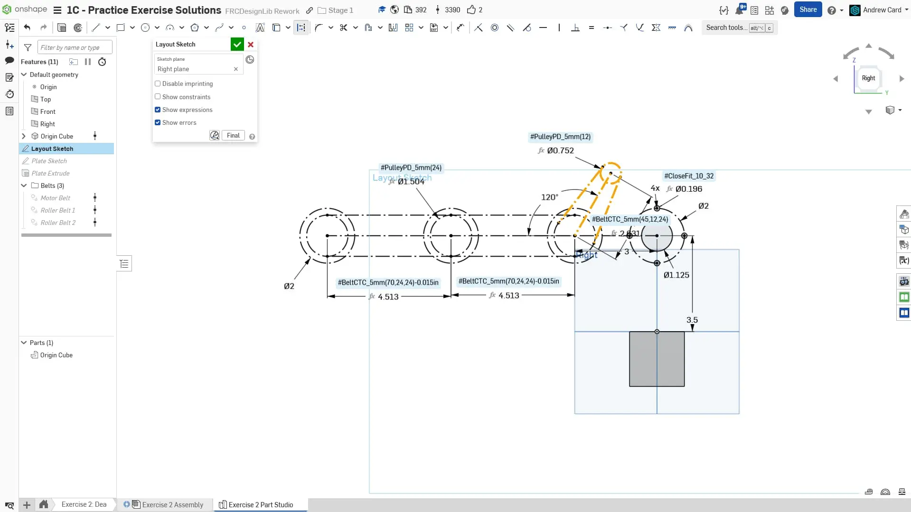
  Sketch the motor belt run off the first roller angled back towards the pivot point.

  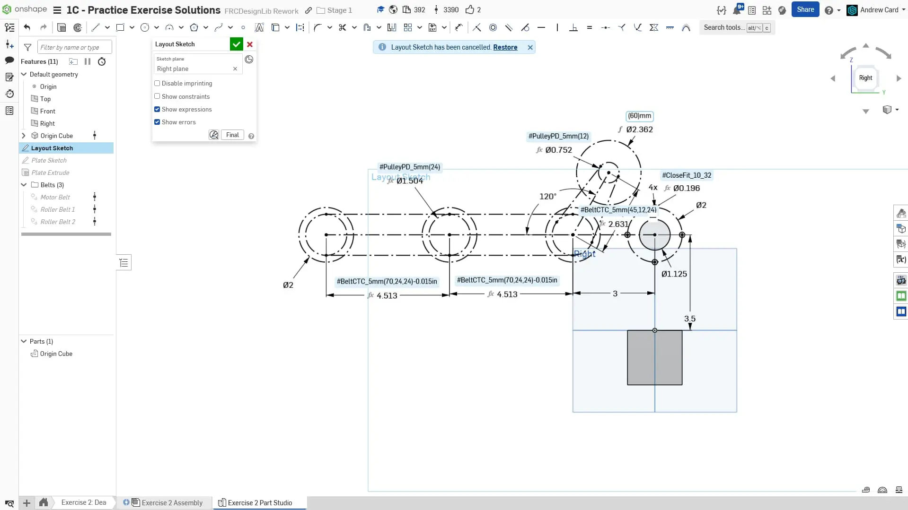
  Add a 60mm circle to represent the motor, this will be useful information when making the plate.

  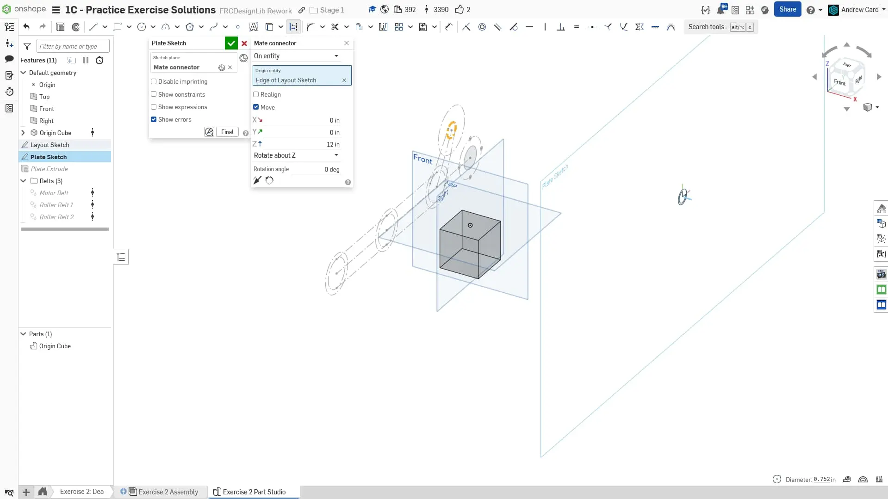
  Create the plate sketch offset from the layout sketch. This is similar to the previous exercise.

  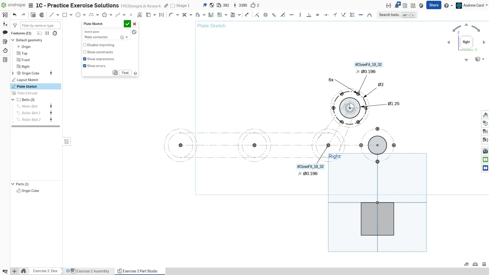
  Start the plate sketch by copying the bolt pattern and pivot axle hole, and adding bolt holes for the rollers. Also add the bolt pattern for the motor, this should be done in the same way as the previous exercise but with a 6 hole pattern. Like before we will only make 3 of these real holes. The rest will be construction circles.

  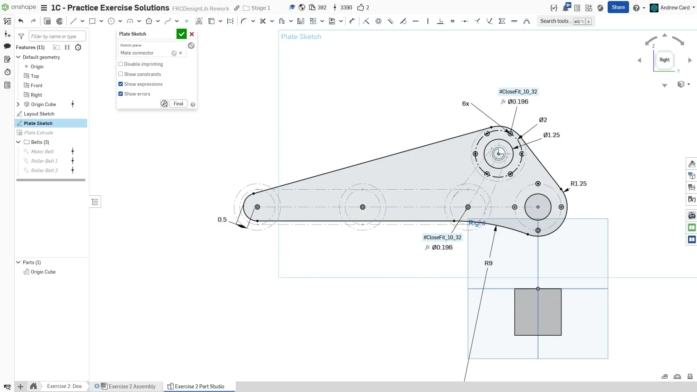
  Draw the plate outline based on the holes created in the previous slide.

  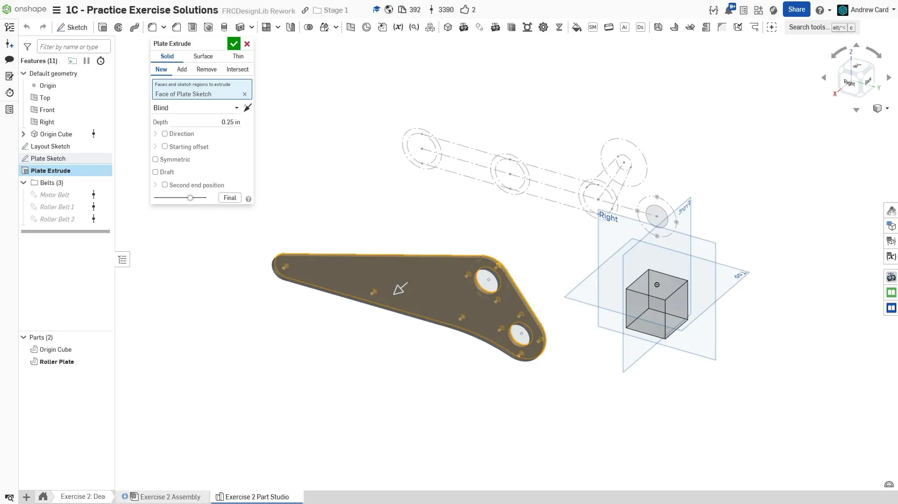
  Extrude the plate in the "Right" direction.

  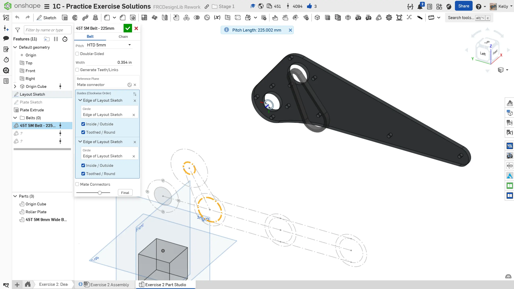
  Use Belt & Chain Gen to make the motor belt. The offsets don't matter here since you will be mating the belts to the pulleys.

  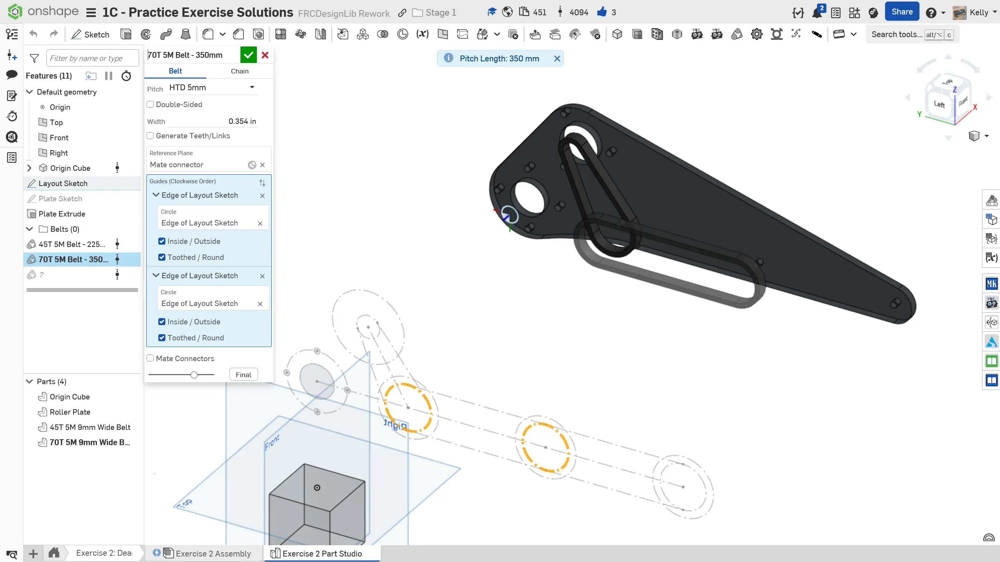
  Use Belt & Chain Gen to make the first roller belt.

  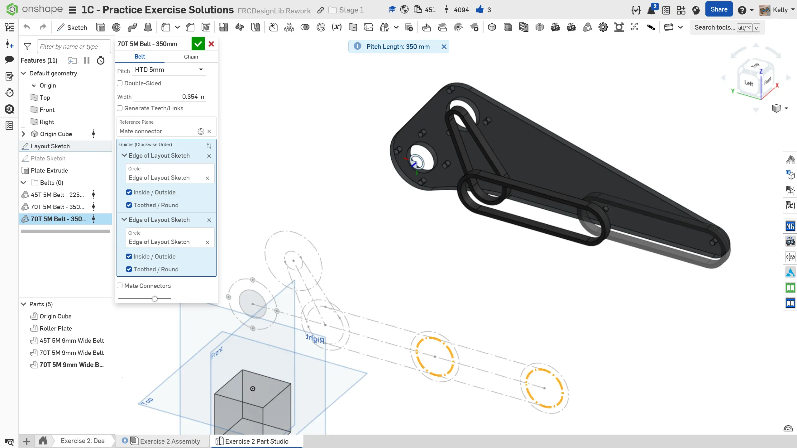
  Use Belt & Chain Gen to make the second roller belt.

  
  Finish the part studio by naming your features and organizing them into folders. Assign the plate material to be polycarbonate.
</Slides>

## Assembly Instructions

**Next, navigate to the "Exercise #2 Assembly" tab** in your copied document and **follow the instructions in the slides** to complete this exercise.

<Slides>
  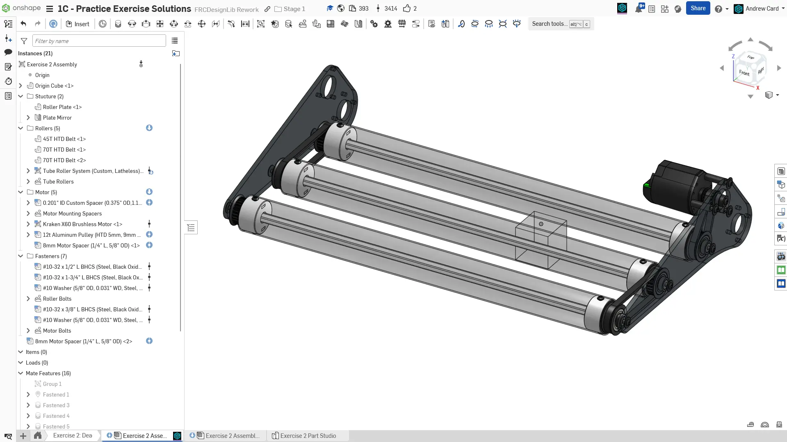
  Final assembly.

  
  Start the assembly by inserting the part studio and grouping the origin cube and plate together. Then fasten the cube to the origin.

  
  Use Assembly Mirror to copy the plate to the other side.

  
  Insert a roller from FRCDesignLib. Make sure the length is set to 24", and has bolt endcaps set to the HTD option. You can mate the first roller to one of the holes in the side plate. You can replicate the single roller to the other two holes. Make sure you select the whole assembly for the replicate as shown.

  
  Mate the belts to the rollers using the center mate point for the belts, and the roller pulleys.

  
  Insert the Motor, Pulley, Shaft Spacers, and Shaft Bolt. Assemble the motor components together and mate the pulley to the center of the belt.

  
  Measure the distance between the plate and motor by clicking the face of each component. Copy this distance to your clipboard. Open the FRCDesignLib Inserter and insert a custom round ID spacer with the length you copied. There is no need to change other configurations. Attach this spacer to the plate and use replicate to add it to the other three plate holes.

  
  Add fasteners to your assembly. Note the use of washers on each bolts When bolting to polycarbonate plates it is best practice to use washers. This helps prevent the plates from cracking. The Rollers should be attached with 1/2" #10-32 bolts, and the motor with 1.75" #10-32 bolts.

  
  Organize your assembly with folders
</Slides>

<Aside type="tip" title="Verification">
Make sure to have you and/or a more experienced member/mentor of your team [**review your CAD!**](/learning-course/stage1/1a/focusing-on-improvement).
</Aside>

## Minimizing Unique Part Count

You may have noticed that the 3rd roller has a 24T pulley on both ends despite there only being a belt connected to one end.
While the configurable roller does allow you to choose no pulley for the end with no belt, it can be advantageous to still keep the pulley in situations like this to reduce the number of unique parts.
By doing so, all three rollers are identical, making part tracking and spare parts easier.

