---
title: "Exercise 3: Ball Shooter"
description: Model a shooter mechanism
---

Starting with exercise 3, the instruction slides will only provide part-by-part instructions and key details.
For exact feature details, you should refer to the exercise solutions document.
This is to prepare you for later exercises that are gradually less guided.

In this exercise, you will be modeling a very simple 2.5" ball shooter.
This mechanism features 3D-printed pulleys, a 3D-printed ramp, and nut strips. Be sure to pay attention to layout sketches when modeling.

## 3D-printed Pulleys
Thus far, you've only utilized COTS pulleys in your assemblies.
However, 3D-printed pulleys are a fantastic alternative since they are cheaper, readily available (assuming you have a 3D printer), and highly customizable.

3D-printed pulleys can easily be generated using pulley generators, such as the ones included in FRCDesignLib and the Robot Pulley Featurescript.
However, close attention must be paid to the shaft interface. 3D-printed hex profiles can easily strip out, so a metal insert (Available from vendors like [WCP](https://wcproducts.com/products/adapters) or [Thrifty Bot](https://www.thethriftybot.com/products/qty-5-aluminum-insert-for-3d-printed-parts)) should be used to better transfer torque.
Take a look below at some examples of 3D-printed pulleys with different types of inserts.

<Aside type="example" title="3D-printed Pulley Inserts">
<ContentFigure src="../img/1c/shooter/3dp-pulleys.webp" alt="3D printed pulleys with various inserts">3D-printed pulleys with hex insert for hex shaft (left), SplineXS insert for Kraken motors (center), and pinion gear insert for NEO/CIM motors (right).</ContentFigure>
</Aside>

<Aside type="caution">
Since 3D-printed pulley bores are easily worn out, you should try to always use a metal insert or a pinion gear insert.
A cheap alternative to buying COTS inserts is to order them from a laser cutting service like [Fabworks](https://www.fabworks.com). In large quantities (~20 pieces), they only cost around $1 each.
</Aside>

## Nut Strips
Nut strips are a very versatile structural component often used to connect perpendicular plates or a plate to a tube.
Vendors like [WCP](https://wcproducts.com/products/nut-strips), [REV](https://www.revrobotics.com/3-8in-nut-strips/), and [Last Anvil](https://lastanvil.com/products/nut-strip) carry nut strips in 6" long segments with either #10-32 or #8-32 tapped holes.
These nut strips are very robust and can be easily cut to any length.
In the exercise you just completed, the nut strips would allow you to easily mount the shooter onto any surface.

<Aside type="example" title="Nut Strips">
<ContentFigure src="../img/1c/shooter/nut-strips-real.webp" alt="Nut strips in use" width="50%">Nut strips can be used to connect a plate to a tube or a plate to a perpendicular plate. (Photo Credits: FRC 4414)</ContentFigure>
</Aside>

## Block Motors
When creating mechanisms, sometimes you need to reference specific COTS components when creating custom parts. While most of the time construction geometry in sketches will suffice (think motor outlines), sometimes you need to make more complex references. Instead of deriving a full detail component into the part studio (which can significantly slow down load times), you can create or derive "block" geometry, like the "block motor" from FRCDesignLib used in this exercise.

<ContentFigure src="../img/1c/shooter/block-motor-example.webp" alt="Block motor example" border />

When inserting a block motor from FRCDesignLib, it is important to use the "Differentiation Variable" because of how Onshape handles derived parts. Assigning a unique value to each block motor prevents these errors in your part studio.

## Part Studio Instructions

**Navigate to the "Exercise #3 Part Studio" tab** in your copied document and **follow the instructions in the slides** to complete the part studio for this exercise.

<Slides>
  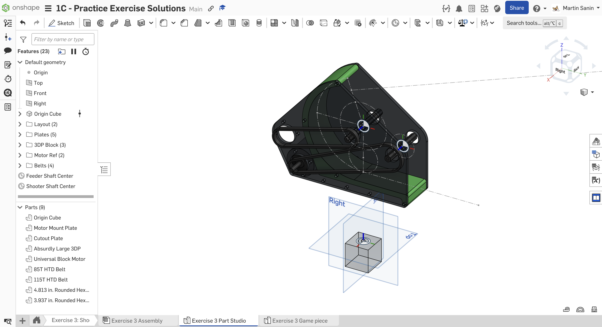
  Final Part Studio.

  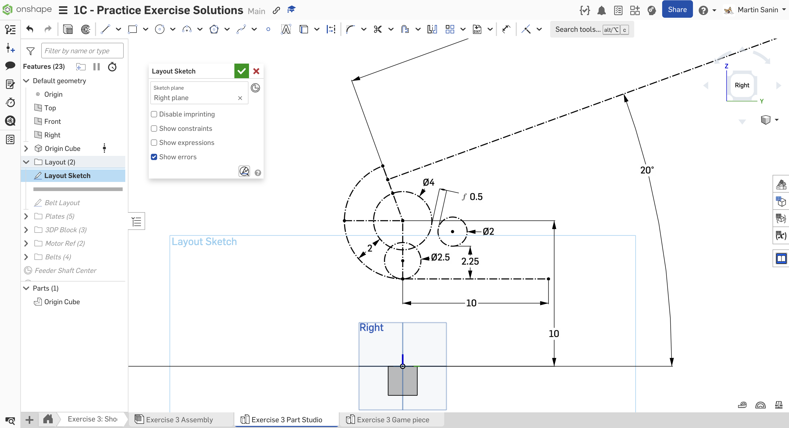
  Create the layout sketch on the Right plane. Begin by sketching the 4" shooter wheel, 2" feeder wheel, and the ball path.

  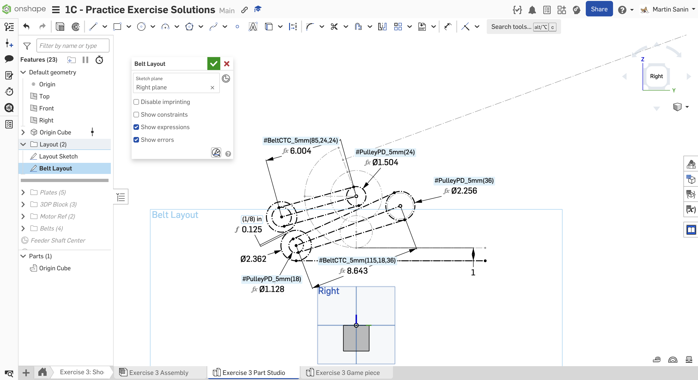
  On the right plane, create a new sketch with the belts, pulleys, and motors. The bottom most construction line defines the bottom of our shooter.

  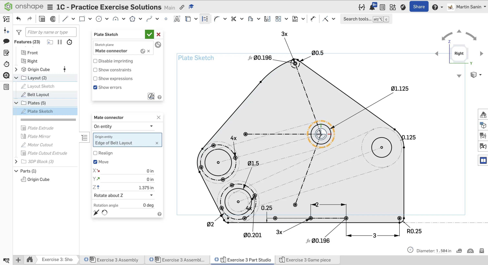
  Using a mate connector offset 1.375" from the layout sketch plane as the sketch plane, sketch the side plate. Use a circular pattern to sketch the #10-32 clearance holes around the shooter hood.

  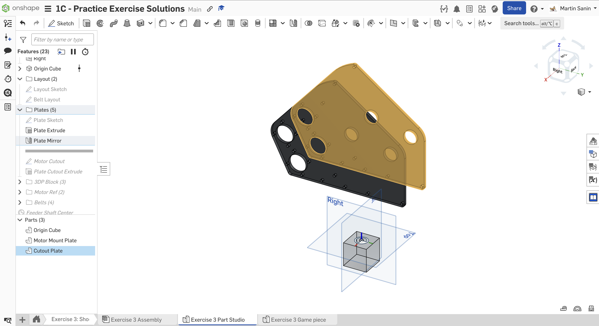
  Extrude the plate as 1/4", then mirror it across the Right plane. We use a mirror because the opposite side plate is the same except for an extra cutout for the motors.

  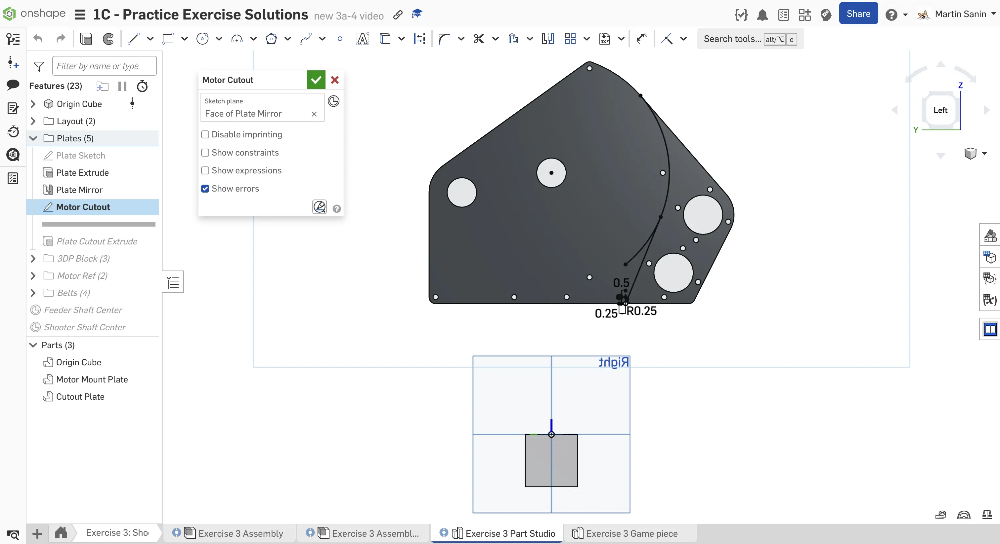
  Sketch a cutoff boundary to remove the motor mounting from the mirrored plate. Make sure imprinting is enabled. You don't need to sketch the whole region, since the plate outline itself will be used in the extrude.

  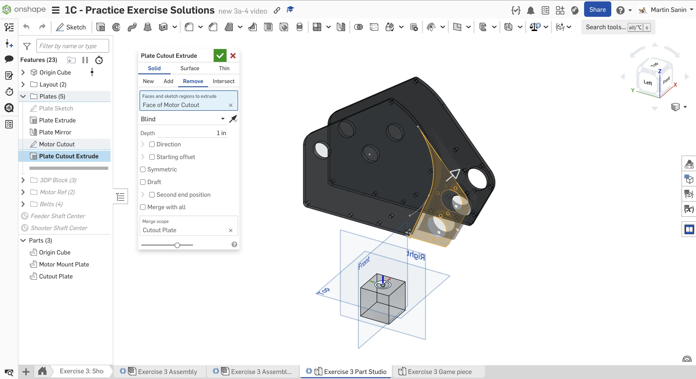
  Extrude the motor mounting region on the mirrored part to remove the geometry from the part.

  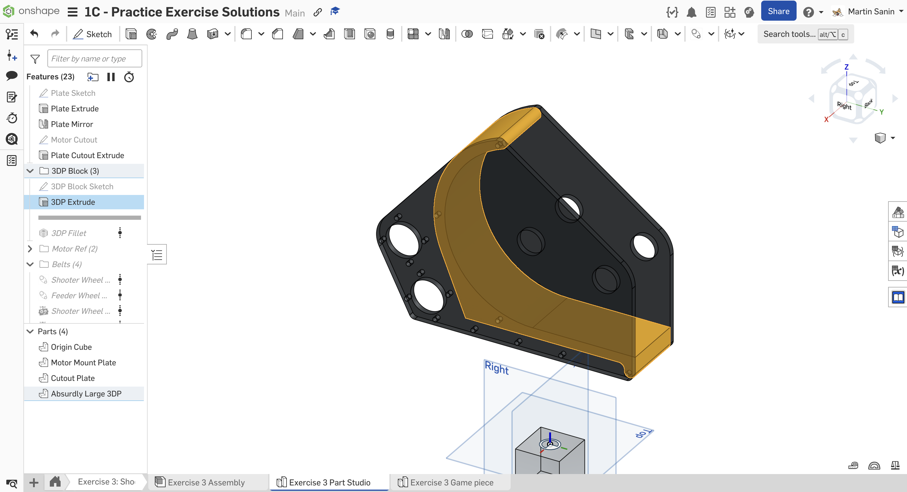
  Model the large 3D print that goes in between the plates. Try to minimize the amount of dimensions you need by using the layout or part geometry. Use an "Up to face" extrude to ensure that the width is parametric.

  
  Use the `Fillet All Edges` Featurescript to add a 3/16" radius fillet to all of the 3D-printed part edges. To select the face of the part, you can utilize the `Isolate` tool, which will make all other components that are not currently selected transparent or hidden.

  
  Insert a block motor from FRCDesignLib. Use the `Transform` feature to transform the block motor to the motor bore.

  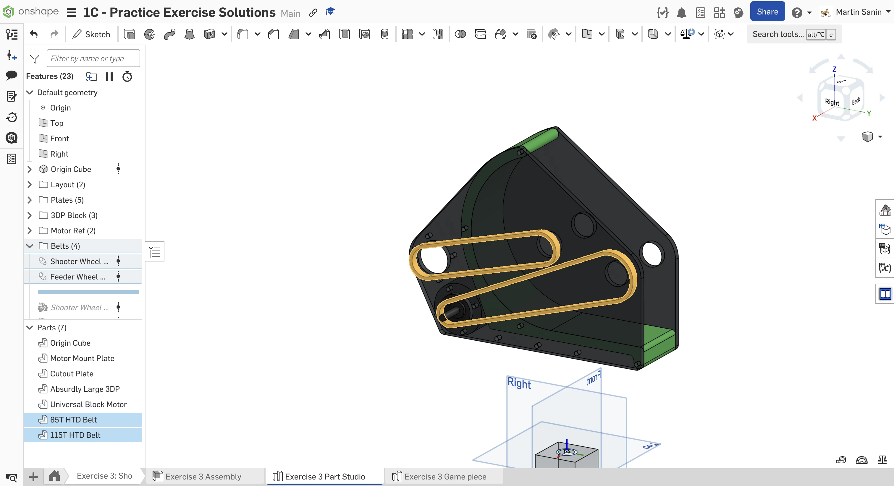
  Add the HTD 5mm pitch belts. Double check that the pitch length is a multiple of 5 mm to ensure that the belt has an integer number of teeth.

  
  Model the shooter wheel and feeder wheel shaft using the `Robot Shaft` featurescript.

  
  Add a mate connector on the layout sketch for fastening the feeder wheel. Set the owner of the mate connector to the feeder shaft. This mate connector marks the center point between the two plates and will help with assembly.

  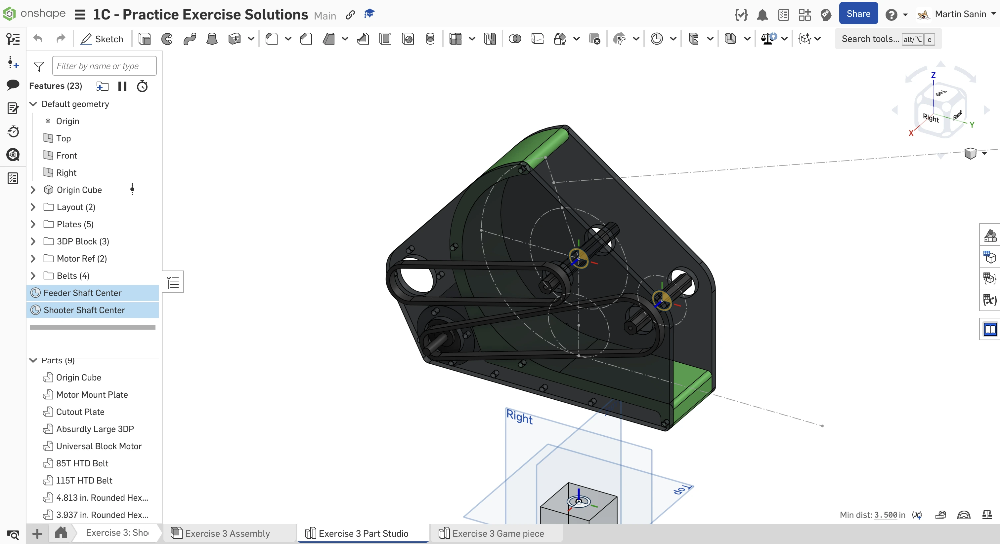
  Repeat the same steps as before to add a mate connector to the shooter wheel shaft. Make sure you select the shooter wheel shaft as the mate connector owner.

  
  Finish the part studio by naming your features and organizing them into folders.
</Slides>

## Assembly Instructions

**Next, navigate to the "Exercise #3 Assembly" tab** in your copied document and **follow the instructions in the slides** to complete this exercise.

<Slides>
  
  Final assembly.

  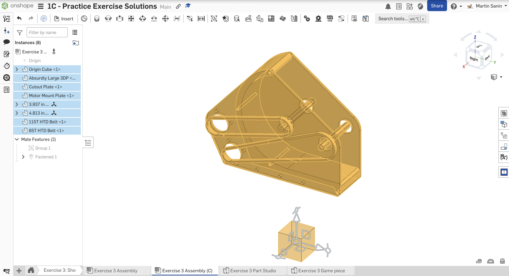
  Insert all the part studio components. Group all the components except for the shafts and belts. Fasten the Origin Cube to the origin.

  
  Insert and fasten 4.5" long nut strips from the FRCDesignLib app. Pay close attention to which side is fastened to the plate - the nut strip holes on adjacent sides are staggered.

  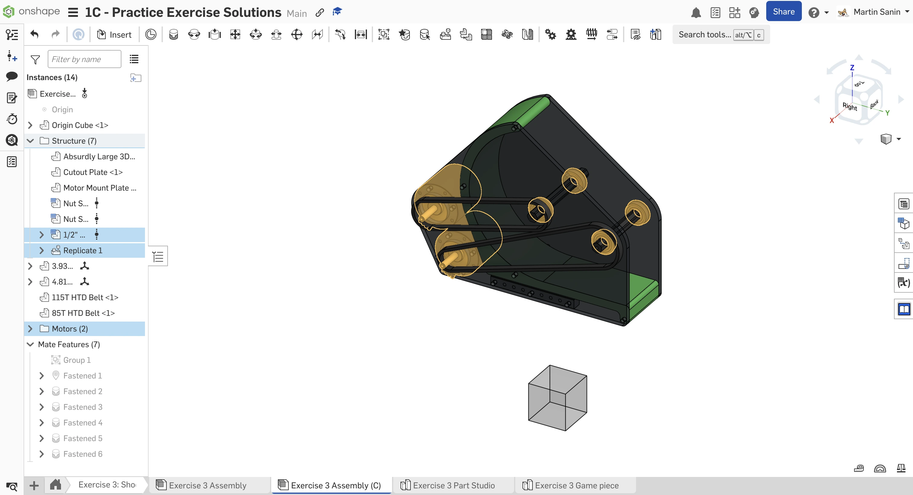
  Insert and fasten the two NEO motors. Insert, fasten, and replicate the bearings.

  
  Insert and configure the shooter pulley to be 24T with 1/2" Hex w/ TTB insert. Copy and paste the pulley and TTB insert to create the motor pulley. Using a 3/16" spacer, fasten the shooter pulley to the shooter bearing. Then, fasten the motor pulley to the belt. Finally, use the `Isolate` tool to fasten the 8mm NEO shaft to 1/2" hex adapter.

  
  Insert and configure the feeder pulley to be 36T with a TTB 1/2" hex insert. Configure the motor pulley to be 18T with a 12T 20DP gear insert. Using a 1/16" spacer, fasten the feeder pulley to the feeder bearing. Then, fasten the motor pulley to the belt. Finally, use the `Isolate` tool to fasten the 12T motor pinion.

  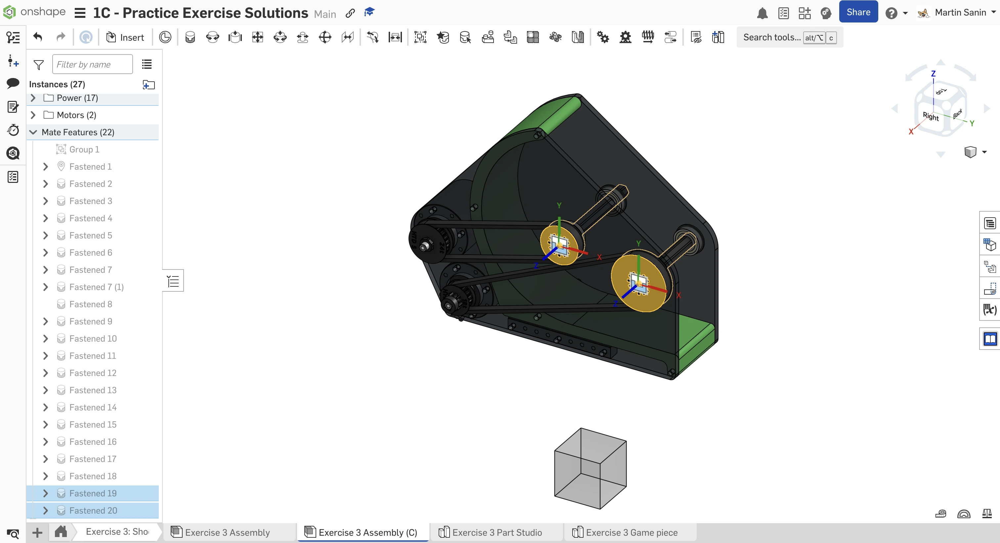
  Fasten the shafts to the pulleys.

  
  Insert and fasten the shooter and feeder wheels to the shaft centering mate connectors. Then, Use the `Measure` tool to measure the gaps between the bearings and the wheels. Create spacers to fill the gaps on the sides of the wheels. Finally, use the `Assembly Mirror` tool to mirror the spacers and the shooter wheel across the feeder wheel's mate connector.

  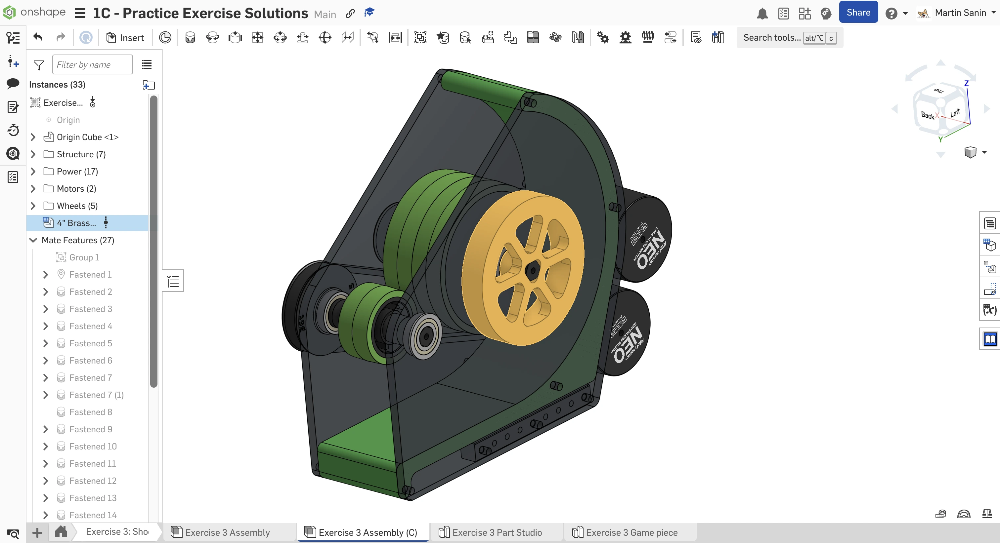
  Insert and fasten the 4" SDS Flywheel to the other side of the shooter.

  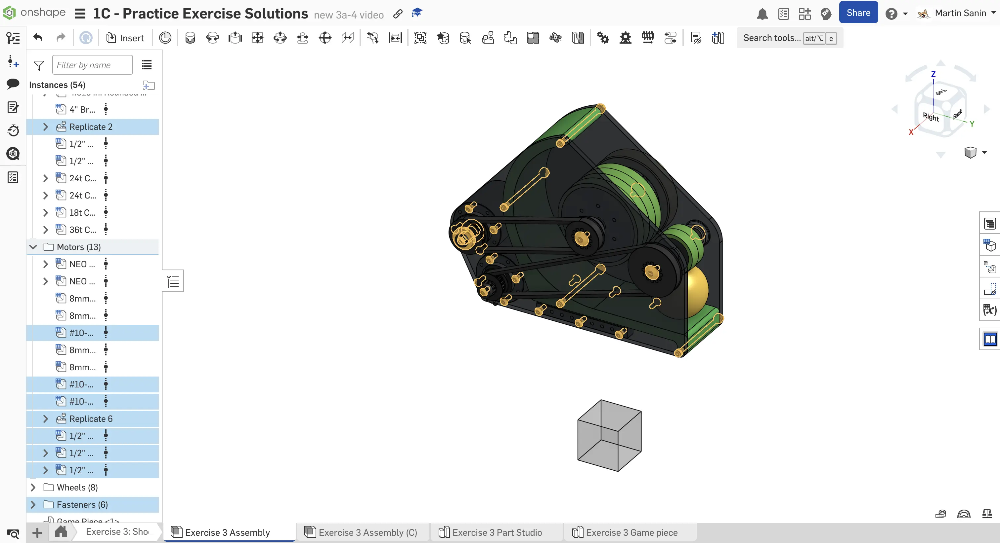
  Insert, fasten, and replicate all of the required fasteners and remaining hardware.

  
  Finish your assembly by organizing the parts into folders and naming your replicates. You can also insert and position the ball to visualize it.
</Slides>

<Aside type="tip" title="Verification">
Make sure to have you and/or a more experienced member/mentor of your team [**review your CAD!**](/learning-course/stage1/1a/focusing-on-improvement) Your assembly should have 54 instances.
</Aside>

## Isolate, Hide, and Make Transparent

The Isolate tool hides all other parts except the selected ones, helping focus on specific components.
The Hide tool removes the selected parts from view, while Make transparent allows you to see through the selected parts without removing it, useful for accessing obscured components.

Rather than deleting or moving parts, you should use these tools to access the parts you need for your task. If you hide parts, don't forget to un-hide them for the next person!

<Aside type="tip" title="Isolate, Hide, and Make Transparent">
<ContentFigure src="I1nFphxKVXc">Isolate parts, hide parts, or make parts transparent to help with assembly.</ContentFigure>
</Aside>

<Aside type="tip" title="Keyboard Shortcuts">
Just like most other tools and constraints in Onshape, hide/show has a nice keyboard shortcut combination. Hover over a part with your cursor or select it and press `y` to hide it. Hover over the same space and press `shift+y` to unhide the part.
</Aside>

