---
title: "Exercise 5: Flipped Gearbox"
description: Model a flipped gearbox
---

Starting with exercise 5, only an outline of the design process and key details will be provided to you. This is to prepare you for stage 2, where the exercises are less guided.

Focus on capturing design intent and maintaining best practices in your part studios and assemblies. Follow the workflow of the solution document.

In this exercise, you will be modeling a two motor, two-stage flipped gearbox. These types of gearboxes are referred to as "flipped" because the output shaft points in the opposite direction as the input motors. This style of gearbox can be desired in some situations to meet packaging constraints. This gearbox also serves as a chain tensioning mechanism allowing the gearbox to slide along the mounting tube to adjust chain tension. Having an easily tensioned chain is important to prevent backlash while still being serviceable.

## Part Studio Instructions

**Navigate to the "Exercise #5 Part Studio" tab** in your copied document and **refer to the solution document** to complete the part studio for this exercise. The **following instruction slides** only provide a general outline and some key details.

<Slides>
  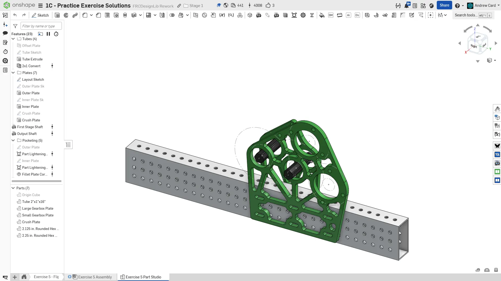
  Final Part Studio.

  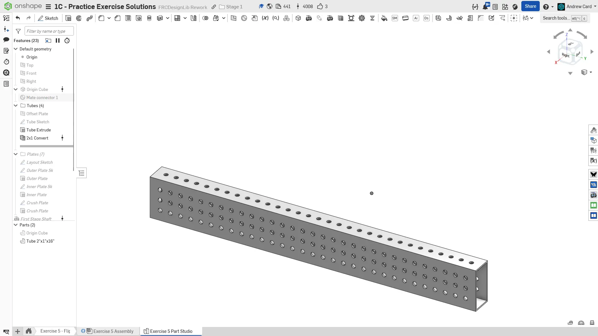
  Start by modeling the tube that the gearbox mounts on.

  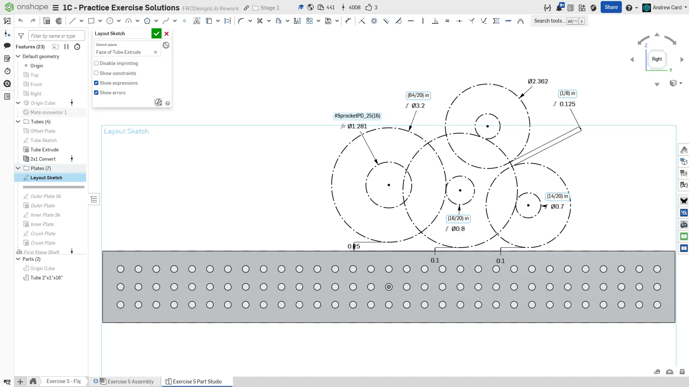
  Create the layout sketch on the tube face. Remember to only include essential information in the layout sketch. In this case, only the gear PD's and motor OD's are required.

  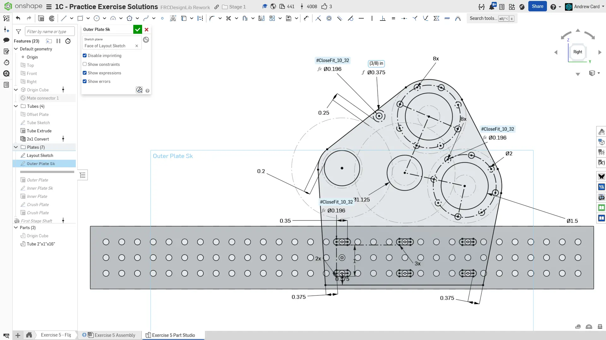
  Sketch the outer plate. We only require two bolts to hold the motor on and choose the two holes that form a line perpendicular to the c-c line between the motor pinion and the gear. This ensures that the motor bolts will be accessible at all times. The bottom mounting bolts are modeled as slots instead of normal holes. This allows the whole gearbox to slide along to tube to tension a chain.

  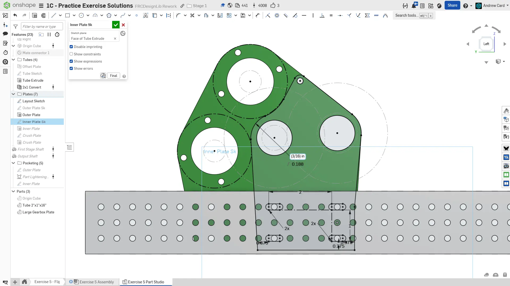
  When sketching the inner plate, verify that there is clearance between the motor and the inner plates. Pay close attention to the tangency of all the edges so that the plate contour is smooth. Also make sure the back side of the plate remains flat for most of the tube distance. This flat surface is pushed by a bolt to keep the chain tensioned.

  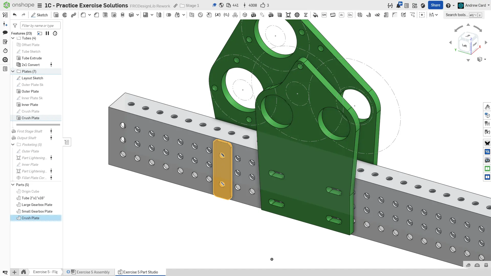
  Model a small crush plate on the outside of the tube. As explained in the prior exercise this prevents the tube from being crushed during assembly by spreading out the bolt force.

  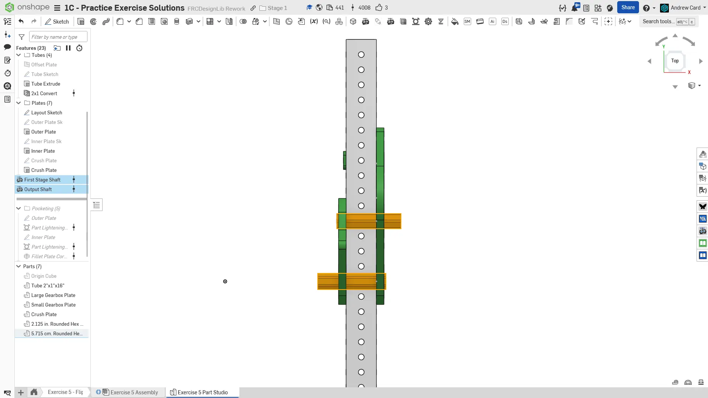
  Use the `Robot Shaft` Featurescript to make the gearbox shafts.

  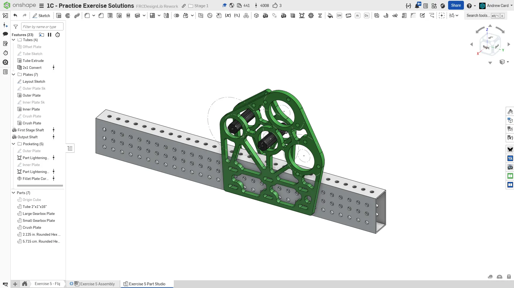
  Pocket the gearbox plates.

  
  Prepare for assembly by organizing parts and naming features.
</Slides>

## Assembly Instructions

**Next, navigate to the "Exercise #5 Assembly" tab** in your copied document and **refer to the solution document** to complete the assembly for this exercise. The **following instruction slides** only provide a general outline and some key details.

<Slides>
  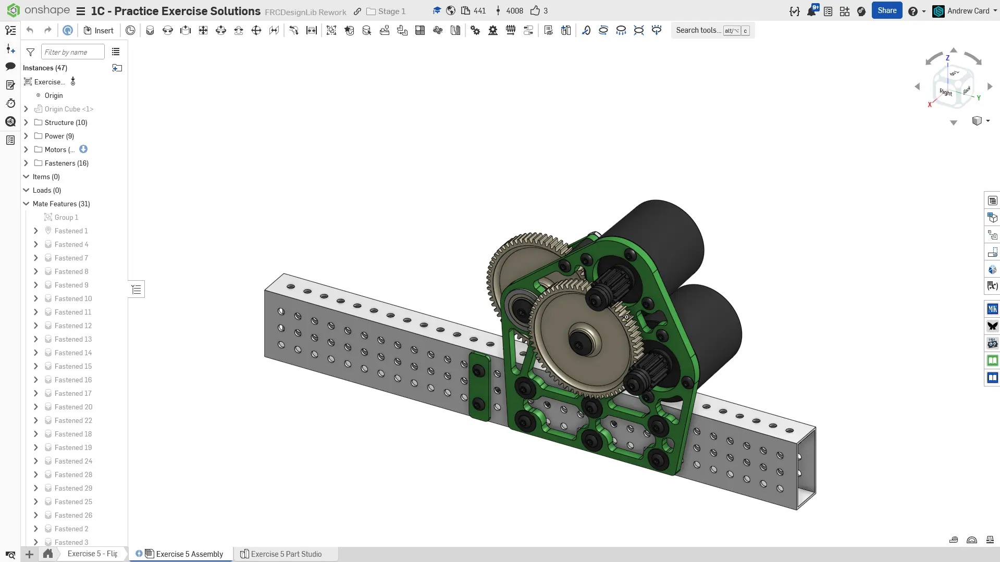
  Final assembly.

  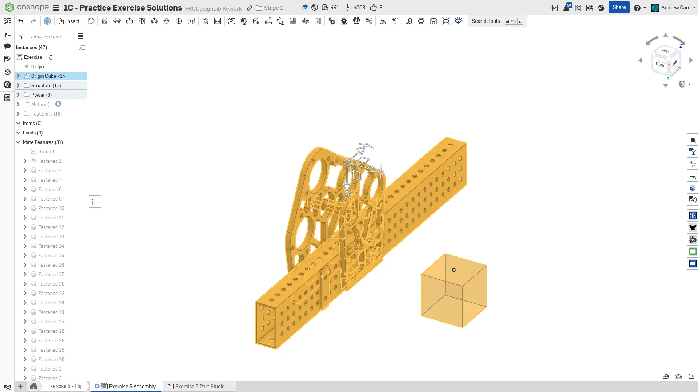
  Add the frame, gearbox plates, gearbox spacer, and shafts to the assembly. Like before, group mate the rigid components with the Origin Cube and mate the Origin Cube to the assembly origin.

  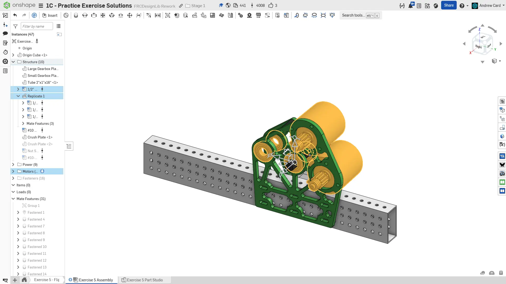
  Insert and fasten the motors and bearings. Make sure to assemble the motor with the correct pinion and shaft spacers.

  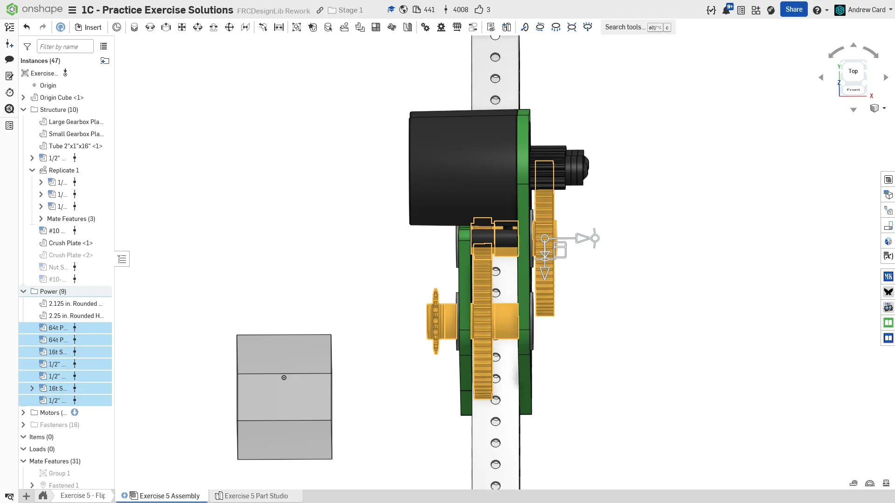
  Insert and fasten the power transmission components, which includes the gears, pinions, spacers, and sprocket.

  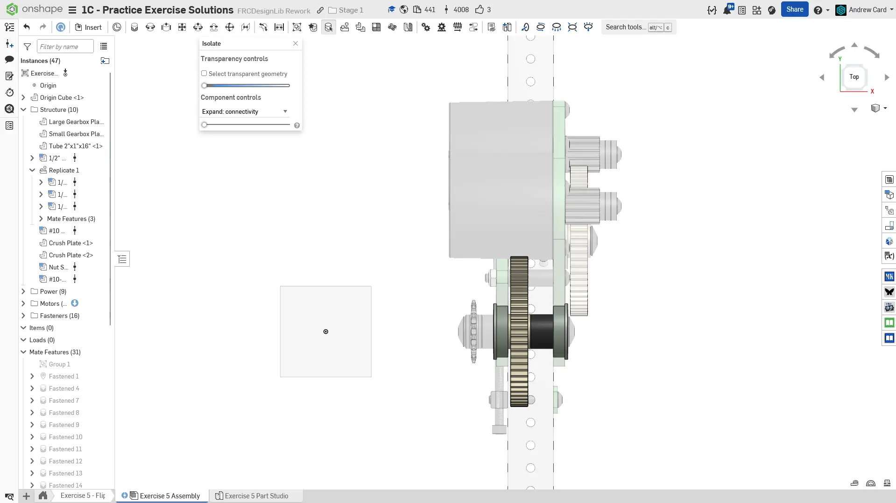
  We use a single 1/2" spacer rather than two 1/4" spacers on each side of the gear to reduce part count. In real life, it's much easier to assemble if there's only one spacer, and centering the gear between the bearings has no tangible benefit.

  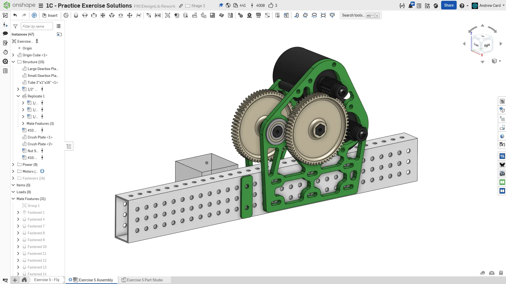
  Copy the crush plate and mate it to the other side of the tube.

  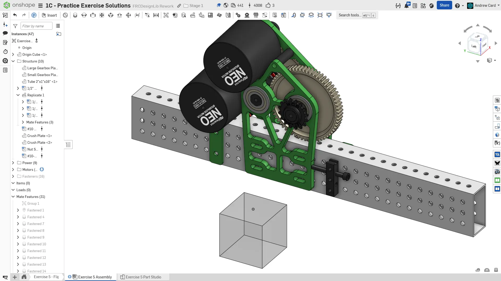
  Fasten a nutstrip to the other side of the crush plate you just added, with a bolt pressing onto the flat face of the gearbox plate. As explained before this prevents the gearbox from sliding from the force of the chain.

  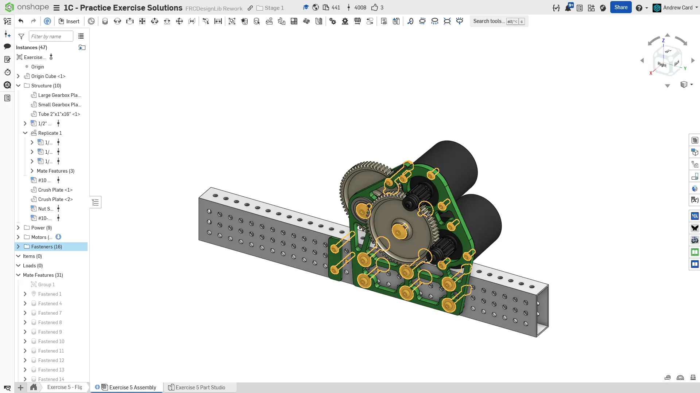
  Add fasteners to the assembly. Make sure all the fasteners on the slotted holes have washers to properly spread the bolt load over the slot. There should be washers on both the bolt head and the nut.

  
  To finish the assembly, organize your components into folders and name your replicates.
</Slides>

<Aside type="tip" title="Verification">
Make sure to have you and/or a more experienced member/mentor of your team [**review your CAD!**](/learning-course/stage1/1a/focusing-on-improvement) Your assembly should have 30 instances.
</Aside>

## Interference Detection

Catch errors in the CAD rather than in real life! Always double and triple check your CAD models for mistakes like interferences. An extra 10 minutes verifying the correctness of your CAD can save you hours of rework if an erroneous part slips through and is fabricated.

<Aside type="caution" title="Interference Detection">
If an interference is detected with the Check Interference tool, it will highlight the intersected volumes in red.
<ContentFigure src="../img/1c/flipped-gearbox/interference-check.webp" alt="Interference check">Interference between a motor and plate detected by the Check Interference tool.</ContentFigure>
</Aside>

