---
title: "Exercise 6: Direction Swap"
description: Model a direction swap mechanism
---

In this exercise, you will be modeling a power transmission with a direction swap gear.
This mechanism features features a 1:1 gear transmission that inverts the direction of the motor, which can be useful when you want two different shafts to be powered by the same motor but spin in opposite directions.
Be sure to pay attention to the layout and plate sketches when modeling.

## 3D Printed, COTS, and Custom Aluminum Spacers
So far, you've used both custom spacers generated with the `Spacer` Featurescript as well as COTS 3/8" OD spacers from FRCDesignLib (the [WCP Aluminum Spacers](https://wcproducts.com/products/aluminum-spacers)).
There are pros and cons to using COTS or custom spacers that you should discuss with your team.

3D printed spacers are a fantastic option for teams with 3D prints, they are cheap and easy to fabricate.
If you want to use aluminum spacers but do not have access to machinery to cut them (e.g. a lathe), COTS aluminum spacers can be a good option as they can also be pre-stocked.
However, they can be pricy and only come in certain lengths, though you can easily get around this by designing for standard spacer lengths.

<Aside type="example" title="Spacer Stock">
<ContentFigure src="../img/1c/direction-swap/spacers.webp" alt="Different spacer types">Spacers can be 3D printed (left), purchased as COTS pre-cut spacers (center), or fabricated in-house from spacer stock (right). (Image Source: WCP)</ContentFigure>
</Aside>

When modeling, it is recommended to use the `Spacer` Featurescript for spacers that you will fabricate in house (e.g. 3D printing or using [round tube stock](https://wcproducts.com/products/shaft-stock)) and use the configurable FRCDesignLib spacers for COTS spacers.
This helps make it clear which parts are custom and which are COTS.

## Part Studio Instructions

**Navigate to the "Exercise #6 Part Studio" tab** in your copied document and **refer to the solution document** to complete the part studio for this exercise. The **following instruction slides** only provide a general outline and some key details.

<Slides>
  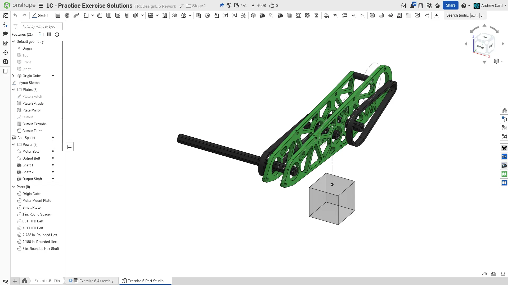
  Final Part Studio.

  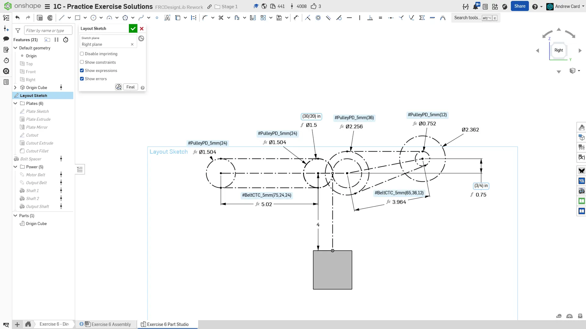
  Begin by creating the layout sketch on the right plane.

  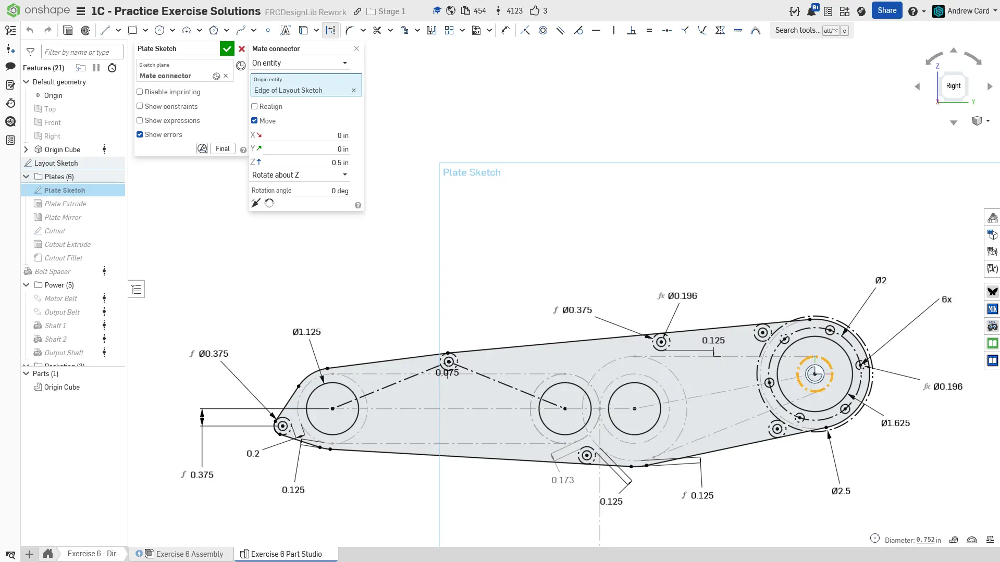
  Using a mate connector offset 0.5" from the Right plane as the sketch plane, sketch the plate. Pay close attention to the clearances used to define the edges of the plate. The location of the two spacers to the left of the motor are driven by the tangency between the 3/8" OD spacer and the 2.5" motor clearance circle.

  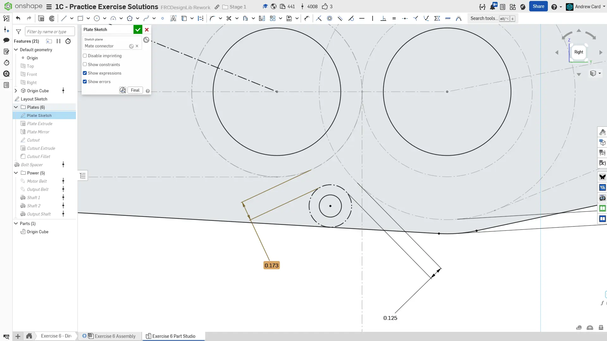
  Use a `Driven Dimension` to show the distance between the left gear and the spacer and verify that there is enough clearance. A driven dimension, as opposed to a driving dimension, just reports the distance between the selected elements and is faded gray to indicate that it does not define the sketch geometry.

  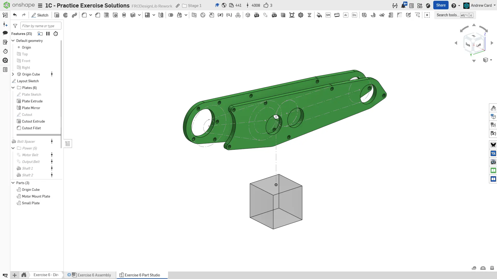
  Mirror the plate across the Right plane and add the motor cutout.

  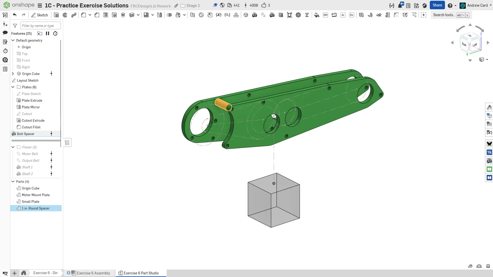
  If you choose to not use COTS spacers, you can use the `Robot Spacer` Featurescript to create the plate spacer.

  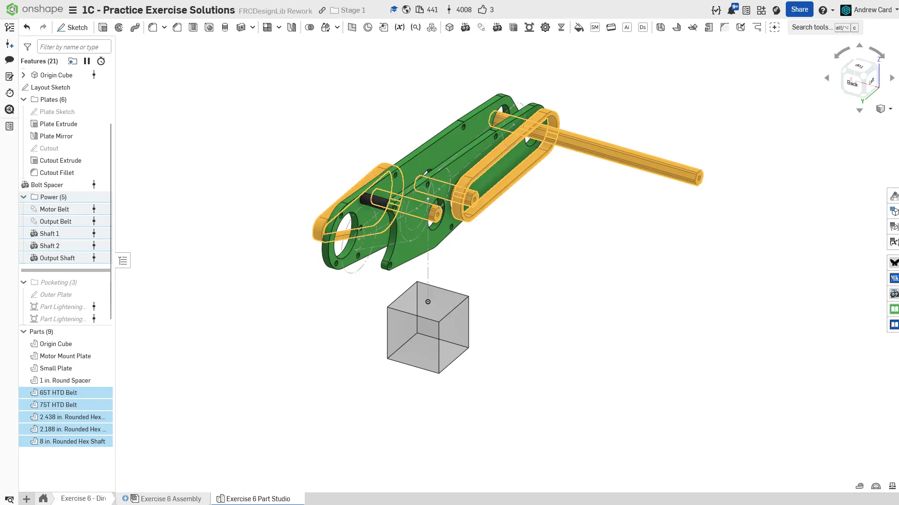
  Model all of the shafts and belts. You should be feeling very comfortable using the `Robot Shaft` and `Belt & Chain Gen` Featurescripts at this point.

  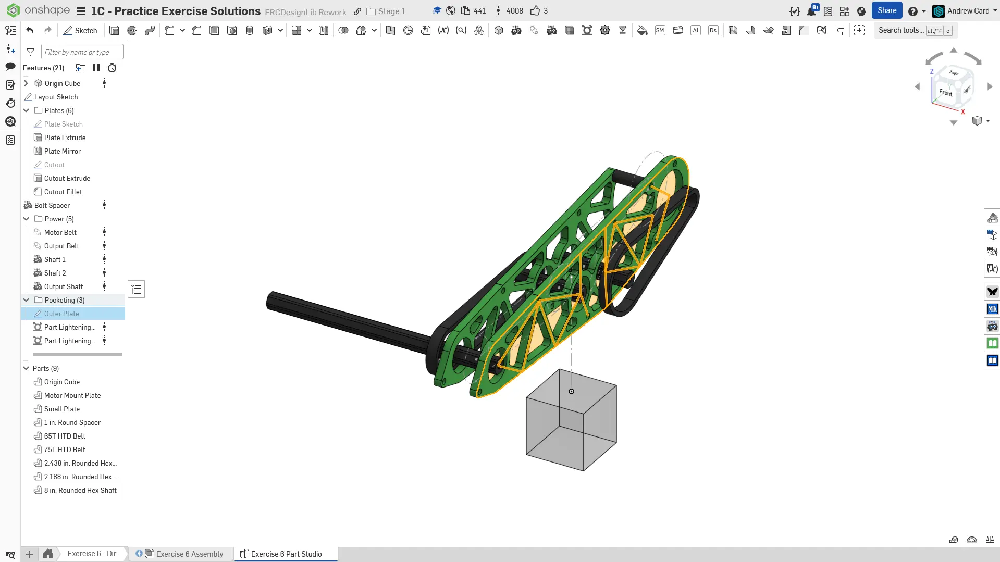
  Pocket the two plates. Since the plates are identical apart from the motor cutout, you can use same sketch to pocket both plates. Only create one sketch with the ribs.

  
  Finish the part studio by naming your features and organizing them into folders. Assign the part materials accordingly.
</Slides>

## Assembly Instructions

**Next, navigate to the "Exercise #6 Assembly" tab** in your copied document and **refer to the solution document** to complete the assembly for this exercise. The **following instruction slides** only provide a general outline and some key details.

<Slides>
  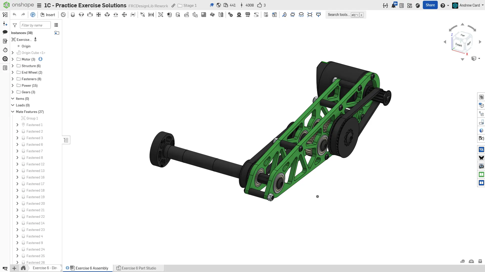
  Final assembly.

  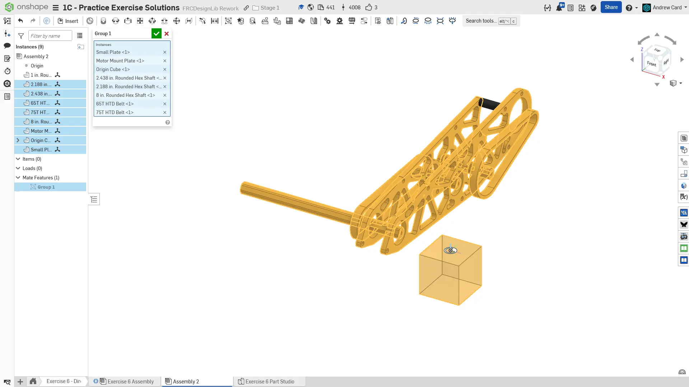
  Add the part studio parts to the assembly. Like before, group mate the rigid components with the Origin Cube and mate the Origin Cube to the assembly origin.

  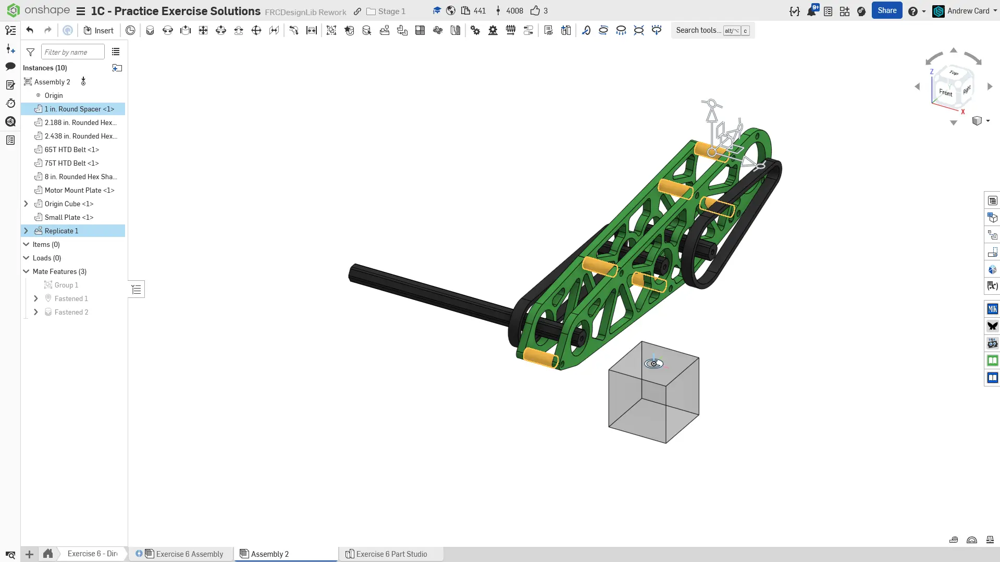
  Fasten the spacer to the plate and replicate it.

  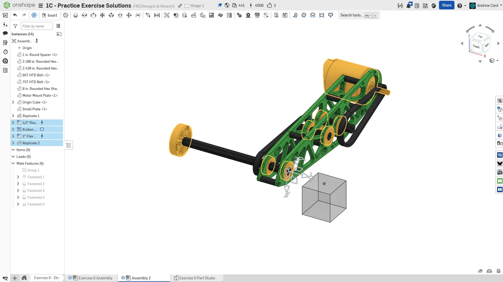
  Insert, fasten, and replicate the bearings. Also insert a 2" flex wheel and Kraken X60 motor from FRCDesignLib.

  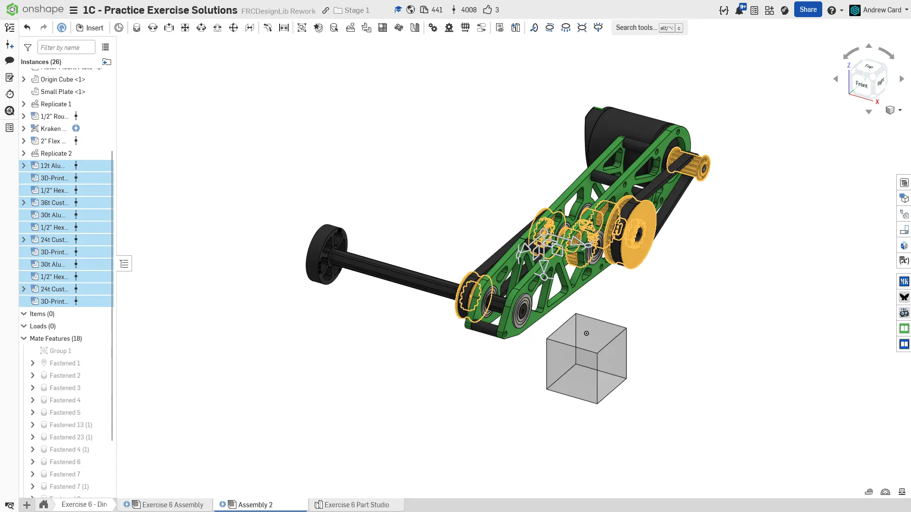
  Insert and fasten the pulleys and spacers. For the pulleys, you can utilize 3D printed HTD pulleys from the FRCDesignLib with 1/2" hex inserts. Also fasten the belts into place.

  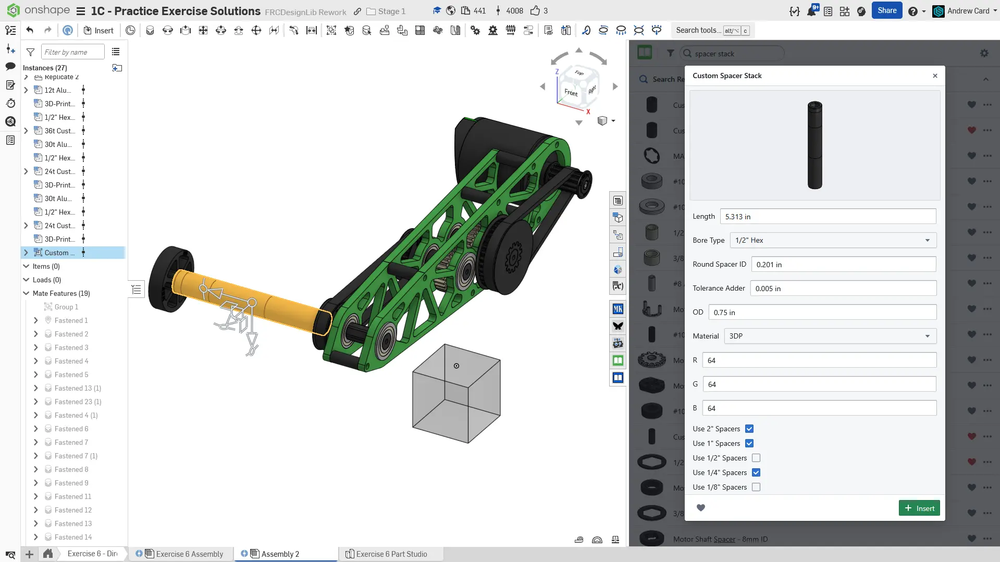
  Insert a configurable spacer stack from FRCDesignLib. The length should be the distance between the pulley and flex wheel. The spacer stack will display an error most likely. This error can be cleared by deselecting the spacer lengths not present in the stack. Alternatively you can make your own stack of COTS spacers, or use a single long custom spacer.

  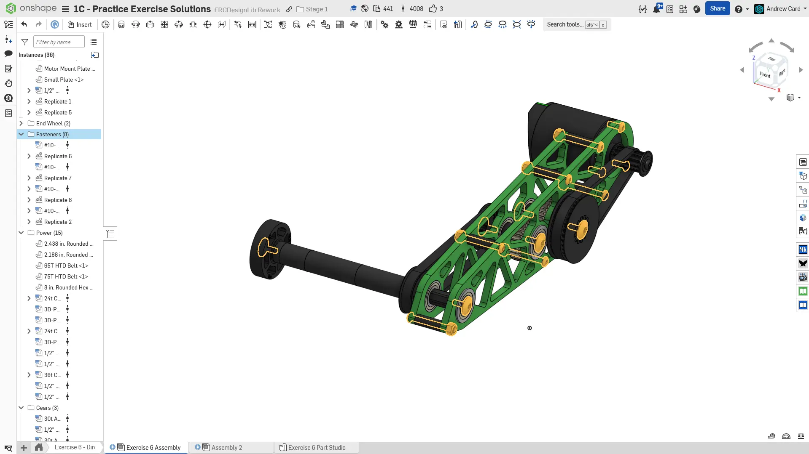
  Add in and replicate all of the required fasteners to complete the design.

  
  To finish the assembly, organize your components into folders and name your replicates.
</Slides>

<Aside type="tip" title="Verification">
Make sure to have you and/or a more experienced member/mentor of your team [**review your CAD!**](/learning-course/stage1/1a/focusing-on-improvement) Your assembly should about 40 instances.
</Aside>

## Driving and Driven Dimensions

In sketches, driving dimensions define and control the geometry, appearing black and editable.
Driven dimensions,on the other hand, are light gray and reflect existing geometry without altering it, useful for maintaining design intent like keeping a specific clearance or thickness.

To toggle between them, right-click the dimension and select "Driving/Driven" from the context menu - useful when a new dimension would over-constrain the sketch or when you need to inspect geometry without changing it.

<Aside type="tip" title="Switching Between Driving and Driven Dimensions">
Right-click the dimension and select "Driving/Driven" from the context menu.

<ContentFigure src="PuMO-vLOKvE" />
</Aside>

