---
title: "Exercise 7: Vertical Rollers"
description: Model vertical rollers
---

In this exercise, you will be modeling some vertical rollers. This mechanism features the Configurable Tube Roller System assembly and a 3D printed motor spacer. Be sure to pay attention to the layout sketch and assembly mating when modeling.

## 3D Printing to Reduce Part Count
3D printing can be used to create spacer blocks.
Rather than using multiple spacers to connect two components, we can opt to use a 3D printed block that combines all of the spacers into a single part, this reduces part count and makes assembly easier. This concept was also used in Exercise 4 on the climb hook to reduce the amount of spacers.

If you have a 3D printer, this can be a good option.

<ContentFigure src="../img/1c/vertical-rollers/3dp-spacer.webp" alt="3D printed spacer block" width="40%">Multiple spacers can be combined into single 3D printed block to reduce part count.</ContentFigure>

## Part Studio Instructions

**Navigate to the "Exercise #7 Part Studio" tab** in your copied document and **refer to the solution document** to complete the part studio for this exercise. The **following instruction slides** only provide a general outline and some key details.

<Slides>
  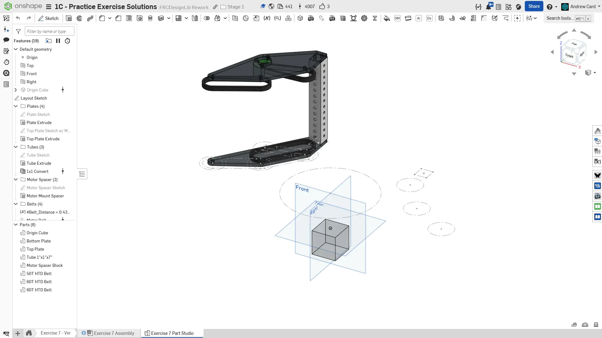
  Final Part Studio.

  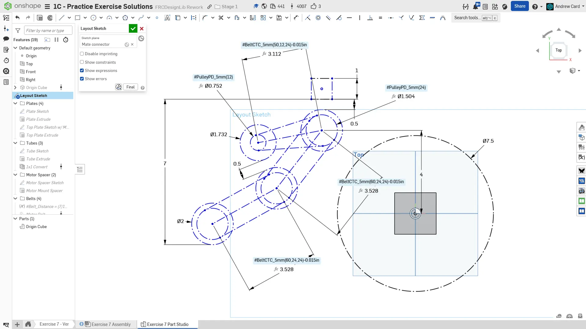
  Begin by creating the layout sketch on an offset mate connector 3" above the origin. We subtract 0.015" from each of the belt c-c's to reduce friction since we are linking multiple belts in series. This increases efficiency at the cost of backlash, which doesn't matter for this mechanism

  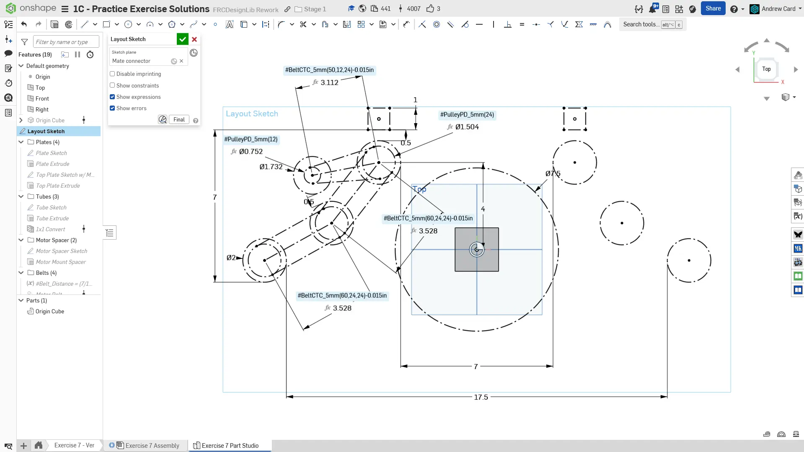
  Use the `Mirror` sketch tool to create a right hand reference for the rollers and tube location. Use the distance between the roller pairs to drive the roller locations.

  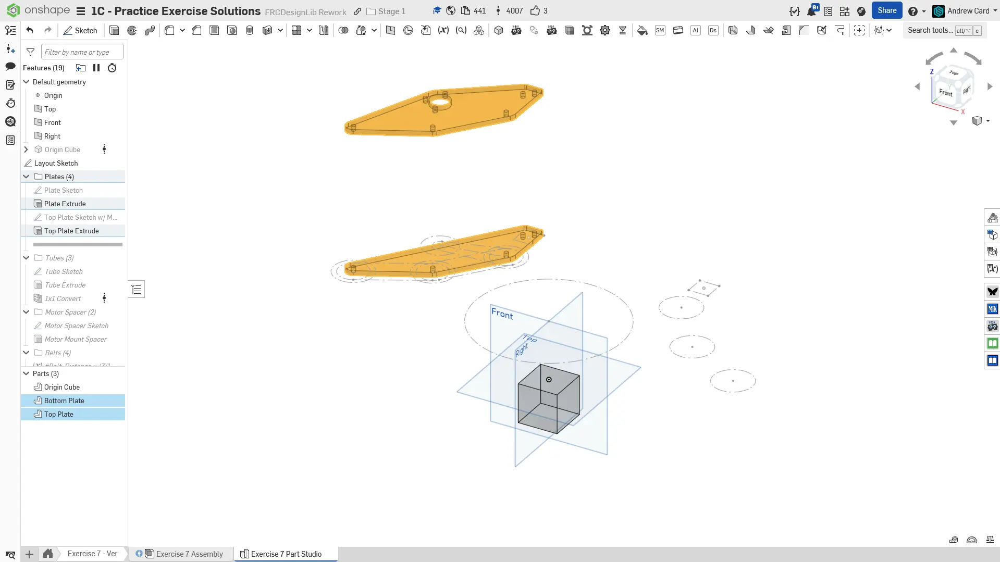
  Create the bottom plate. Then, create the top plate offset 7" from the bottom plate. Pay close attention to the plate sketches in the solution document. Note that the 1x1" tube plug requires a 4 holes spaced 3/8" apart from each other in a square pattern. We dont need all 4 so we will only use 2 of them.

  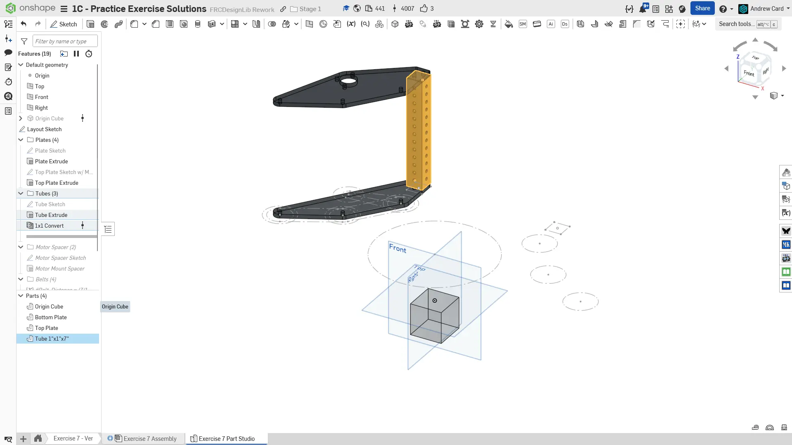
  Sketch, extrude, then tube convert the thin-wall 1x1 tube.

  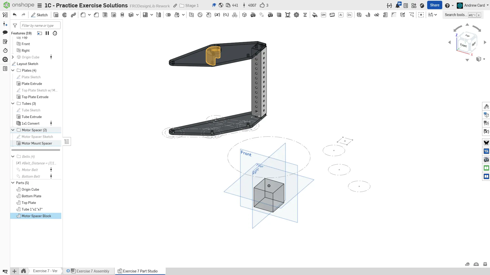
  Model the the 3D printed motor spacer block and extrude it to be 1" long.

  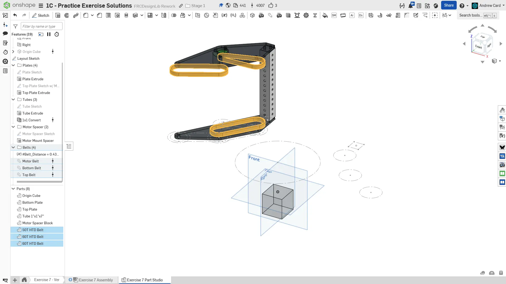
  Model the belts.

  
  Finish the part studio by naming your features and organizing them into folders. Assign the part materials accordingly.
</Slides>

## Assembly Instructions

**Next, navigate to the "Exercise #7 Assembly" tab** in your copied document and **refer to the solution document** to complete the assembly for this exercise. The **following instruction slides** only provide a general outline and some key details.

<Slides>
  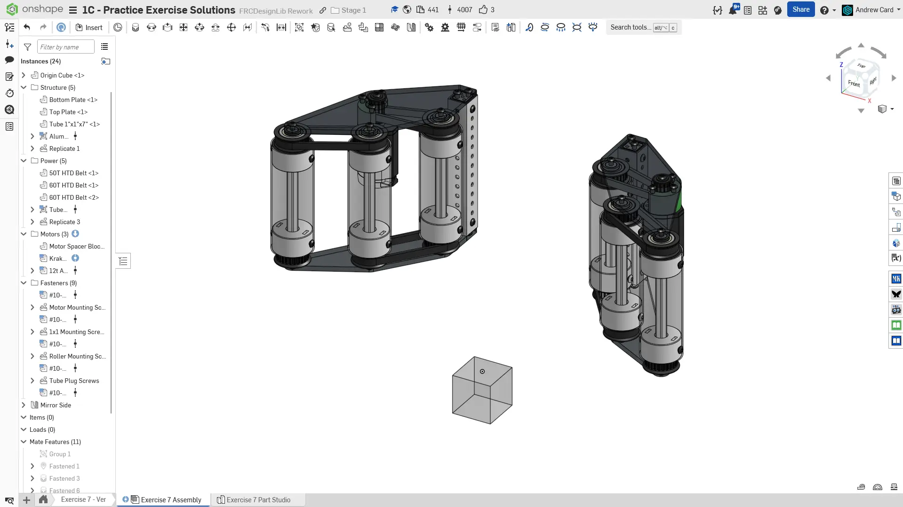
  Final assembly.

  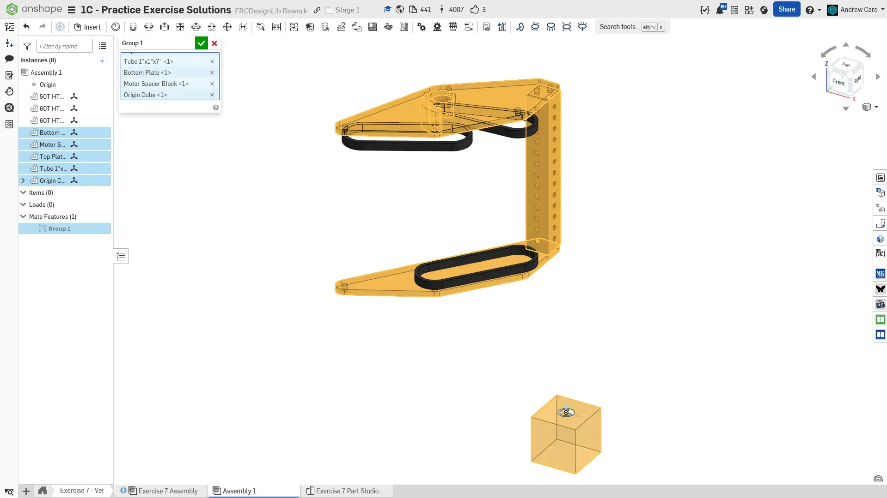
  Add the part studio parts to the assembly. Like before, group mate the rigid components with the Origin Cube and mate the Origin Cube to the assembly origin.

  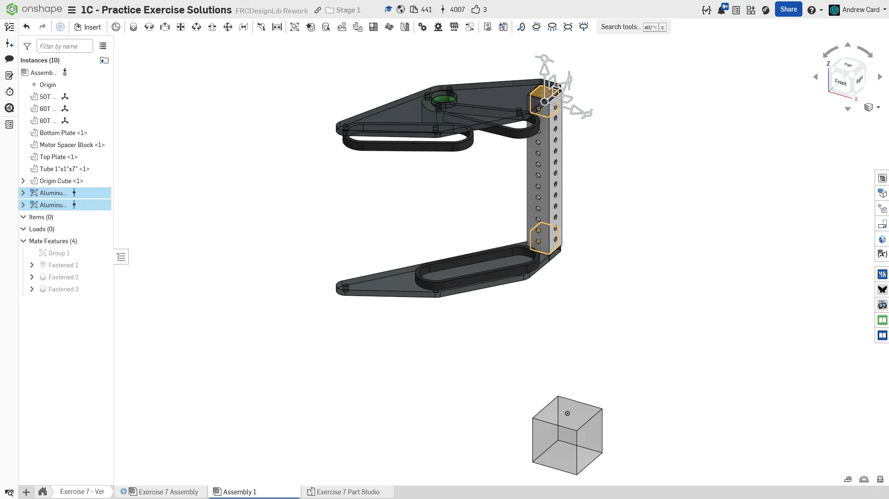
  Add 1x1 Tube Plugs to the vertical 1x1 tube.

  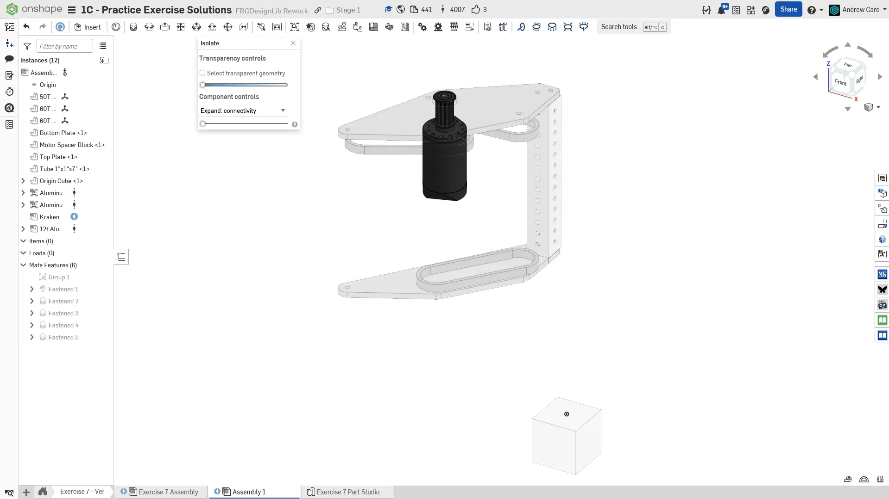
  Insert a Kraken X44 and 12t pulley into the assembly. Mate the pulley to the motor, and fasten the motor to the spacer.

  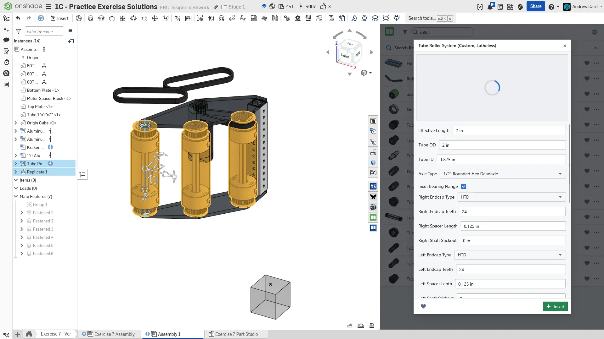
  Insert the "Tube Roller System" assembly from FRCDesignLib. Set the overall roller length to 7" and use 24T pulleys on each end. Duplicate and fasten the other 2 rollers.

  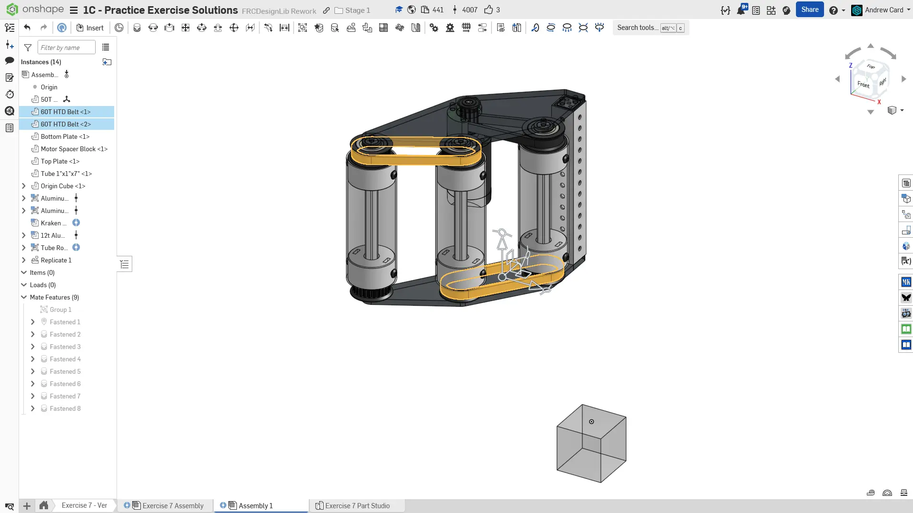
  Fasten the belts to the roller pulleys.

  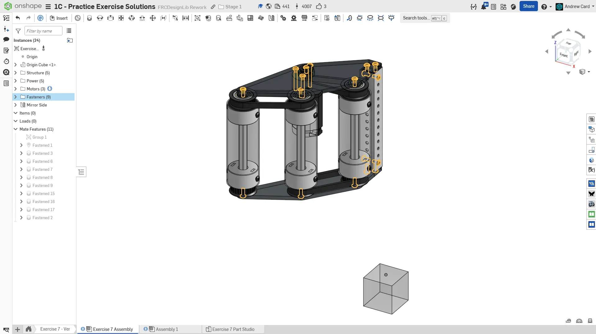
  Insert, fasten, and replicate all of the required fasteners.

  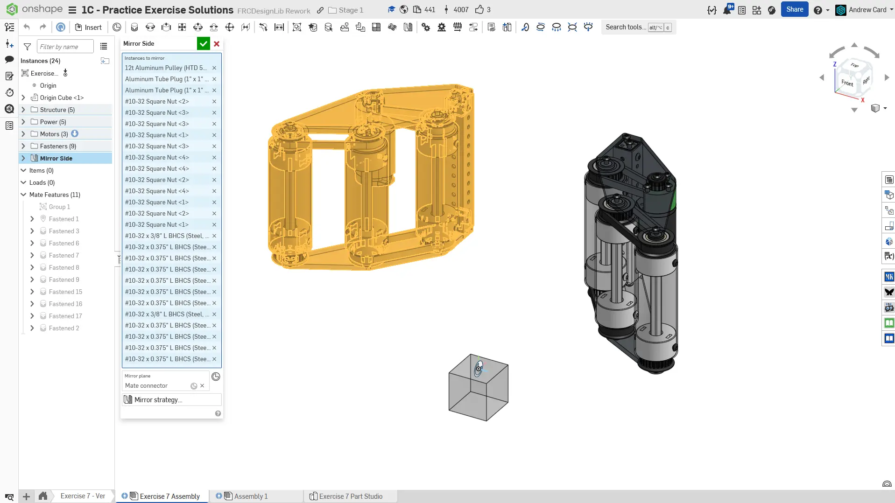
  Use Assembly Mirror to copy the left side assembly to the right side. Make sure all items have the mirror strategy set to transform so you don't end up making new parts.

  
  Finish the assembly by organizing your instances into folders.
</Slides>

<Aside type="tip" title="Verification">
Make sure to have you and/or a more experienced member/mentor of your team [**review your CAD!**](/learning-course/stage1/1a/focusing-on-improvement) Your assembly should have approximately 25 instances.
</Aside>

