---
title: "Exercise 8: Indexer Centering"
description: Model an indexer centering mechanism
---

In this exercise, you will be modeling a centering indexer for 9.5" diameter balls, similar to [1678's 2022 indexer](https://www.youtube.com/watch?v=RiUaItTKomU). This mechanism features belts, chain, gear, and tube crush blocks. Be sure to pay attention to the plate sketches when modeling.

## Part Studio Instructions

**Navigate to the "Exercise #8 Part Studio" tab** in your copied document and **refer to the solution document** to complete the part studio for this exercise. The **following instruction slides** only provide a general outline and some key details.

<Slides>
  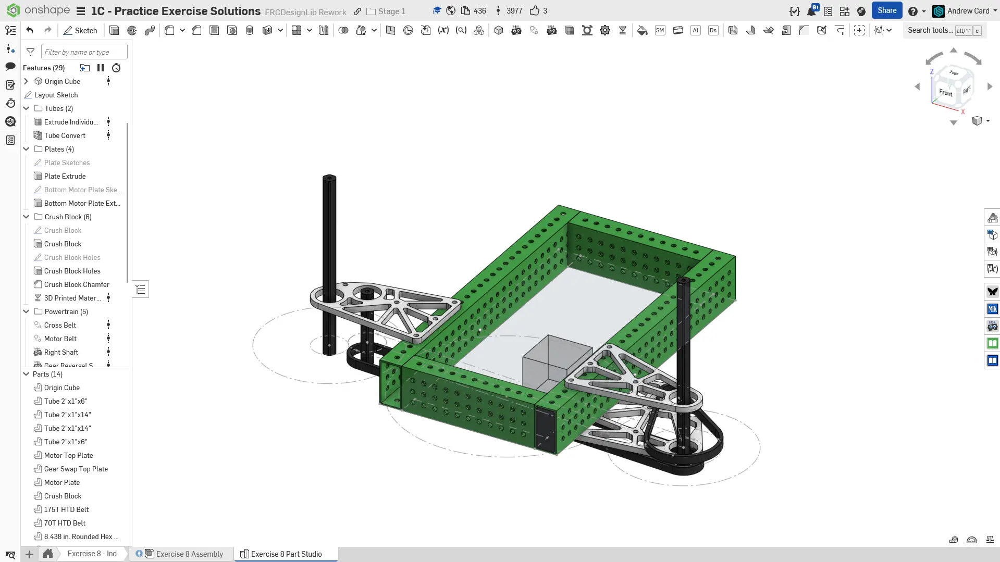
  Final Part Studio.

  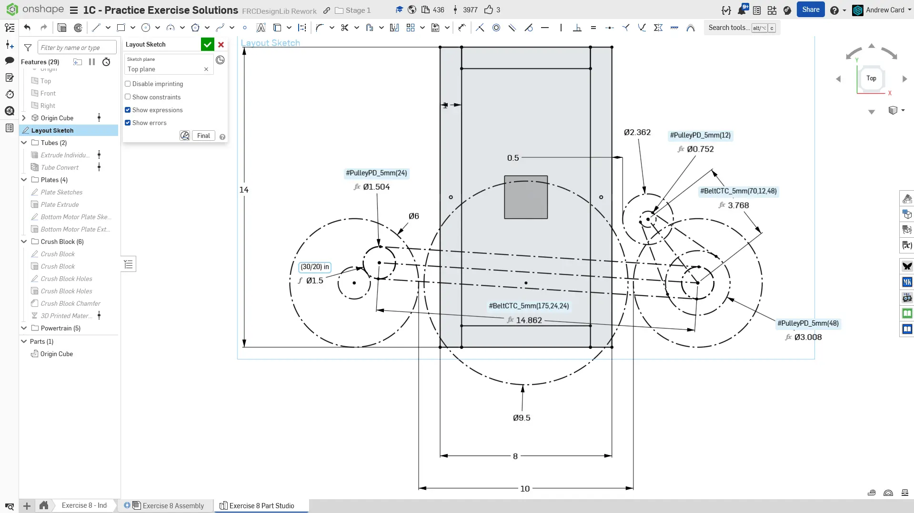
  Begin by creating the layout sketch on the top plane. Just like with the previous exercise, we define the distance between the rollers by mirroring the indexer wheel.

  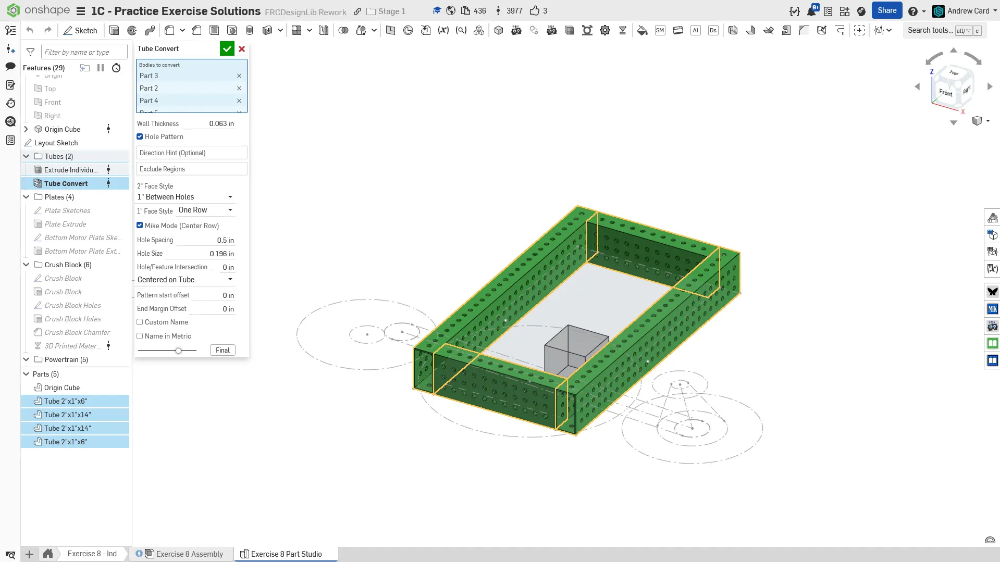
  Model the thin-wall 2x1 tubes with Extrude Individual and Tube Converter.

  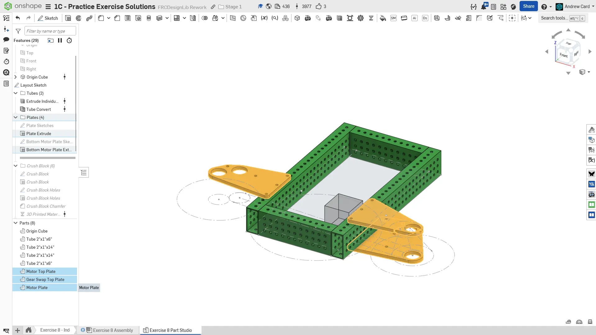
  Model the top plates and bottom plates. The top plates can be modeled in the same sketch since they are on the same plane.

  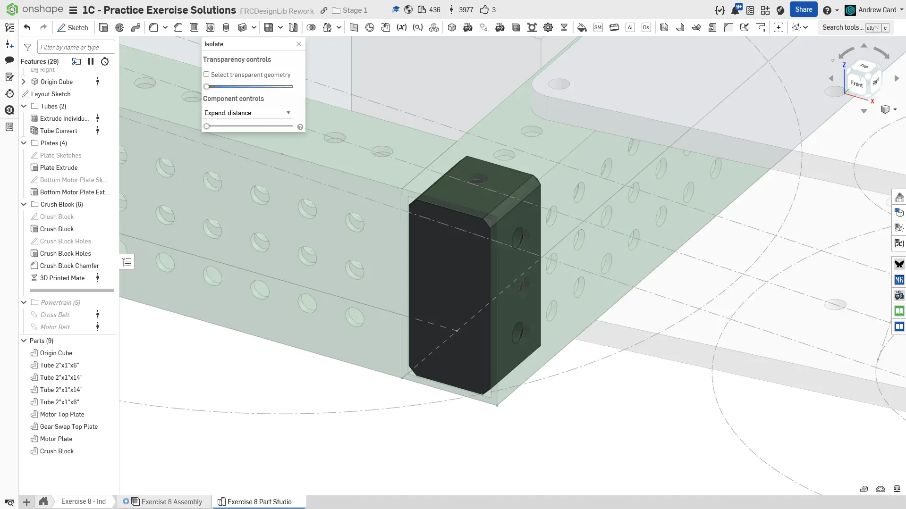
  Model a basic crush block that extends into the tube far enough for the first row of holes. Make sure to add the side holes for the bolts to pass through. Chamfer the edges to make it easier to install during IRL assembly.

  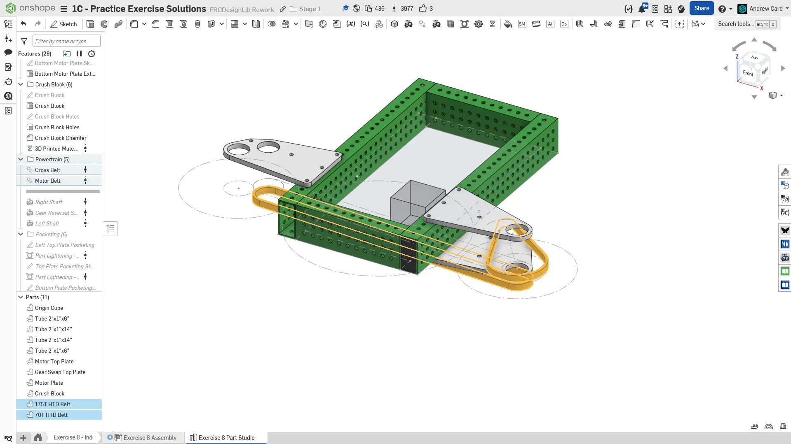
  Model the belts using the `Belt & Chain Gen` Featurescript.

  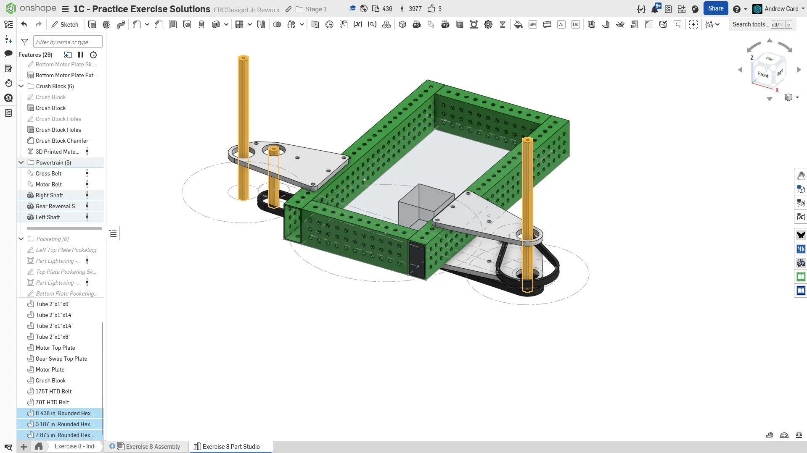
  Model the shafts `Robot Shaft` Featurescript. The exact length of the longer shafts is somewhat arbitrary for this exercise, just make them semi long as shown.

  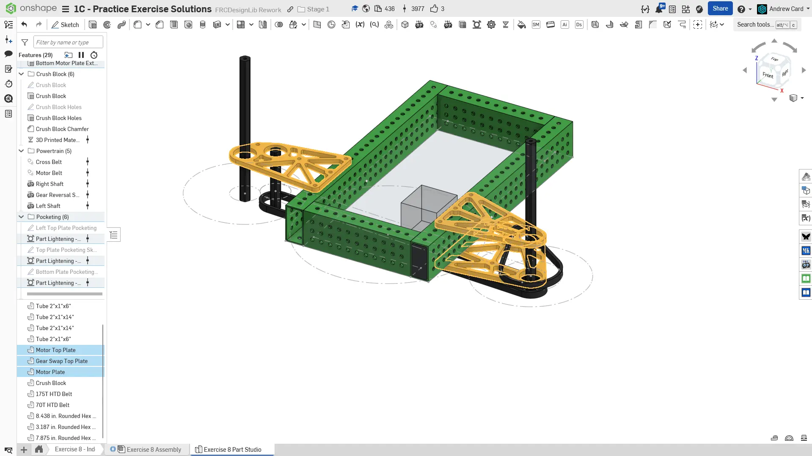
  Pocket the plates using the `Part Lighten` featurescript. Recall that you can select an entire sketch to automatically select all the ribs.

  
  Finish the part studio by naming your features and organizing them into folders. Assign the part materials accordingly.
</Slides>

## Assembly Instructions

**Next, navigate to the "Exercise #8 Assembly" tab** in your copied document and **refer to the solution document** to complete the assembly for this exercise. The **following instruction slides** only provide a general outline and some key details.

<Slides>
  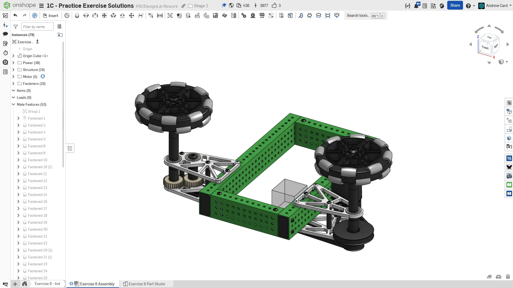
  Final assembly.

  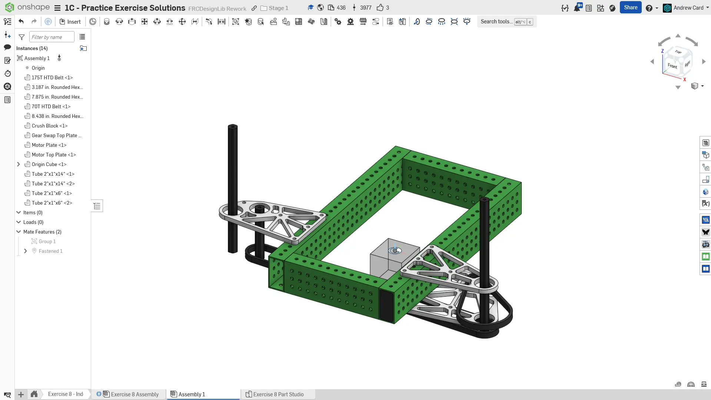
  Add the part studio parts to the assembly. Like before, group mate the rigid components with the Origin Cube and mate the Origin Cube to the assembly origin.

  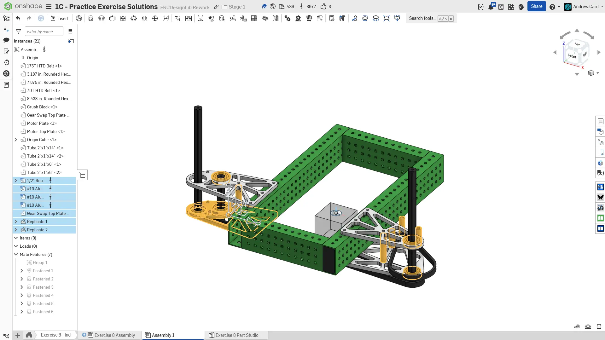
  Insert, fasten, and replicate the 2" long, 3/8" OD plate spacers. Insert, fasten, and replicate the 1.25" long, 3/8" OD motor spacers. Copy and fasten the bottom gear plate to the 2" spacer. Insert, fasten, and replicate the 1/2" rounded hex shaft bearings.

  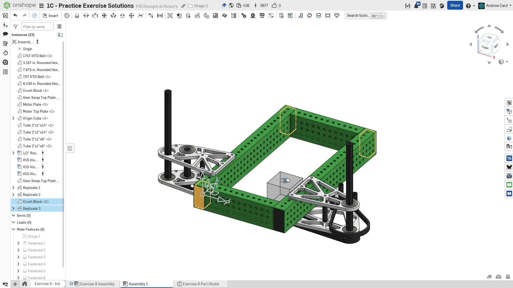
  Copy, fasten, and replicate the 3D printed crush block to the other tube ends.

  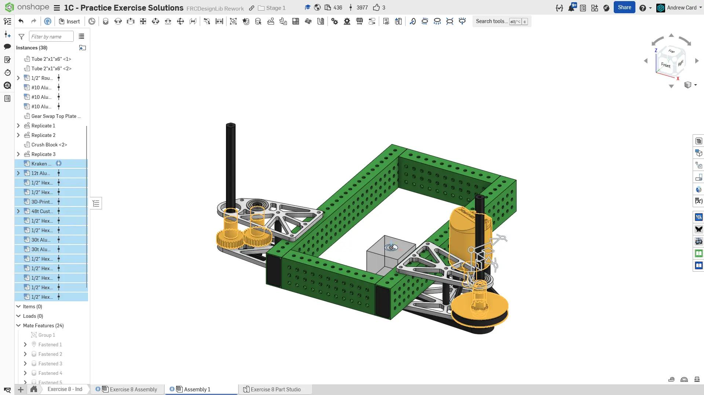
  Insert and fasten the motor, motor pulley, 48T 3D printed HTD pulley with 1/2" hex insert, 30T gears, and configurable spacer stacks from FRCDesignLib. Fasten the belt to the pulley. Also fasten the shafts.

  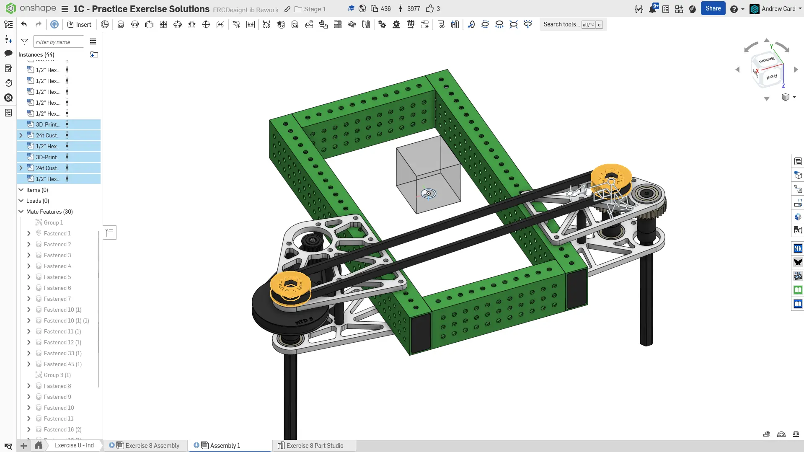
  Insert and fasten the bottom belt pulleys.

  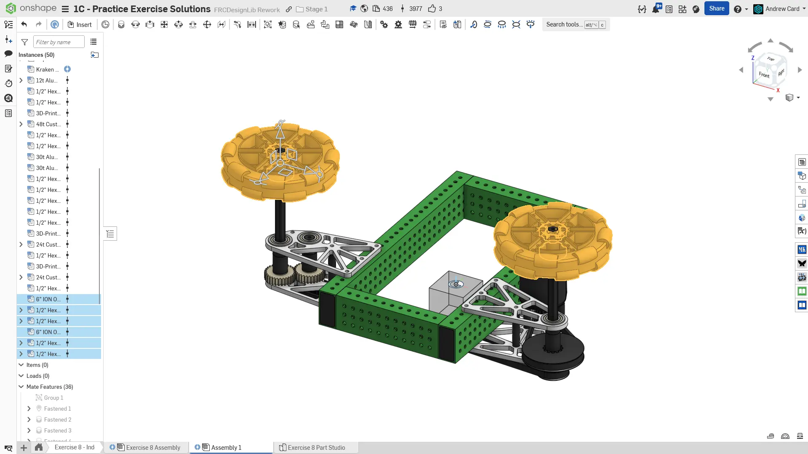
  Insert and fasten the 6" REV Omni-wheels and 1/2" Hex MAXHubs from FRCDesignLib. Fasten the hubs to the wheels and fasten the wheel assemblies to the long shaft ends.

  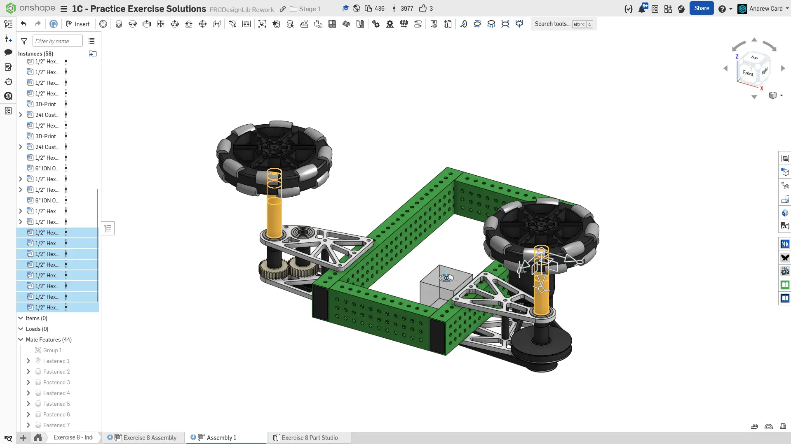
  Insert, configure, and fasten 1/2" Hex spacers to fill the gap between the wheel's and plates. These can either be stacked COTS spacers, or a single custom spacer depending on preference.

  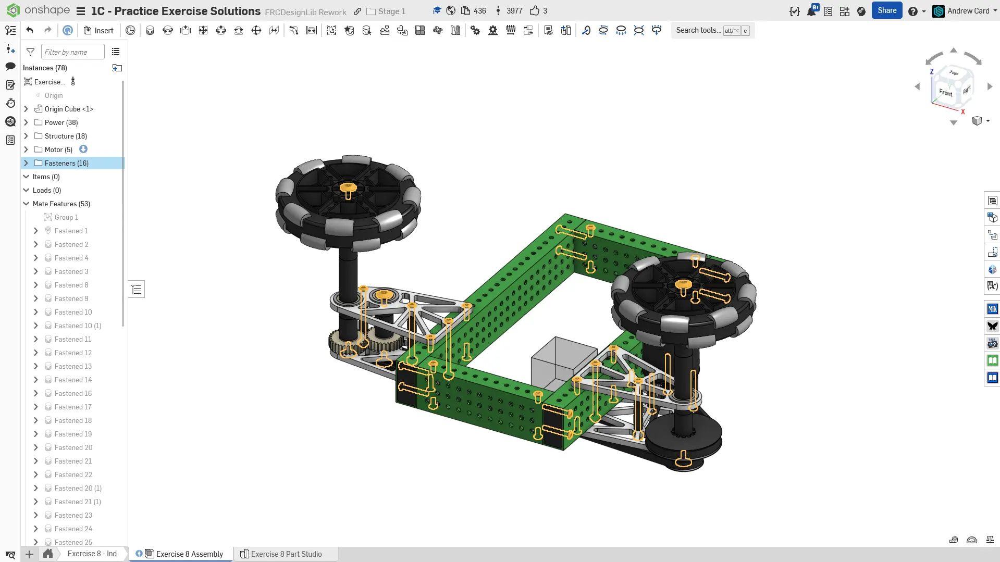
  Insert, fasten, and replicate all of the required fasteners.

  
  To finish the assembly, organize your components into folders and name your replicates.
</Slides>

<Aside type="tip" title="Verification">
Make sure to have you and/or a more experienced member/mentor of your team [**review your CAD!**](/learning-course/stage1/1a/focusing-on-improvement) If everything is present, modeled, and assembled correctly, you should have about 80 instances in your assembly.
</Aside>

