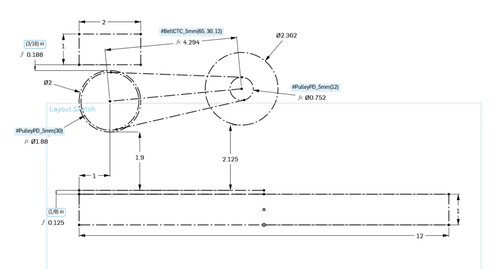
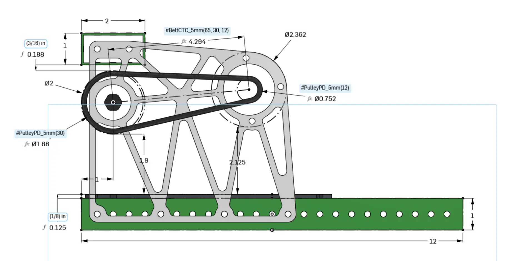
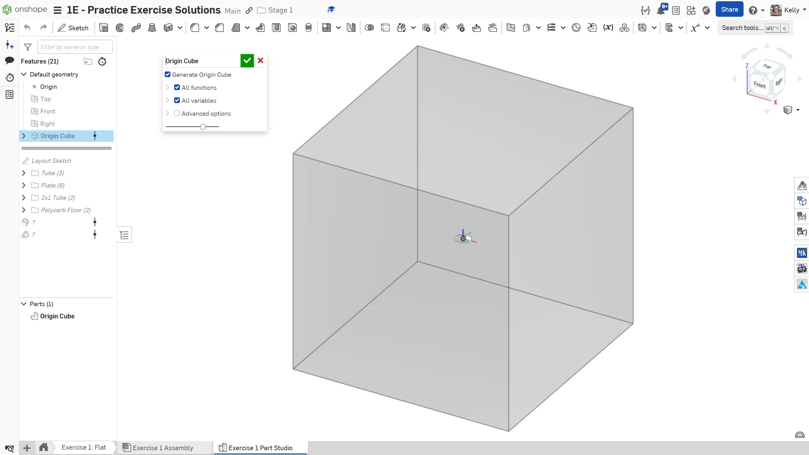
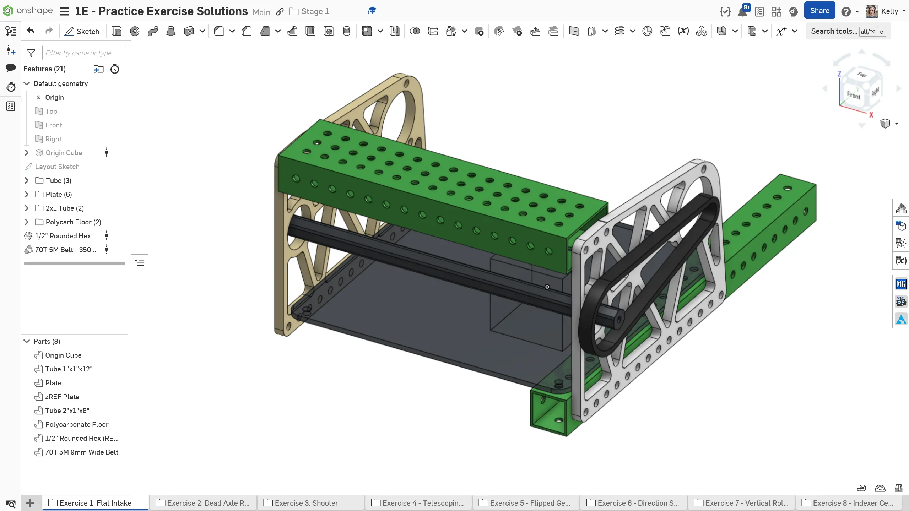

---
title: Practice Mechanisms Introduction
description: Introduction to practice mechanisms
---

Welcome to stage 1C! In this stage, you will be modeling a number of different mechanisms to practice your CAD skills and execution of small details. You will be introduced to new COTS parts and Onshape tips and tricks along the way to help your workflow.

Because these mechanisms are designed specifically to help practice skills and introduce concepts, they are modeled out-of-context of a full robot.
While these mechanisms do include some good design techniques, they are not necessarily complete systems. The models are strictly for CAD practice and not recommended for use on real robots.

## Layout Sketches

Make sure to use a layout sketch for each mechanism, like the ones introduced in the Stage 1B exercises. Layout sketches are helpful at any scale, letting you define key dimensions in a single sketch, which makes it easy to adjust when needed.

<Aside type="tip">
Add the components that drive the design to the layout sketch (i.e. power transmission, game piece path, rollers, etc.) while keeping specific part details in their own sketches and features (i.e. a separate sketch for the bearing holes and plate outline, to be extruded).
</Aside>

<Slides>
  
  Exercise 1 layout sketch. Notice that only key geometry details are included in the layout sketch.

  
  Exercise 1 side view. Notice how the layout sketch drives the geometry of the mechanism.
</Slides>

<Aside type="note">
The concept of layout sketches will be expanded upon later when you start to use them in the context of a robot.
</Aside>

## Maintaining Consistent Origins

As mentioned in previous sections of Stage 1, you should maintain a consistent origin between your part studio and assembly. You will use the [`Origin Cube` Featurescript](https://cad.onshape.com/documents/321c197a842fc5f1a29e6621/w/fc3cdd5ca7edcd93e02f13cc/e/2b321cb91b74224b9c14b433) to achieve this. **Make sure that the origin cube is always the first feature in any part studio.** The below slides provide a demonstration of how to use the origin cube.

<Slides>
  
  Place the Origin Cube featurescript as the first feature in the part studio.

  
  Model your mechanism.

  
  Insert the part studio into the assembly with the green checkmark. Group all static parts together with the Origin Cube part, then fasten the mate connector on the Origin Cube to the origin of the assembly.
</Slides>

Following these steps will allow the origin of the assembly to be tied to a part that will never change or disappear. The position of the other parts relative to the origin cube will consistent with the part studio, even when things are changed in the part studio. This will be particularly useful for flexible assemblies, such as an arm or elevator, in stage 2 and beyond.

