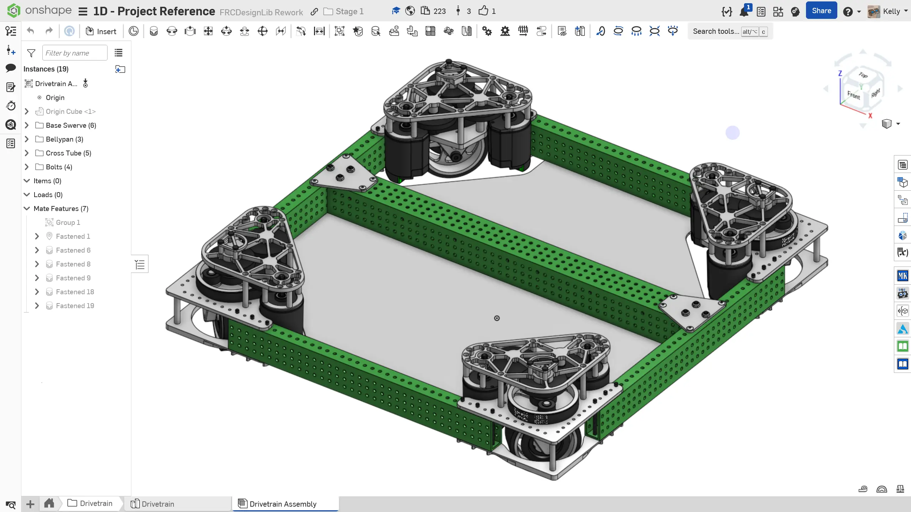
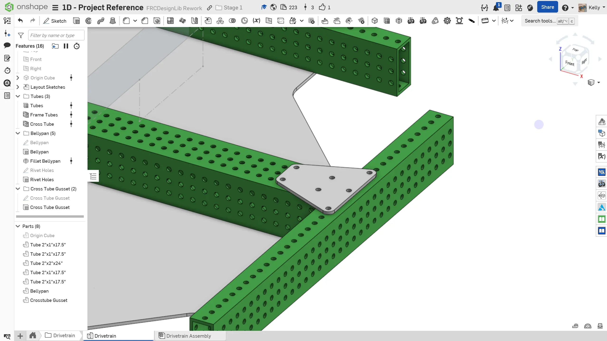
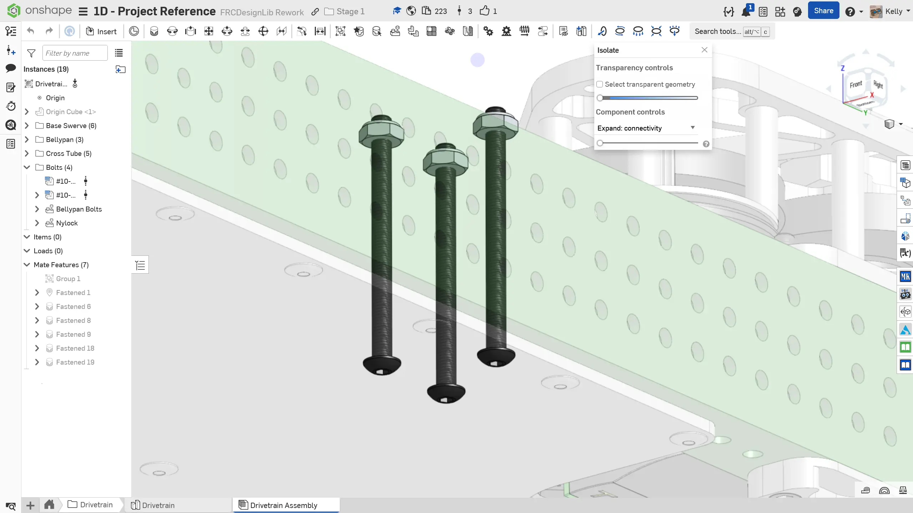

---
title: Adding More Components
description: Adding additional components to the design
sidebar:
  order: 6
---

## Adding More Components

When you model more parts in the part studio, you can insert them into the assembly in a similar to fashion to before. Hit insert and immediately click on the green checkmark. Then, edit the initial `Group` you made and add the part to the group. By doing this, you ensure that added parts will always stay in the same place it was modeled in the part studio.

Let's add a gusset to connect the 2"x2" tube to the 2"x1" tube.

### Instructions

Start by **navigating to the `Drivetrain` Part Studio** in the `Drivetrain` folder. **Follow the instructions in the slides** to add the gusset.

<Aside type="tip" title="Manually Define Mounting Holes">
When you project the holes off of the tube or use the gusset featurescript, those references can break easily if the tube converter or length of the tube gets changed. Try to dimension manually defined holes from the edge of the tube or only project one hole and use a linear pattern to minimize the amount of things you need to fix if something changes.

<ContentFigure src="../img/1d/define-holes.webp" alt="Manually defined mounting holes" width="60%" border />
</Aside>

<Slides>
  
  Finished drivetrain assembly.

  
  Sketch and extrude a 1/8" thick gusset to connect the crosstube to the top of the frame using the holes shown.

  
  Insert the gusset into the assembly and add it to the Group.

  
  Add 2-1/2" #10-32 bolts to the three holes in the bellypan on each side so they go through the gusset holes on the other side. Add nylock nuts to the holes on the gusset. As you learned in 1C, this is to help prevent rivets from loosening and falling out over time.

  
  Edit the replicate feature to add rivets to the gusset.

  
  Mirror the gusset, bolts, and rivets to the other side of the drivetrain using a mate connector on the origin cube.

  
  Finished drivetrain assembly.

</Slides>

Make sure you sort the instances in your assembly into folders (i.e. frame, swerve modules) and name any patterns and replicates used. This will help you locate components in the assembly later down the line.

<Aside type="tip" title="Verification">
Make sure to have you and/or a more experienced member/mentor of your team [**review your CAD!**](/learning-course/stage1/1a/focusing-on-improvement/)

Your assembly should weigh approximately 37.2lbs.

Your tab manager should have the following tabs and folder:

<ContentFigure src="../img/1d/tab-manager.webp" alt="Tab manager view" />
</Aside>

### Level of Detail

It should be noted that while modeling every detail of the robot hardware (bolts, rivets, nuts) is beneficial for purchasing and real life assembly purposes, it isn't strictly necessary. Time is a precious resource, especially during build season, so you should spend it on what will give you the biggest return.

More details about best practices for Onshape assemblies are included on the [Assembly Best Practices Page](/best-practices/assembly-setup/).
