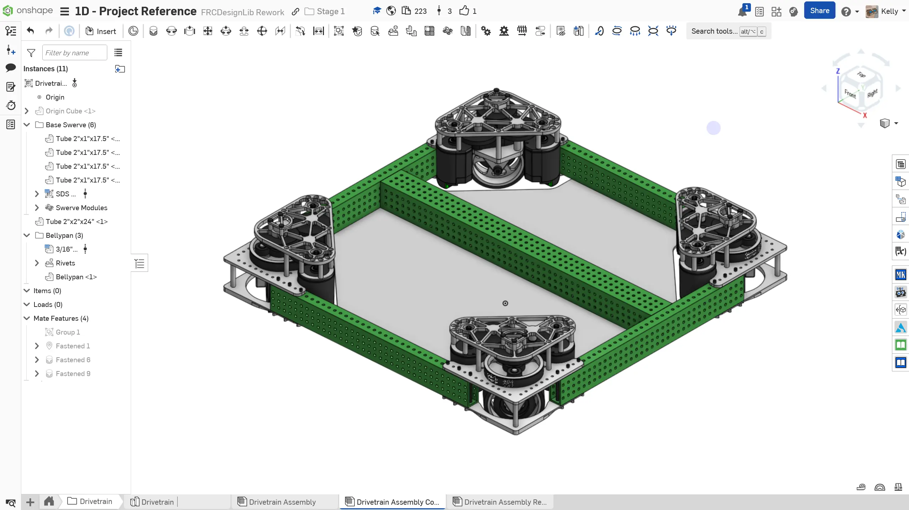
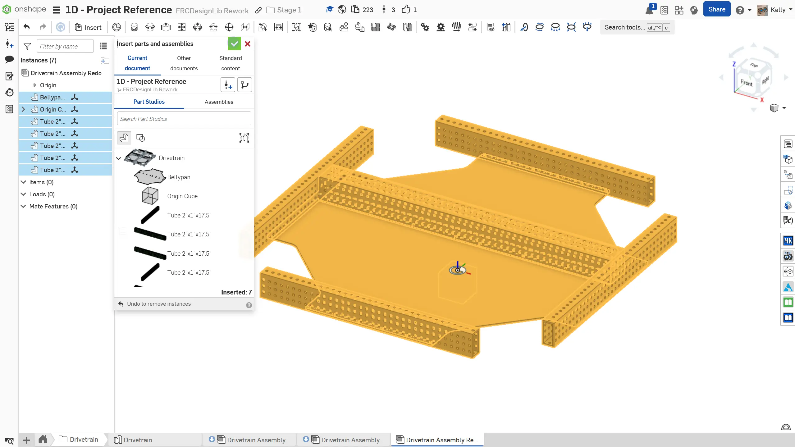
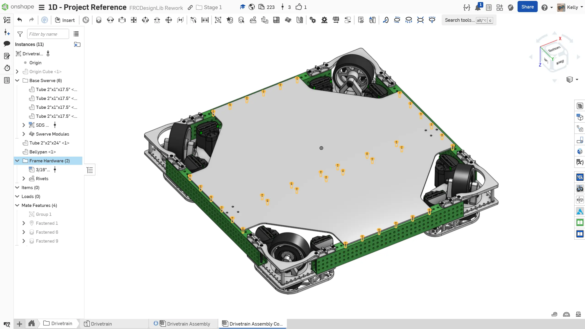

---
title: Assembly
description: Assembly modeling
sidebar:
  order: 5
---

## Assembly

Now that the part studio is finished, you can create the drivetrain assembly.

Just like with the practice exercises in the previous stage, after inserting and grouping all of the parts, you should fasten the origin cube to the origin of the assembly. This aligns the part studio origin and assembly origin.

### Instructions

Start by **creating a new assembly tab called `Drivetrain Assembly`** in the `Drivetrain` folder. **Follow the instructions in the slides** to complete the assembly.

<Slides>
  
  The assembly.

  
  Add the part studio parts to the assembly. Like before, group mate the rigid components with the Origin Cube and mate the Origin Cube to the assembly origin.

  
  Insert the simplified MK4i module from FRCDesignLib into the assembly and mate it into place.

  
  Use the Circular Pattern assembly tool to finish assembling the modules.

  
  Insert, fasten, and replicate the 3/16" Aluminum Blind Rivet (WCP) (.125" - .250" Grip Length) from FRCDesignLib onto the bellypan holes. Make sure to leave the three holes shown in the image empty on each side for bolts to be added when the gusset is modeled and added.

  
  To finish the assembly, organize your components into folders and name your replicates.

</Slides>

### Rivet Grip Length

As was mentioned in 1A, When selecting rivets to insert from the part library, you'll notice they have a configuration for **grip length**. The grip length of a rivet is the total thickness of material it can fasten together. Make sure you choose the appropriate grip length or they can either come out easily or not fasten the material together.

<ContentFigure src="../img/1d/pop-rivet-steps.webp" alt="Pop rivet installation steps" border>Image Credit: https://animalia-life.club/qa/pictures/types-of-pop-rivets</ContentFigure>
