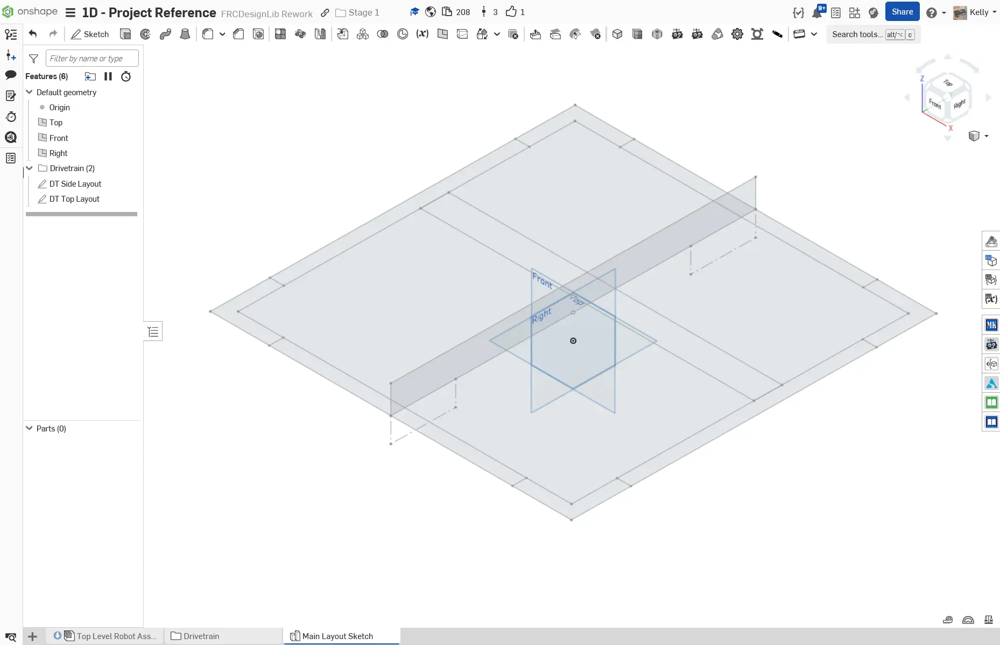
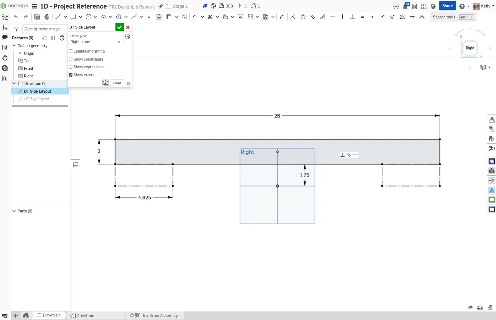
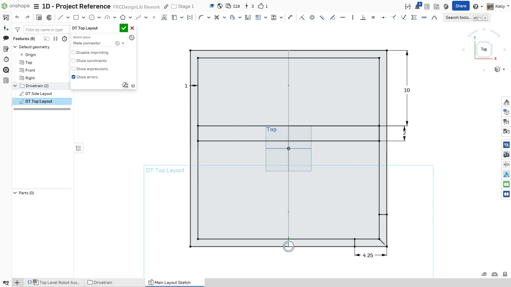

---
title: Layout Sketch
description: Creating a layout sketch
sidebar:
  order: 3
---

## Drivetrain Layout Sketches

To begin, you will be creating a layout sketch of the drivetrain. This will dictate the size and position of the drive tubes. The layout will be drawn from the side and top view of the drivetrain. For your swerve drivebase, you will make it 26" x 26".

### Instructions

Start by **creating a new Onshape Document called `Stage 1D Robot`** and within it, **a new part studio called `Main Layout Sketch`**. Then, use the `Origin Cube` Featurescript to create an origin cube. **Follow the instructions in the slides** to complete the layout sketch.

<Slides>
  
  The final layout sketch.

  
  Draw the side profile of the drivetrain on the Right Plane. We place the tube 1.75" from the ground, which is the offset from the ground to the bottom of the tube for the MK4i modules. Then, draw the wheel clearance box, which represents the area that the wheel takes up. For the MK4i modules, the box is 4.625" wide.

  
  Create the top layout sketch by using the bottom mate connector on the vertical line of the side layout. Utilizing auto-generated mate connectors for sketch planes is a very useful tool to have. Press the "Top" button on the view cube to get a top view.

  
  Sketch the top outline of the drive base. Make the rectangle a square and set the side length equal to the length of the side layout tube. This ensures that the size of the top layout always matches the side layout, which makes the design parametric. Notice that the sketch is fully defined despite having no sketch dimensions.

  
  To sketch the tubes, draw a square 1" smaller than the previous square. This will represent the four 2"x1" tubes that make up the outer frame. Then, draw the top profile of the 2"x2" tube. At the bottom right corner, draw two lines, each offset by 4.25" from the edge. This is the required offset for MK4i modules. Other modules will differ.

  
  To apply the cutout for all four tubes, we use the Circular Pattern sketch tool to copy the lines to all four corners. For a Circular Pattern we first define the number of instances and then the axis of rotation.

  
  Finally, name your sketches and organize them into folders in the feature tree. Your sketches should all be fully defined.

</Slides>

As previously explained, this method of top-down modeling is extremely powerful as it enables you to capture the most important dimensions all in one place. However, you should be careful to not over-detail layout sketches. You will be practicing layout sketches all throughout Stage 2, and use them in Stage 3 alongside multi-document practices to design a whole robot.
