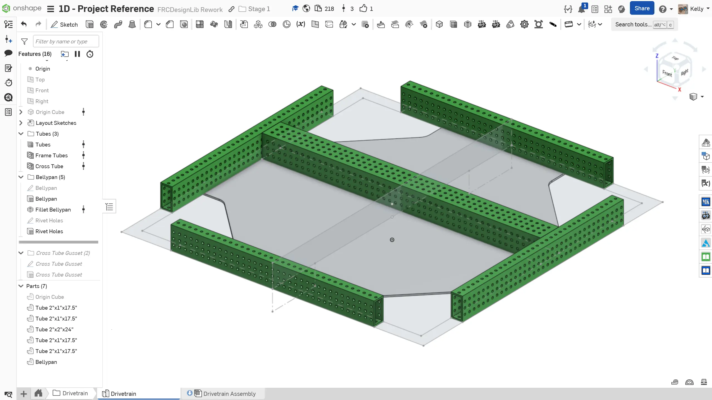
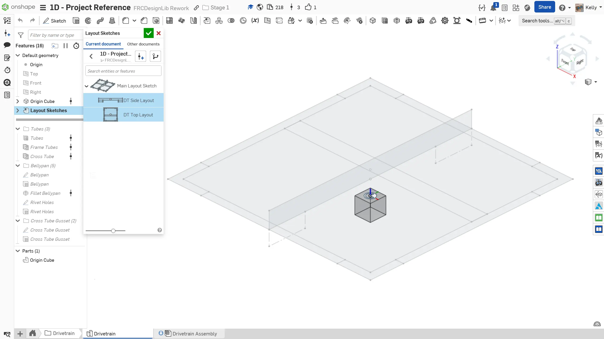
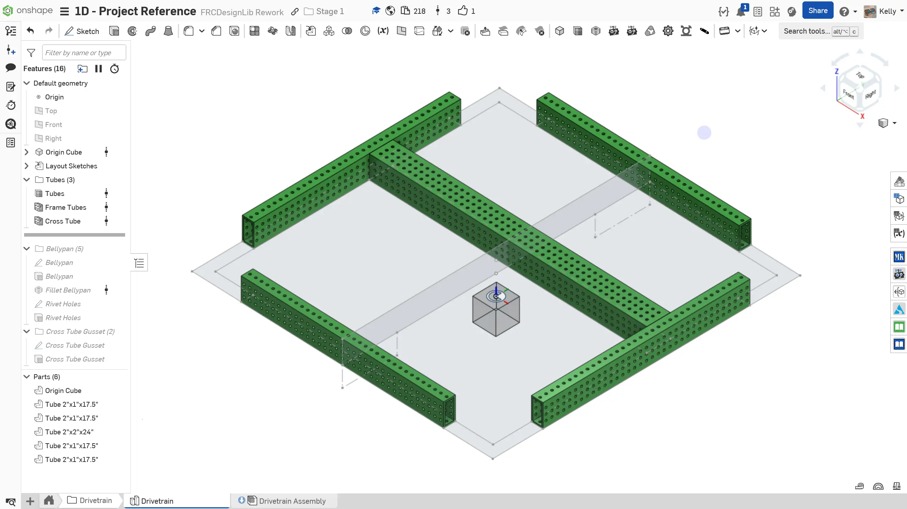
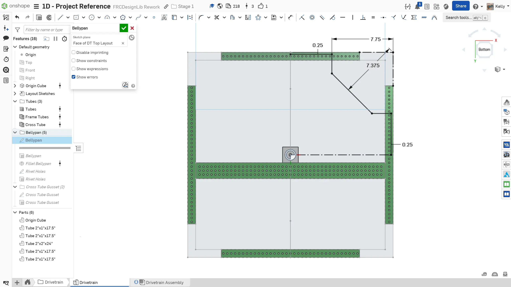
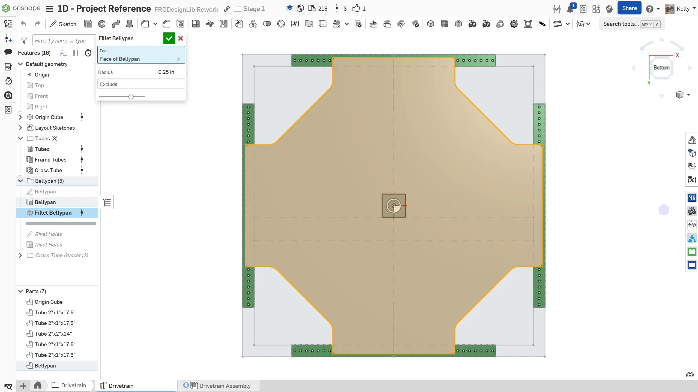
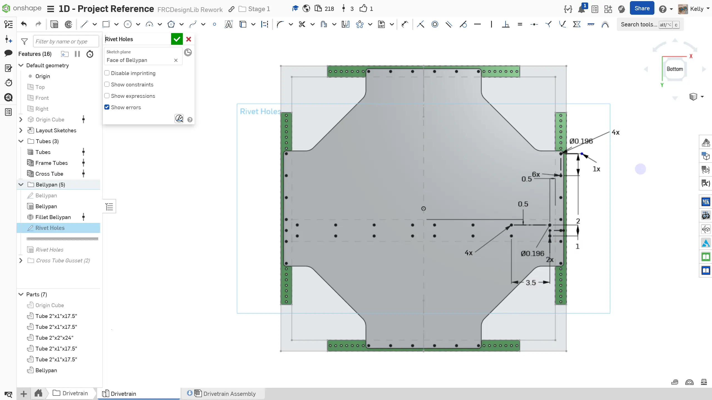

---
title: Part Studio
description: Part studio modeling
sidebar:
  order: 4
---

## Deriving Layout Sketches and Part Modeling

Now that you have created the layout sketch, you can begin modeling the individual parts. The critical dimensions of the parts, such as the length of the tubes, will be driven by the layout sketch. This way, the tubes will automatically update with any changes in the size of the drivebase in the layout sketch.

### Instructions

Start by **creating a new folder tab in your Document called `Drivetrain`**. Then, **create a new part studio called `Drivetrain`** within the `Drivetrain` folder. **Follow the instructions in the slides** to complete the part studio. Remember that the Origin Cube should be the first feature in your part studio.

<Slides>
  
  The part studio.

  
  Start by inserting the origin cube. Then, use the Derived tool to insert the layout sketches you previously drew from the Main Layout Sketch part studio. This feature will automatically update if changes are made to the layout sketch.

  
  Use the Extrude Individual and Tube Converter Featurescripts to model the tubes. The 2"x1" tubes should be 1/8" wall for strength, while the 2"x2" tube can be 1/16" wall.

  
  Start with one corner of the bellypan. The corner is cut out to create room for the swerve module.

  
  Use the Fillet sketch tool to add a 1" radius sketch fillet on the two internal corners of the cutout.

  
  Next, use the Circular Pattern sketch tool to pattern the other three corners. Extrude the bellypan to be 1/8" thick.

  
  Use the Fillet All Edges Featurescript to add a 0.25" radius fillet to the remaining edges on the bellypan by selecting the bottom face of the bellypan.

  
  Add the mounting holes for the bellypan. Use a mix of Linear Pattern and Circular Pattern to pattern the 0.196" rivet and bolt holes. As was learned in 1C Exercise 1, bolts can be used to stop rivets from loosening over time.

  
  Extrude the holes into the bellypan. If the sketch is correctly drawn, you should not need to select each individual hole.

  
  Finally, name your sketches and organize them into a folder in the feature tree. Additionally, set the material of the bellypan to Aluminum 6061 and name your parts.

</Slides>

### Derived Feature

In this section, you were introduced to the `Derived` feature. This feature is extremely powerful and can be used to import parts from one part studio into another to enable references for modeling. However, you must be careful to not overuse this function as it can significantly slow down your part studios.

### Feature Tree Organization

At this point, you should be feeling more and more comfortable with Onshape modeling and using Featurescripts. Always make sure to clean up your feature tree while working to keep it organized and easy to use. You can more learn about feature tree organization on the [Feature Tree Best Practices](/best-practices/feature-tree-setup/) page.
