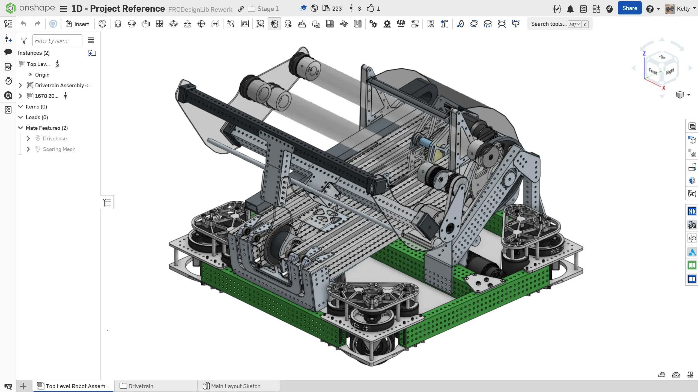

---
title: Top Level Assembly
description: Creating the top level assembly
sidebar:
  order: 7
---

## Top Level Robot Assembly

Now that you have a drivebase, you can create a _top level robot assembly_. The top level robot assembly is the highest in the assembly hierarchy. Organizing the assemblies in this way keeps thing organized from both a CAD assembly and real life assembly standpoint.

You will create a top level robot assembly to go with your drivebase. The mechanism you'll be adding is the scoring mechanism from [1678's 2023 robot](https://www.thebluealliance.com/team/1678/2023). The scoring mechanism CAD can be accessed from here:

<LinkButton href="https://cad.onshape.com/documents/28a750426de8e2bc17d5b900/w/8e79c6217ae2ce07ff57d900/e/a4d266d03289620078d13a80" external center>1678 2023 Scoring Mechanism Document</LinkButton>

### Instructions

Start by, **creating a new assembly tab above the `Main Layout Sketch` part studio** and name it **`Top Level Robot Assembly`**. **Follow the instructions in the slides** to complete the top level robot assembly.

<Slides>
  
  Finished top level robot assembly.

  
  Insert the drivetrain assembly and fasten the origin cube to the assembly origin. You may need to unhide the origin cube to mate it.

  
  Insert the 1678 2023 scoring assembly by pasting the scoring mechanism link into the Insert menu textbox. Then, fasten its origin cube to the assembly origin. You may need to hide the drivetrain's origin cube to access the origin of the assembly for mating.

  
  Finished top level assembly.

</Slides>

<Aside type="tip" title="Verification">
Your tab manager should now look like this:
<ContentFigure src="../img/1d/tab-manager-2.webp" alt="Tab manager with top level assembly" />
</Aside>

That's all there is to the top level robot assembly! The use of the origin cube makes it very easy to mate together assemblies. In later stages you will explore how to create flexible assemblies (arms, elevators, etc) with the origin cube. If you are interested, you can get a sneak peek [here](/best-practices/assembly-setup/#utilizing-origin-cube-for-flexible-assemblies).
