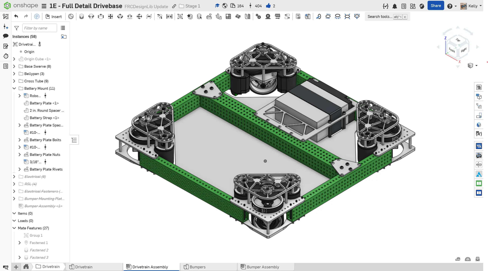
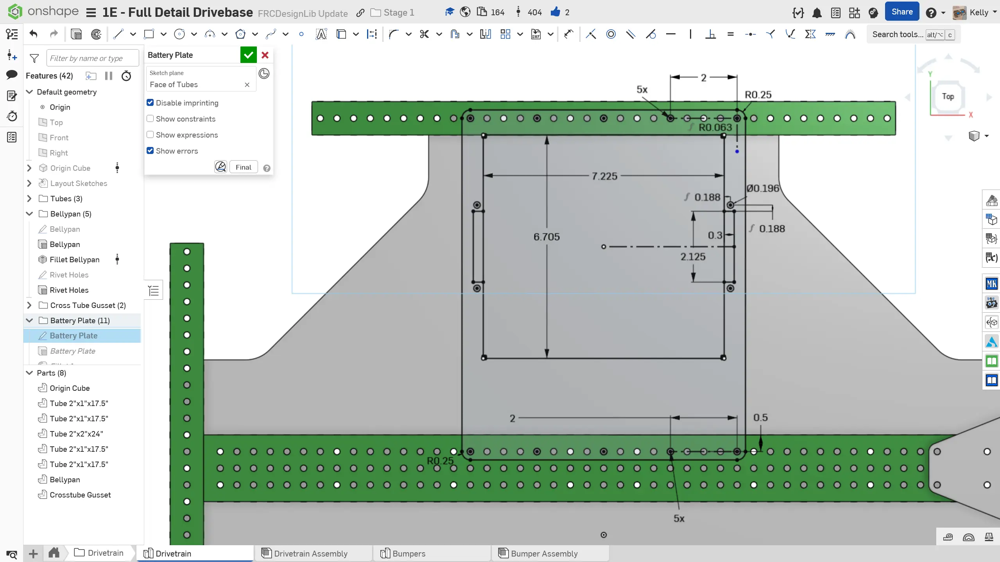
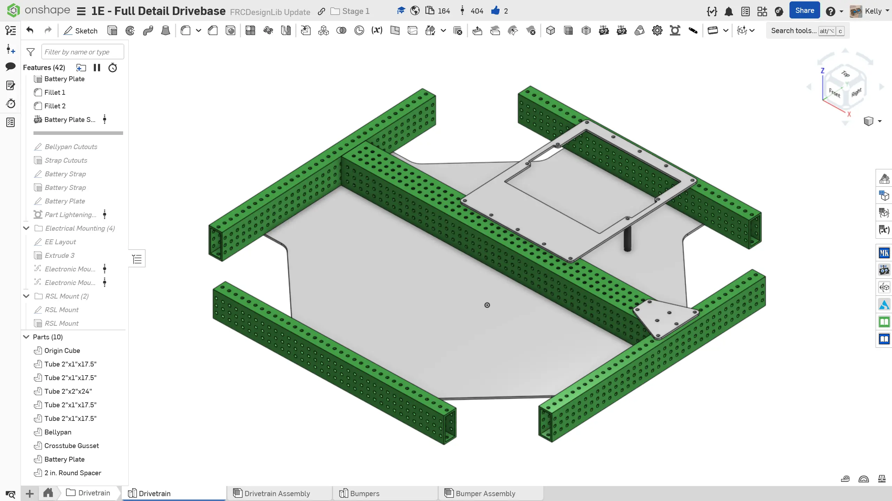
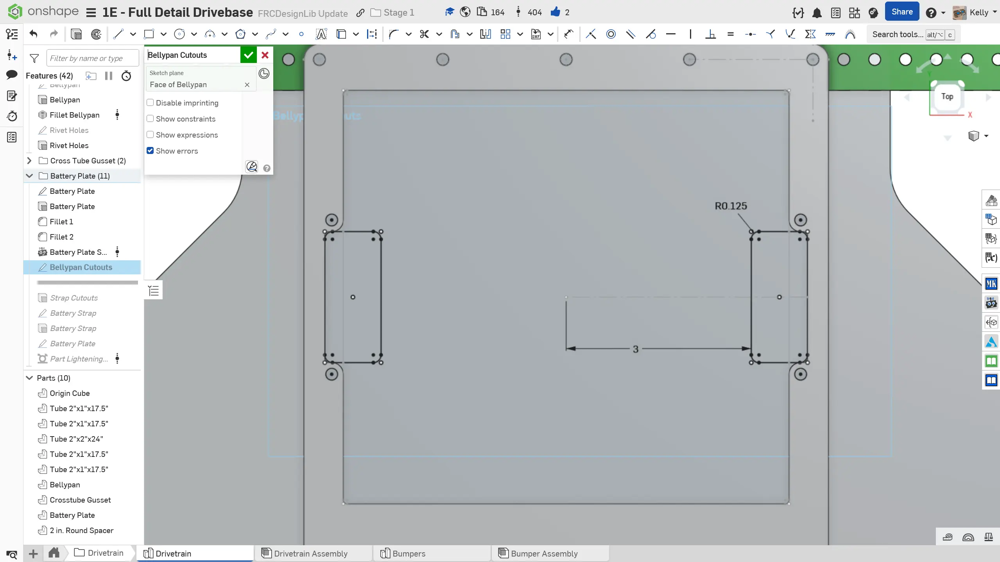
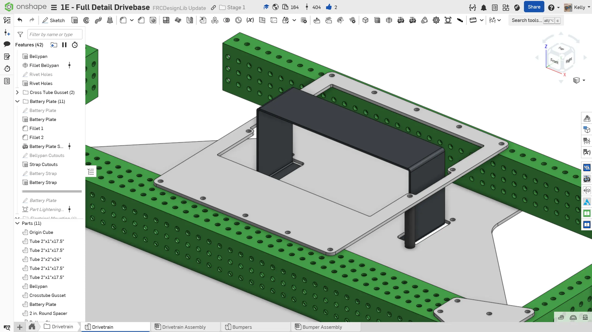
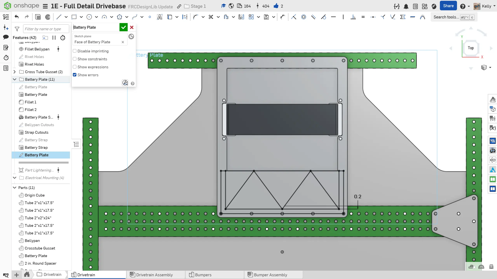

---
title: "Exercise 1: Battery Holder"
description: Model a battery holder
---

## Exercise 1: Battery Holder

In the reference design, the battery is placed horizontally on the bellypan. It is secured with a 2" wide strap that wraps around the battery and bellypan to secure it.

### Instructions

**Add a battery holder to your drivetrain.** You can take inspiration from the following instructions slides.

<Slides>
  
  Finished battery holder w/ mounting holes, strap cutout in bellypan, and strap.

  
  Layout of battery and battery mount plate. To fit the battery with 1/16" radius fillets on the inner corners, the cutout should be around 6.705" x 7.225".

  
  1/8" thick aluminum is a good option for this plate. Also add a 3/8" diameter spacers to connect to the bellypan.

  
  Add the mounting holes and cut out for the battery strap on the bellypan.

  
  Optionally model the battery strap.

  
  Optionally pocket the battery holder. 0.2" wide ribs are recommended.

  
  Insert the battery holder, spacers, and battery into the assembly. Don't forget to organize your feature tree, name your parts, assign part materials, and organize your assembly file tree.

</Slides>
