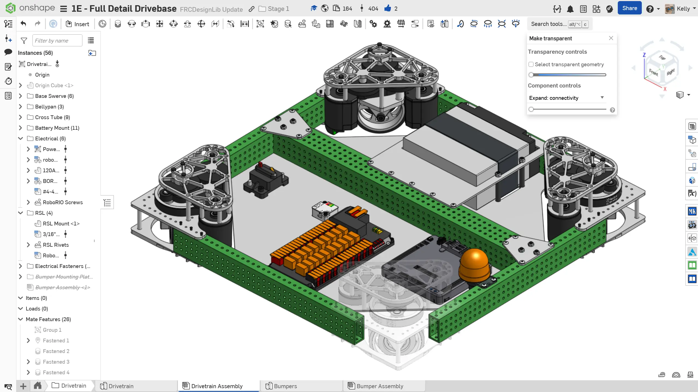
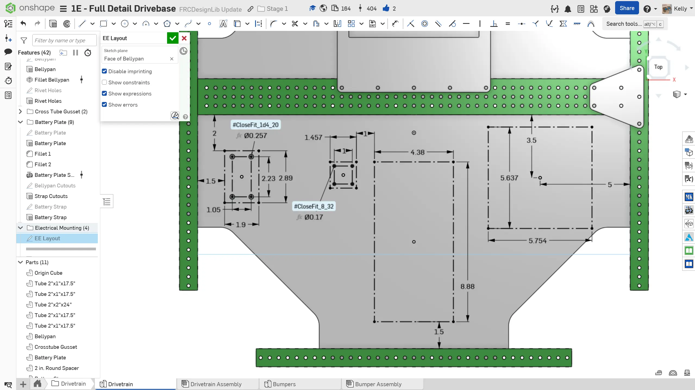

---
title: "Exercise 2: Mounting Electronics"
description: Mount electronics on the robot
---

## Exercise 2: Mounting Electronics

In the reference design, the Power Distribution Hub (PDH), main breaker, and RoboRIO are mounted onto the bellypan. The [`Electronic Mounting` Featurescript](https://cad.onshape.com/documents/95c00401c440b44ad8799ef5/w/1f1ebce01a3b8eb6fa102975/e/83cfa4ae1a46ea05581445c9 "Electronic Mounting Featurescript Onshape Document") can be very useful for generating the mounting holes for electronics. If you cannot accurately manufacture mounting holes for electronics, VHB tape (which comes in the Kit of Parts) can be a good option for robustly securing your electronics.

### Bellypan Mounting Instructions

**Add mounting for some electronic components to your drivetrain.** You can take inspiration from the following instructions slides.

<Slides>
  
  Finished mounted electronics.

  
  Draw box outline for PDH and RoboRIO. Also add the outline and holes for the main breaker and whatever IMU your team uses (Pigeon 2.0, Canandygro, etc.) You can find these dimensions in pdf files on the vendor's websites or by measuring the CAD models from FRCDesignLib.

  
  Use the `Electronic Mounting` Featurescript to add the PDH and RoboRIO mounting holes. Optionally override the hole size for the PDH to be 0.159" diameter, which (if tapped IRL) will allow the mounting bolt to screw directly into the bellypan.

  
  Insert the electronics from FRCDesignLib and add all of the necessary fasteners. The PDH uses #10-32 screws, the RoboRIO uses #4-40 screws, the Breaker uses 1/4-20 screws, the Pigeon 2.0 uses #6-32 screws, and the Canandgyro uses #8-32 screws.

</Slides>

<Aside type="tip" title="Simplified Models">
It is recommended to use the Simplified electronics models to improve assembly performance. You can read more about simplified models on the [Assembly Best Practices Page](/best-practices/assembly-setup/ "Assembly Best Practices Page"). Simplified swerve module models can also be used to reduce lag.
</Aside>

### Robot Signal Light (RSL)

Every robot is also required to have a Robot Signal Light (RSL). An easy location to mount the RSL is on the side of the drive frame. Typically, only one RSL is required and needs to be "easily visible while standing 3 ft. (~ 100 cm) away from at least one side of the ROBOT". Be sure to check the latest game manual rules for the most up to date RSL mounting rules.

**Add mounting for an RSL to your Stage 1D drivetrain.** You can take inspiration from the following image.

<ContentFigure src="../img/1e/elec/elec-rsl.webp" width="50%" alt="RSL mount constructed out of 1/8 inch thick polycarbonate plate" border>RSL mount constructed out of 1/8" thick polycarbonate plate. The mounting hole for the classic RSL is 1" in diameter. Both the classic and new RSL models can be found in FRCDesignLib.</ContentFigure>

### Radio

Each robot is also required to have a radio. The radio should be mounted on the robot following Vivid Hosting's [radio mounting guidelines](https://frc-radio.vivid-hosting.net/getting-started/usage/mounting-your-radio "Vivid Hosting Radio Mounting Guidelines").

<ContentFigure src="../img/1e/elec/elec-radio.webp" width="50%" alt="Radio mounting" border />
