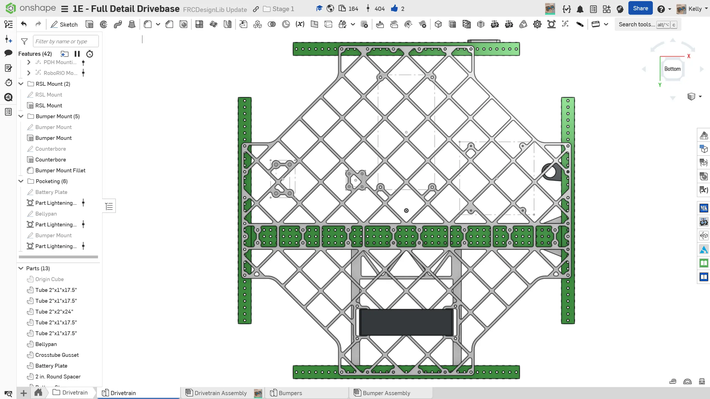
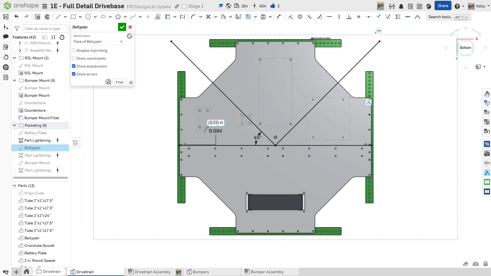
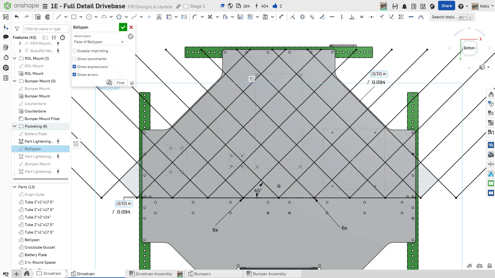
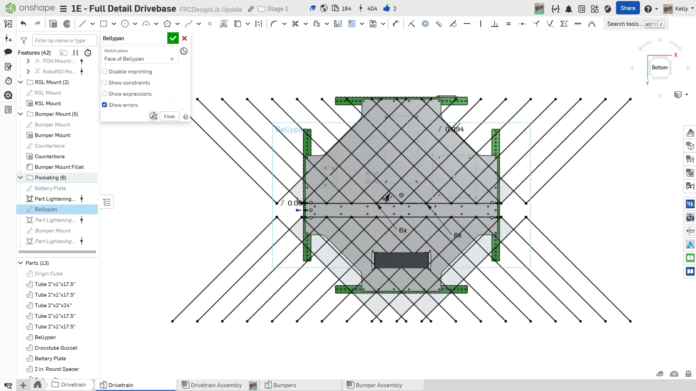

---
title: "Exercise 3: Bellypan Pocketing"
description: Create bellypan pocketing
---

## Exercise 3: Bellypan Pocketing

Some teams may choose to pocket their bellypan to reduce weight and make wiring easier. A pocketed bellypan can save around 3-4 lbs. However, this will add significant machining time if you are manufacturing the bellypan yourself or increase cost if you are purchasing the bellypan from a fabrication service (eg: [Fabworks](https://fabworks.com/ "Fabworks Sheet Metal Services")). You should carefully consider the tradeoffs with your team.

### Instructions

**If you choose to pocket your bellypan for your drivetrain**, you can **follow the instructions in the slides** which utilize the `Part Lighten` [Featurescript](/resources/featurescripts "Featurescripts Page"). You could also use the `Vent` or `Part Lighten` [Featurescripts](/resources/featurescripts "Featurescripts Page") to pocket the bellypan. While the workflow may vary slightly between each Featurescript, the general idea is the same. A diamond pattern is recommended for strength and ease of modeling.

<Slides>
  
  Pocketed bellypan.

  
  Draw two perpendicular lines that are offset 45 degrees from vertical and a line offset slightly from the edge of the crosstube.

  
  Linear pattern the diagonal lines until they completely cover the top portion of the bellypan. These will be the main ribs.

  
  Mirror the top ribs to the bottom of the bellypan.

  
  Connect any islands that might result from mounting holes being too far from a rib. The video shows a potential workflow that allows you to see the end result of the lighten feature while adding ribs.

  
  Use a pocketing Featurescript to pocket the bellypan. Recommended settings are 0.15" wide ribs and 3/16" tool radius.

</Slides>
