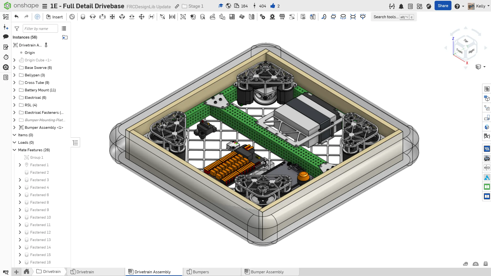
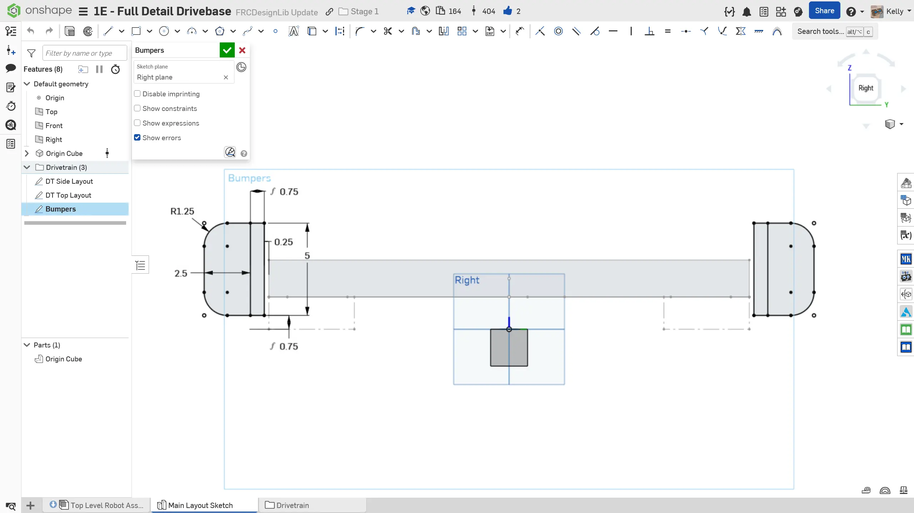
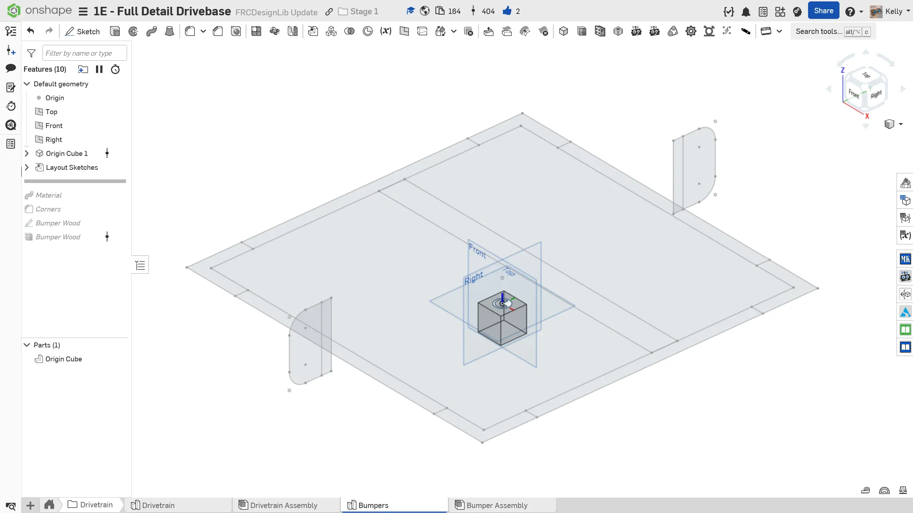
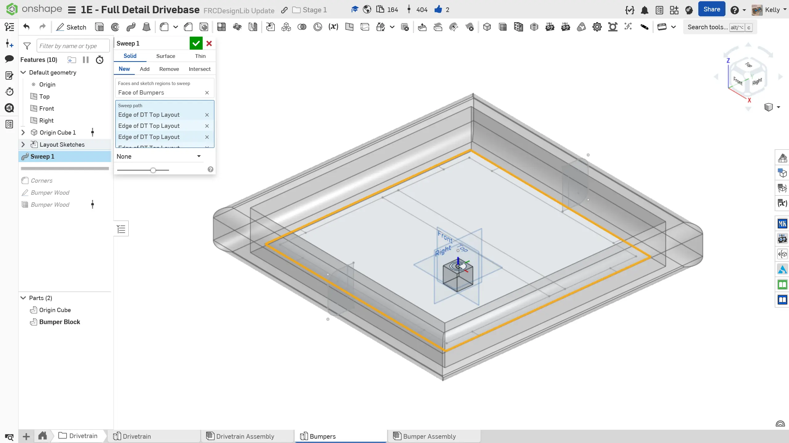
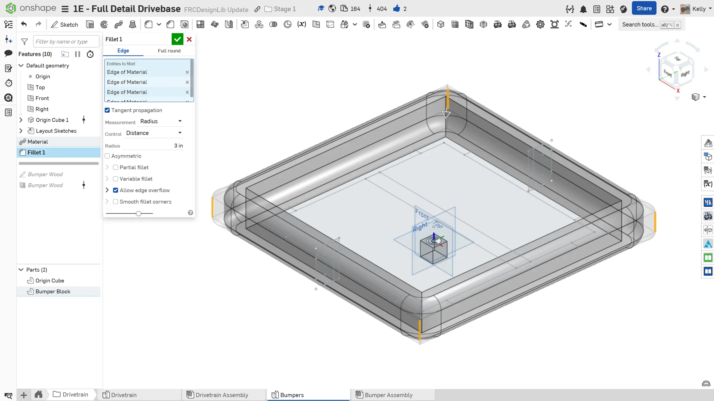
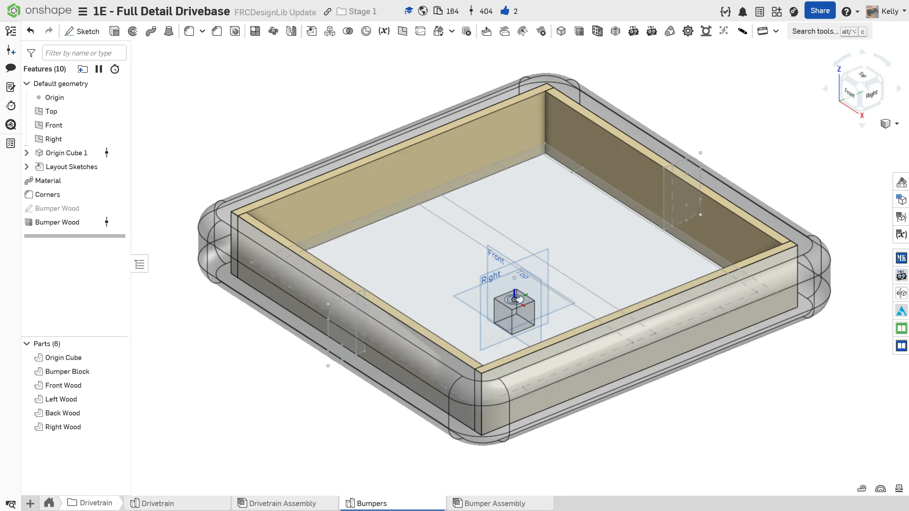
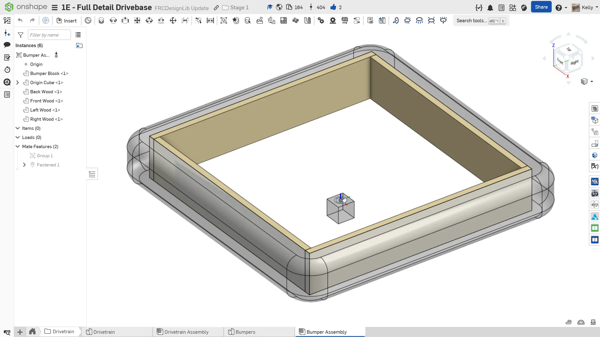

---
title: "Exercise 4: Bumpers"
description: Model bumpers
---

## Exercise 4: Bumpers
Bumper construction is described in each year's FRC game manual. In the past, it was required to be two 2.5" diameter pool noodles backed by a 5" tall 3/4" thick plywood sheet. Refer to the latest game manual for the most up to date bumper rules. Bumper cutout and ground clearance rules will vary from year to year.

### Bumper Model
It is recommended to place the bumpers in a new part studio and assembly to keep your feature and assembly trees organized. The minimum level of detail should be a block model of the bumper. Some teams may opt to model the bumper wood, bumper wood holes, angle brackets for the bumper wood, and other details to assist with manufacturing. You should communicate with the rest of your team members to determine the level of detail that is required.

### Instructions

**Add bumpers to your drivetrain.** You can take inspiration from the following instructions slides.

<Slides>
  
  Finished bumpers assembly inserted into drivetrain assembly.

  
  Create a new sketch in the Main Layout Sketch part studio with the bumper profile. A 3/4" ground clearance and 1/4" gap between the bumper and frame is recommended.

  
  Create a new part studio in the drivetrain folder for the bumpers. Insert the Origin Cube and derive the drivetrain and bumper sketches from the Main Layout Sketch.

  
  Sweep the bumper profile along the edges of the drivetrain top layout sketch to create the block model of the bumpers.

  
  Optionally add a fillet on the corners. Size it according to how your team wraps the bumper pool noodles.

  
  Optionally model the wood for the bumpers. This can be useful for manufacturing purposes.

  
  Create a bumper assembly in the drivetrain folder and insert all the components. Don't forget to group all the components and mate the origin cube mate connector to the origin.

  
  Insert the bumper assembly into the drivetrain assembly.

</Slides>

Keeping the bumper part studio and assembly separate from the drivetrain keeps the drivetrain feature tree cleaner and allows for easier hiding/showing of the bumpers in the top level assembly since you can show and hide the entire bumper assembly at once.
