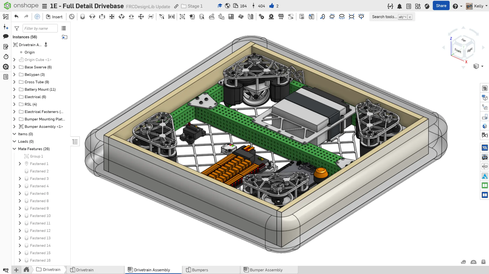
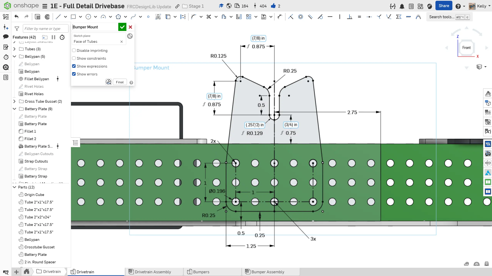
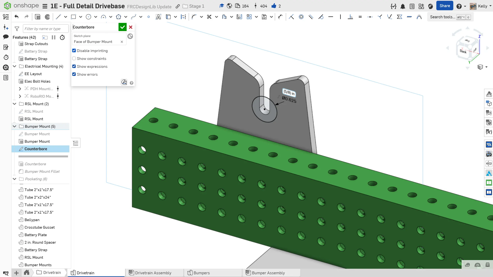
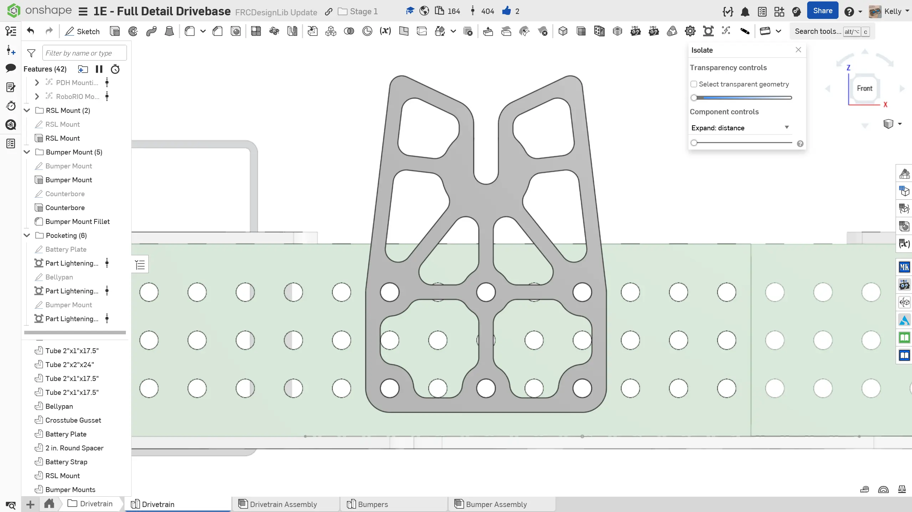
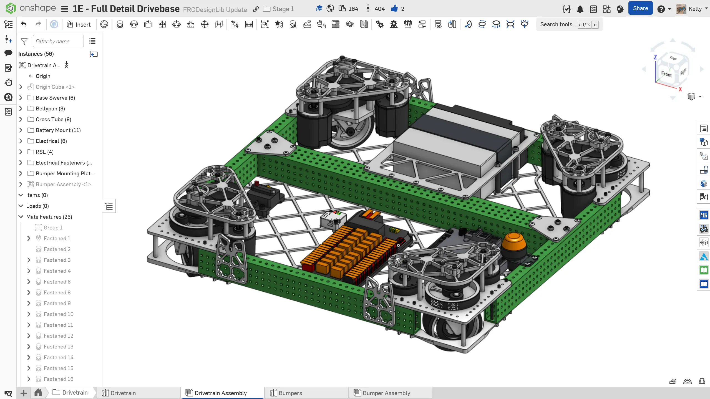

---
title: "Exercise 5: Bumper Mounting"
description: Mount bumpers on the robot
---

## Exercise 5: Bumper Mounting

Similar to battery mounting, good bumper mounting is often overlooked. While a robust bumper mounting system won't win you any matches, a poor bumper mounting system can certainly lose you a match. Poor bumper mounting can lead to [bumper damage](https://youtu.be/9mawtTD6v7M?si=RyM0fE6GrR4QlMEU&t=78 "3647 Bumpers Breaking"), long bumper swap time, or even lead to your [bumpers falling off](https://youtu.be/pBUKxWKGV-Q?si=hmJtt9N6C7vGLFpL&t=42 "Bumpers Falling Off").

In the reference design, the threaded stud bumper mounting system is implemented.

<Aside type="example" title="Threaded Stud Bumper Mounting System">
<ContentFigure src="../img/1e/bumper-mount/stud-mount.webp" alt="Section view of the threaded stud bumper mount system" width="40%">Section view of the threaded stud bumper mount system. The threaded stud is attached to the bumper wood and the nut holds the bumpers tight against the frame.</ContentFigure>
</Aside>

### Instructions

**Add your desired bumper mounts to your drivetrain.** You can take inspiration from the following instructions slides.

<Slides>
  
  Finished bumper mounts.

  
  Model the bumper mount. This part should be 3/16" thick aluminum. The threaded stud falls into the slot.

  
  Add the pocket for the nut that screws onto the threaded stud. This nut keeps the bumpers tight with the frame. The pocket secures the nut and prevents the bumper from lifting up.

  
  Fillet and optionally pocket the mount. 0.15" wide ribs and 1/8" tool radius are recommended.

  
  Insert the mount and add it to the `Group`. Copy three more mounts and mate them onto the drivetrain assembly. If your team runs multi piece bumpers (eg: two C shaped bumpers) you may need to add more mounts to secure the bumpers.

  
  Finished bumper mounts in drivetrain assembly.

</Slides>
