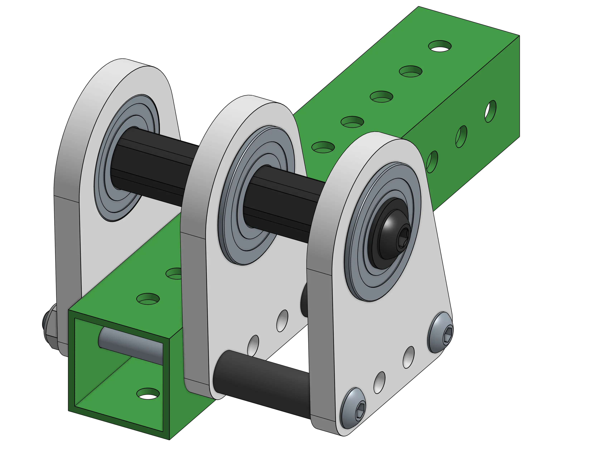
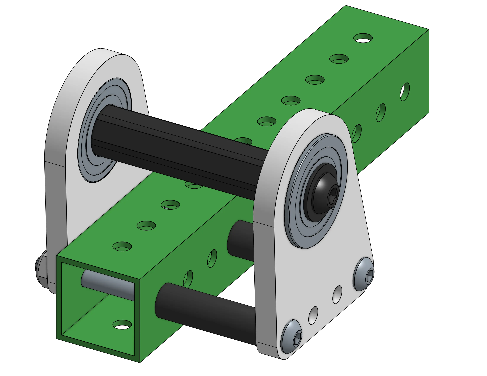

---
title: Friction & Efficiency
description: Understanding friction and efficiency in shooters
---

## Friction & Efficiency

Friction reduces efficiency by converting energy into heat and adding unnecessary load to the motor. Excessive friction can prevent the flywheel from reaching speed, causing shot inconsistencies, and may overheat or damage the motors.

### Minimizing Friction

The following are all practices that should be followed to reduce friction.

#### Belt Tension
Slightly reduce belt tension by shortening the center-to-center distance (0.01-0.02") to improve efficiency.

#### Spacers
Use spacers between components on shafts and bearings. Components should not contact the outer race of the bearing to avoid friction.

<ContentFigure src="../img/2a/hexspacers.webp" alt="COTS 1/2 hex delrin spacer" width="40%"/>

#### Shaft Support
Don't over-constrain shafts by using more than 2 fixed bearing points to hold a shaft; small misalignments can cause massive friction with the bearings.

<Aside type="example">
<Slides>
  
  Example of a shaft being overconstrained by having a fixed bearing in the middle of the shaft.

  
  Example of a shaft being properly constrained with two fixed bearings.
</Slides>
</Aside>

#### Bent Shafts
Bent shafts reduce efficiency. Prevent bending by avoiding excessive cantilevering and ensuring proper alignment of bearings. Keep pulleys close to bearings.

#### Tolerance Stackup
Minimize tolerance stackup, which occurs when multiple parts connect and introduce friction. Improve precision in fabrication or reduce the number of connections. Generally its best to keep belt runs on the same plate. In this design, a single manufactured plate for bearing holes and center-to-center distances helps reduce tolerance stackup.

#### Larger Wheels
Larger shooter wheels mean lower RPMs are necessary for the same surface speed, which reduces the amount of friction throughout the system. Additionally, gearing your motors down and running them at not max speeds is better for the motor.

#### Last Resort
If necessary, throw another motor at your shooter. This is the easiest way to deal with your problems in case you have slightly too much friction and need something that works without too much effort.

<Aside type="note">
These tips for reducing friction can be applied to all power transmissions.
</Aside>
