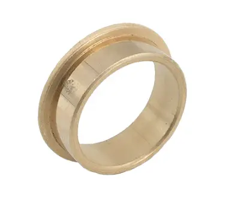
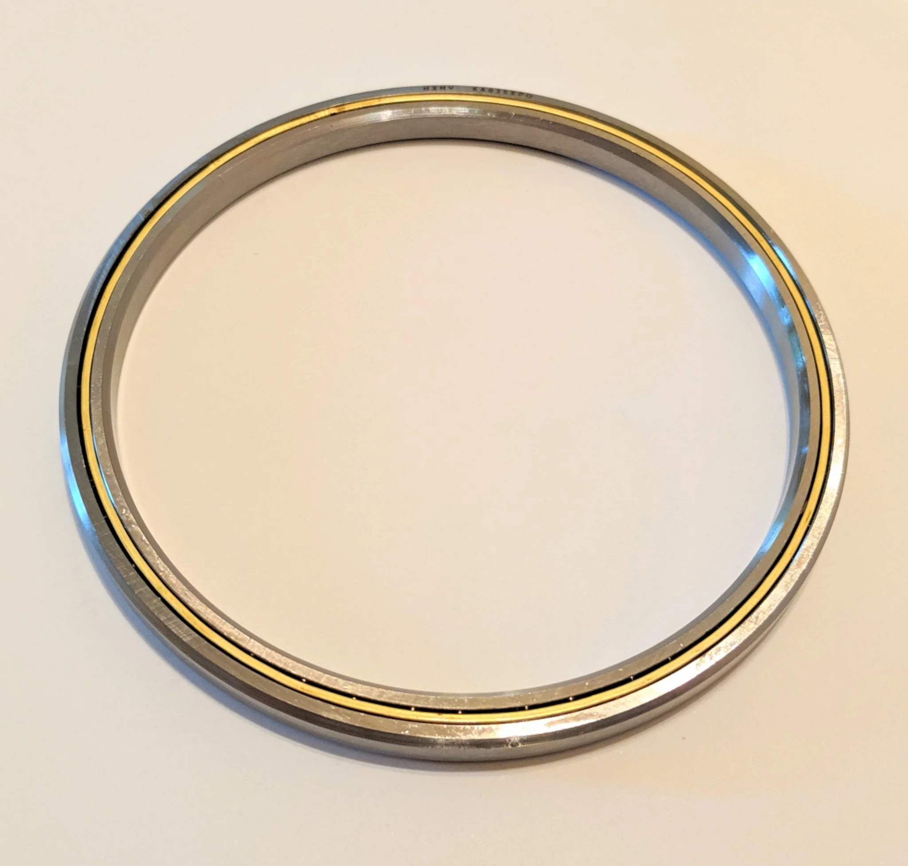

---
title: Friction
description: Understanding friction in pivot mechanisms
---

## Friction

Friction must be minimized since the mechanism pivots around the axle. This can be done using either bushings or bearings. Bushings can handle higher loads at lower speeds, while bearings are more suited for higher speeds and lower loads, but larger bearings can be used for large dead axles.

<Slides>
  
  A stepped bushing

  
  A large x contact bearing sometimes used for large dead axles
</Slides>

### Reference Design

This reference design uses 7/8" ID, 1.125" OD Bushings for its pivot. This design is intended to handle a high load, which was why 7/8" tube was chosen for the pivot axle. Its larger OD gives it more strength than 1/2" hex or 3/4" tube, but while keeping a much lower profile than an extruded spline shaft. The bushing having a 1.125" OD makes it compatible with the 1.125" bore found on most COTS plate sprockets.
