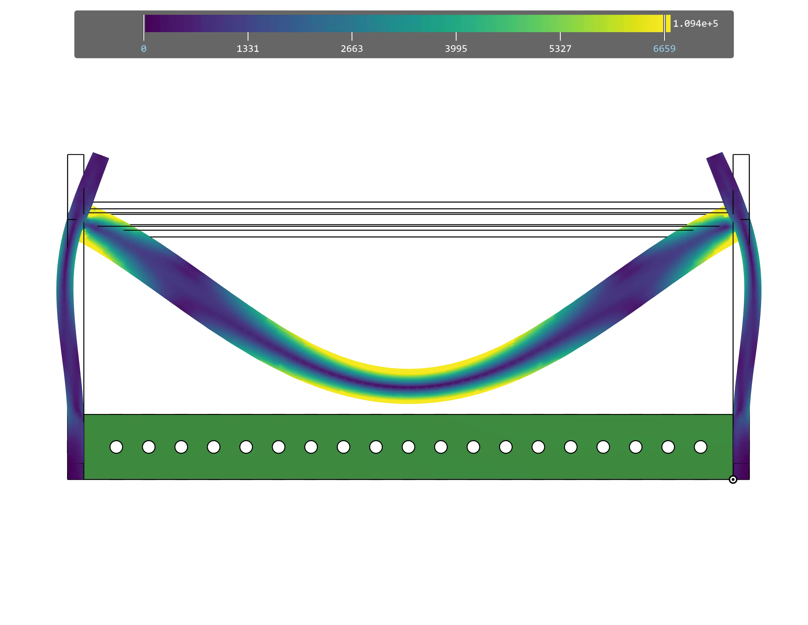
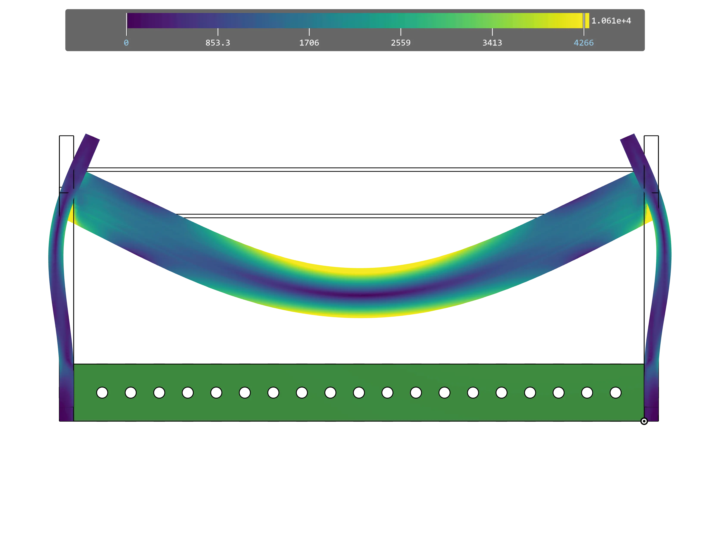
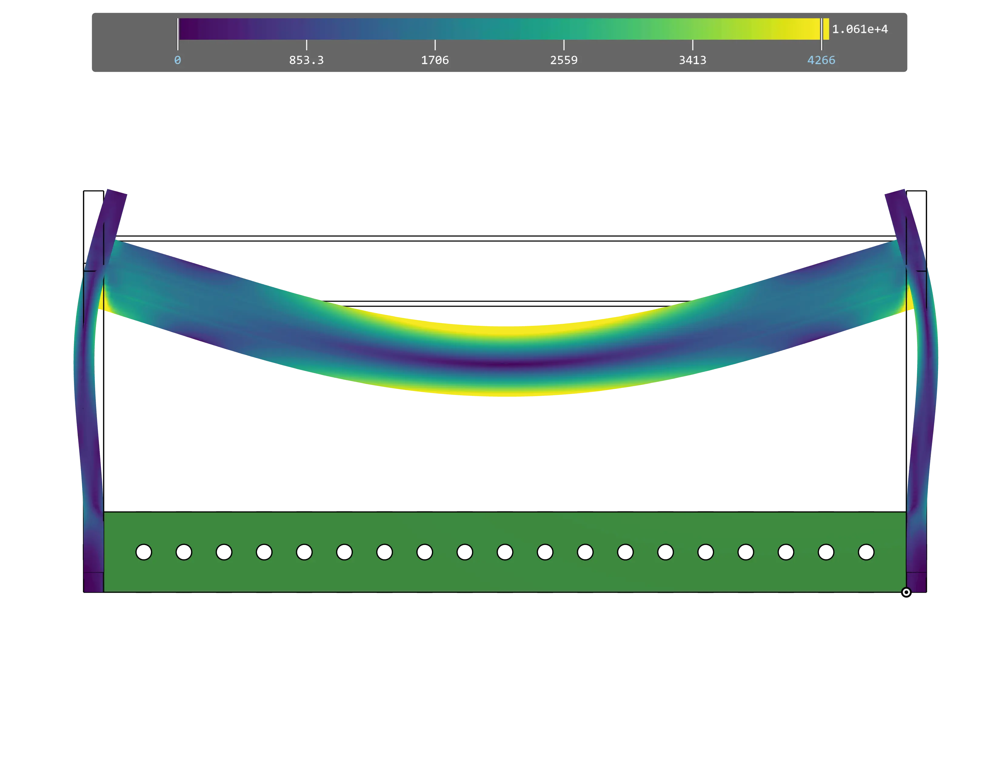
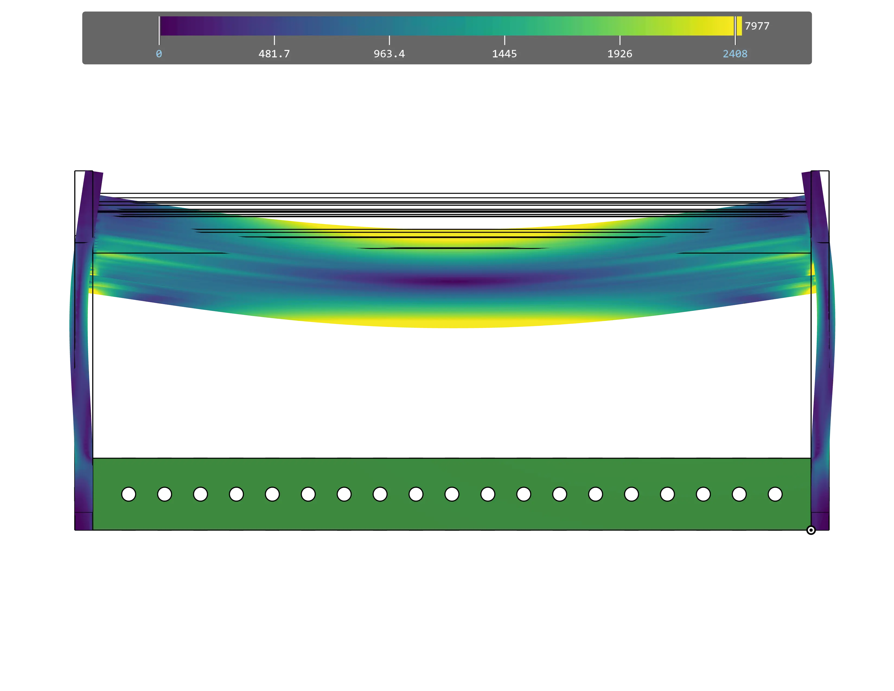
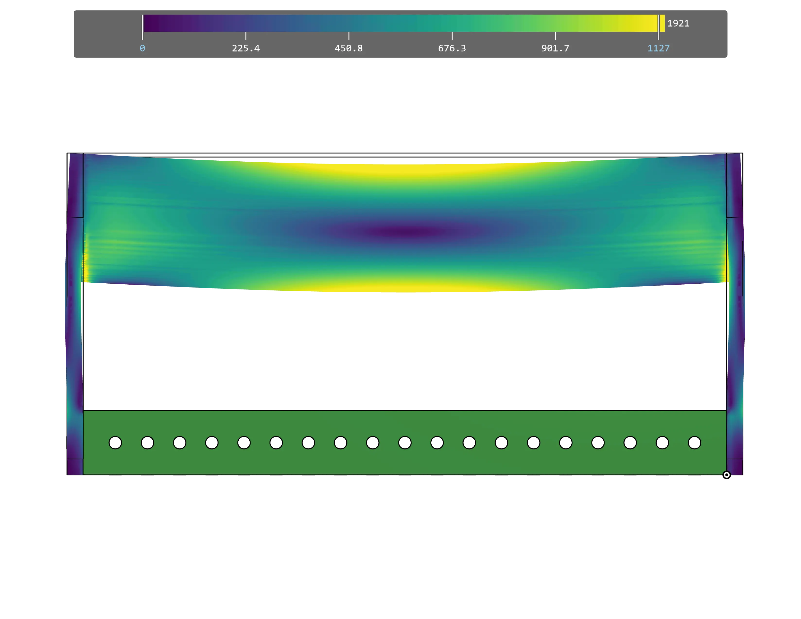

---
title: Strength
description: Understanding strength in pivot mechanisms
---

## Strength

The primary considerations for the strength of a pivot are the rigidity (resistance to bending) and resistance to twisting. Dead axles provide superior strength to live axles due to the way they don't transmit any load and can be fastened to the rest of the structure.

Large round tubes, such as 3/4" and 7/8" diameter, are preferred over 1/2" hex for their strength-to-weight ratio and resistance to twisting. The primary reason 3/4" and 7/8" tube diameters are chosen is those sizes have bushings with a 1.125" OD available, which means they fit almost all COTS sprockets. Live axles can be utilized in some situations for low load applications.

<Aside type="tip">
Click through the slides to see how much each axle bends given the same load. **Deformation is exaggerated by 100 times**.
</Aside>

<Slides>
  
  1/2" Hex

  
  3/4" Tube

  
  7/8" Tube

  
  SplineXL

  
  2" Tube
</Slides>

### Reference Design

The reference design utilizes 7/8" OD round tube for the arm pivot, which is a good balance of strength and size.
