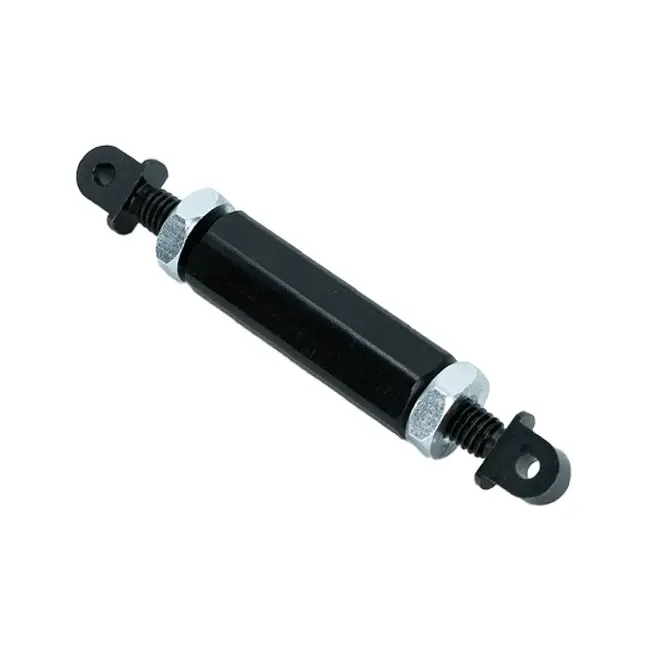
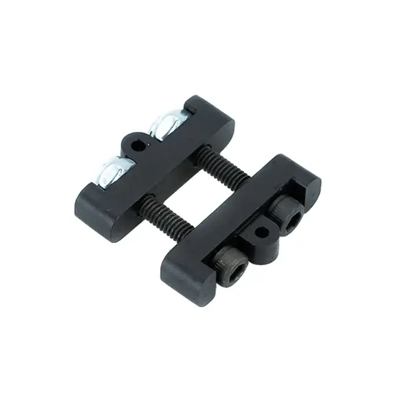

---
title: Tensioning
description: Tensioning in pivot mechanisms
---

## Tensioning

To accommodate chain stretch over the course of a season and reduce backlash, an active tensioning system is required. If enough chain length is available, **inline tensioners** such as turnbuckles and Spartan tensioners are the simplest way to tension the chain.

If there isn't enough space for an inline tensioner (if the chain moves too much, the tensioner might run into either of the sprockets), other methods, such as moving the position of one of the sprockets with a sliding or rotating gearbox or stage, may be used.

<ContentFigure src="../img/2b/chaintensioncut.webp" gif width="60%" alt="Chain and sprocket with turnbuckle tensioner">A chain and sprocket moving with a turnbuckle tensioner. The turnbuckle is located on the bottom half the chain.</ContentFigure>

<Slides>
  
  Turnbuckle tensioner

  
  Spartan tensioner
</Slides>

### Reference Design

For this design, enough chain length was provided for a simple inline spartan tensioner to work well.
