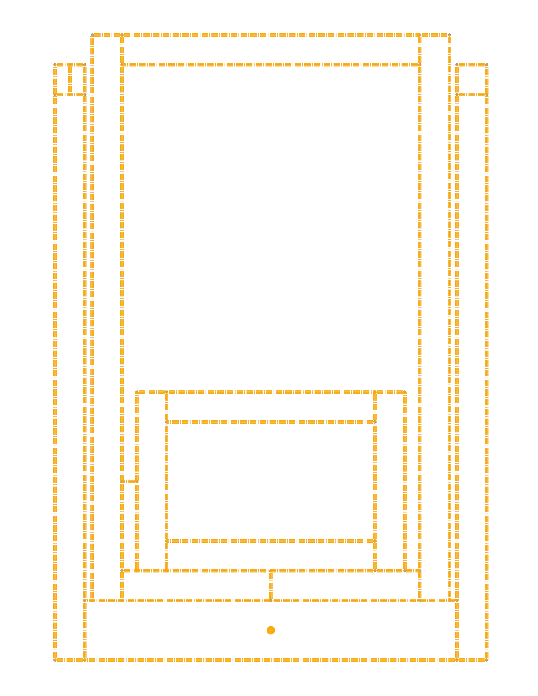
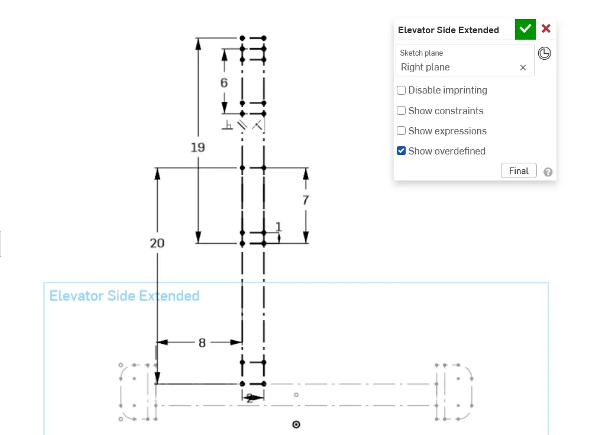
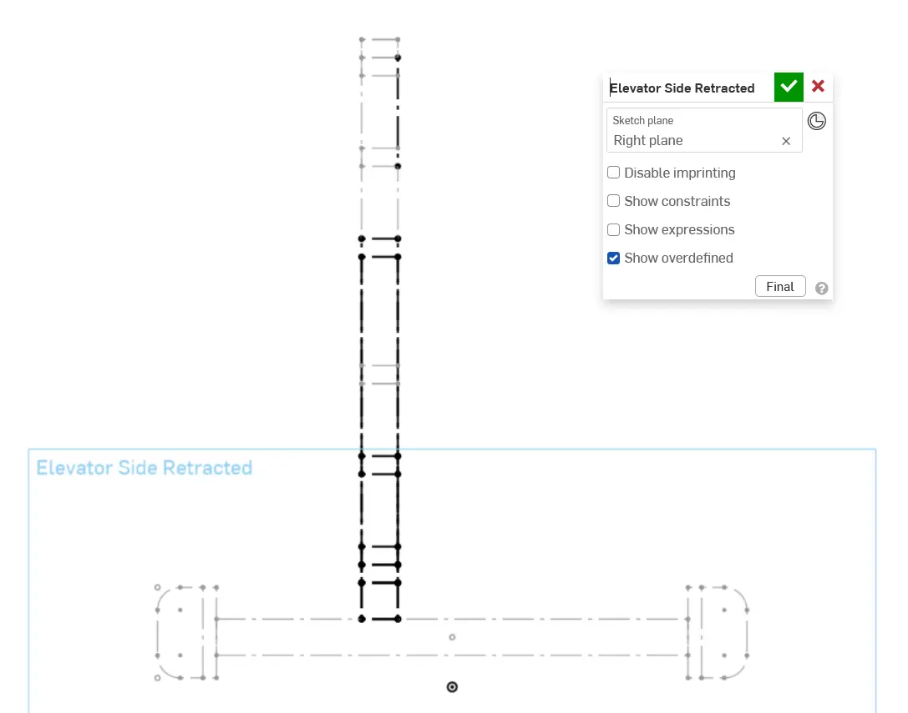
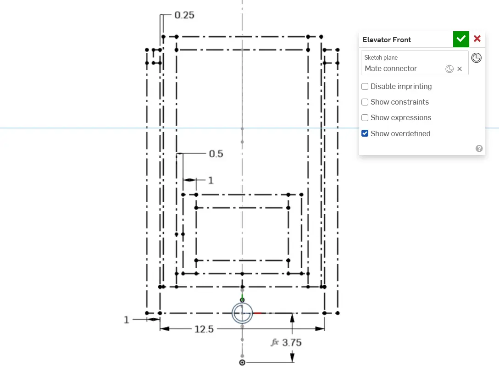

---
title: Layout Sketch
description: Creating a layout sketch for the elevator
---

## Layout Sketches

Elevator main layout sketches usually start with an extended side view so you can drive the length of it based off of the extension limits and your required beginning and end position for whatever mechanism you're moving.

Though this elevator doesn't have that context, it's still useful to follow the same workflow of starting with a side sketch, which will contain most important dimensions but can be hard to conceptualize at first.

Follow the instructions in the slides to create your elevator layout sketches.

<Slides>
  
  A clean view of the front sketch of the elevator tubes.

  
  As practice for stage 3, we'll start with defining the position of the elevator in relation to drivetrain side sketch. Use rectangles to represent the 2x2 tube and the length of the stages. Add rectangles to represent the bottom tubes of each stage and carriage as well.

  
  Feel free to create a retracted side sketch (constraining it to the geometry of the first side sketch) to help double check geometry and integration. This especially helpful when designing a full robot.

  
  Now add the front sketch to define all the elevator tubes, the width of the elevator, and the distance between stages on the side.
</Slides>

<Aside type="tip">
Instead of creating "extended" and "retracted" views, you can separate the stages into their own individual side sketches to let you "animate" how it moves in the sketch. You can use configurations to do this.
</Aside>
