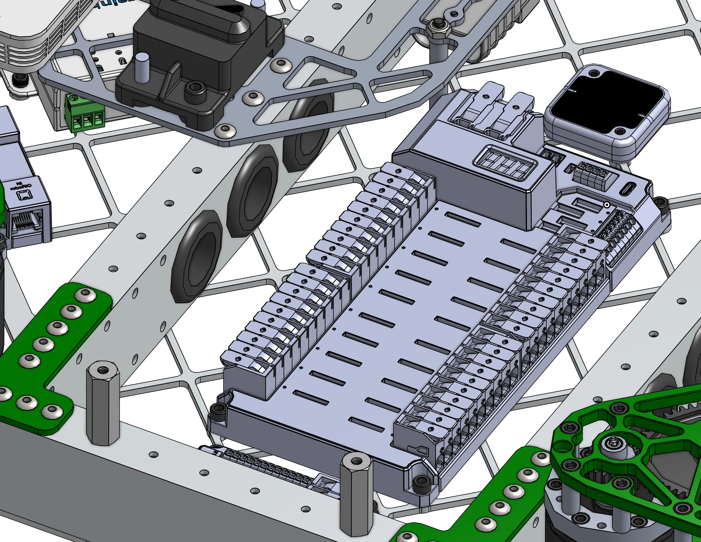
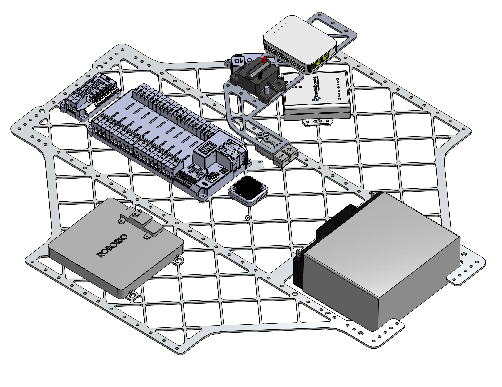

---
title: 2910 Charged Up Drivebase
description: A drivebase with cross tubes featuring wire grommets
socialCard:
  image: ./img/2910/2910_2023_dt.webp
---

<a href="https://cad.onshape.com/documents/cd06c24a1f9c6c76ba35c8b1/w/a16c3bc2858ebe73ed66d141/e/fb73561fc4c787b4c7e5d9d3"><ContentFigure src="./img/2910/2910_2023_dt.webp" alt="2910 Charged Up Drivebase" width="80%">Swerve drivetrain featuring MK4i swerve modules, a pocketed bellypan, and a billet brass frame-rail for weight distribution.</ContentFigure></a>

### Links

<LinkButton href="https://cad.onshape.com/documents/cd06c24a1f9c6c76ba35c8b1/w/a16c3bc2858ebe73ed66d141/e/fb73561fc4c787b4c7e5d9d3" center>
  CAD Document
</LinkButton>

## Behind the Design

This drivebase embodies all fundamentals of good drivebase design, including the following features:

### Rigidity

<ContentFigure src="./img/2910/2910topdown.webp" alt="2910 Top Down View" />

This drivebase is constructed primarily from 1/8 inch box tube, with important cross-members providing rigidity to the structure. Drivebases must be built extremely tough, as they will experience the brunt of each collision while robots travel across the field at high speed. The bellypan offers extra rigidity by holding the frame members parallel with each other.

### Electrical

<Slides>
  
  Holes in the drive-rails allow electrical teams to easily route wires to where they need to go. Holes cut into aluminum may have sharp edges, so it's important to cover them with rubber grommets!

  
  The robot's bellypan should have mounting holes for most of the major electronics designed into it. This allows for easy and secure fastening of components like the PDH, and reduces the chances of electronics coming loose in competition.
</Slides>

The drivebase usually serves a double purpose as a robot's electrical hub, so it's important to take electronics into consideration. While looking through the CAD, you may notice several key aspects of this drivebase that intentionally accommodate electronics including:

- Pocketed bellypan serves a double purpose of both weight reduction, and providing many points to secure wires with zip-ties.
- All electronics have pre-designed mounting holes
- Holes in the frame-rails around the PDH allow for easy wire routing while keeping wires low in the bellypan and out of the way.
