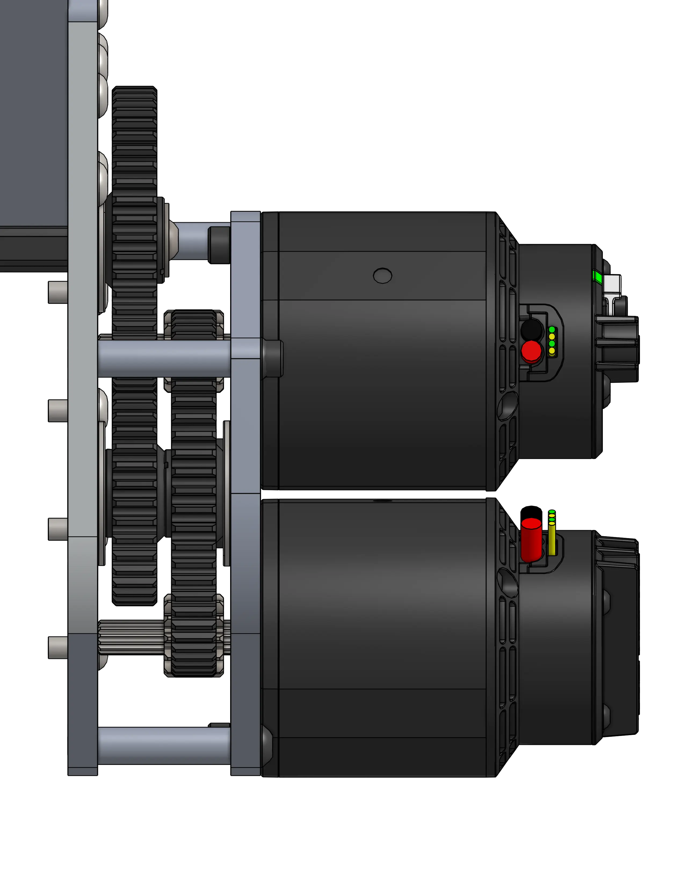
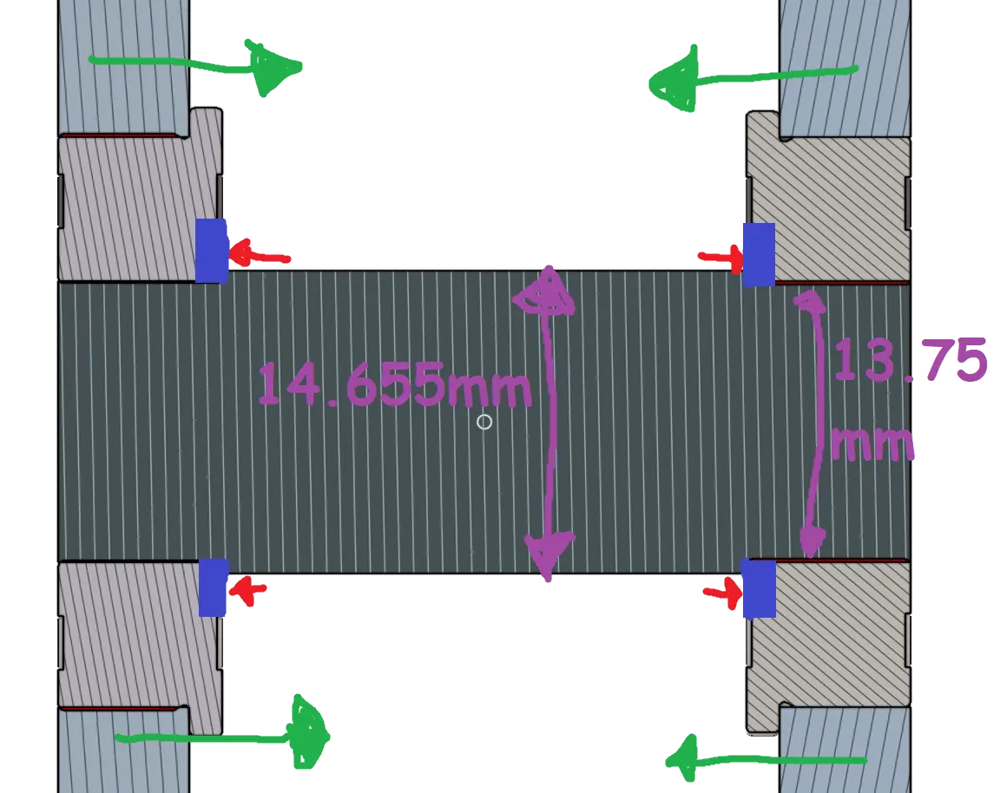
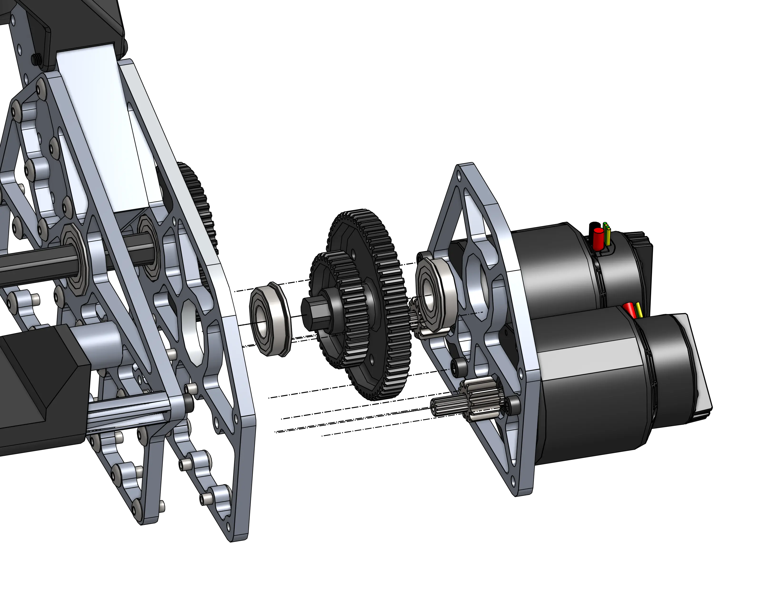
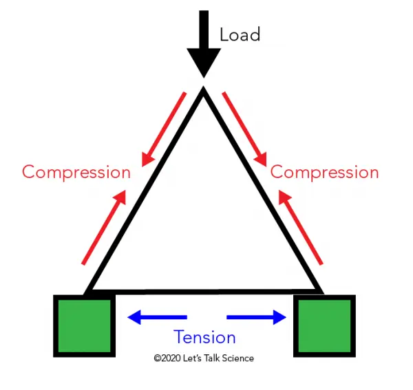
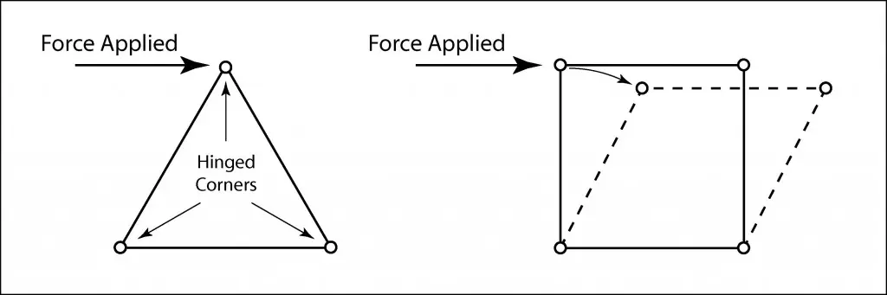

---
title: 2910's 2023 Dead Axle Pivot
description: A custom dead-axle pivot with creative chain tensioning
socialCard:
  image: ./img/2910/2910_2023_pivot.webp
---

<a href="https://cad.onshape.com/documents/9b839dcfb57e2325343c7e68/w/d4eb9bd29f2760b8b1531c60/e/f0179551d0ae559b6caa8dd6"><ContentFigure src="./img/2910/2910_2023_pivot.webp" alt="2910 Dead Axle Pivot" width="60%">A custom dead-axle pivot with a creative chain tensioning solution.</ContentFigure></a>

### Links

<LinkButton href="https://cad.onshape.com/documents/9b839dcfb57e2325343c7e68/w/d4eb9bd29f2760b8b1531c60/e/f0179551d0ae559b6caa8dd6" center>
  CAD Document
</LinkButton>

(Thanks to JB of FRC6995 for cleaning the OnShape document up!)

- [CAD and Tech Binder Release ChiefDelphi Thread](https://www.chiefdelphi.com/t/2910-cad-and-tech-binder-release-2023/436653)
- [Match Video](https://www.youtube.com/watch?v=LzgU0rbpWqY)

## Behind the Design

The pivot is driven by 2 mirrored dual falcon 500 gearboxes. These gearboxes are incredibly compact and thoughtful design decisions have been made throughout the whole pivot to reduce part count. One method utilized in this gearbox is to use a Thunderhex bearing retention technique in which each shaft is turned down from 1/2" Hex to 13.75mm (Thunderhex diameter) on each end, which fully constrains each flange bearing as long as the two plates are compressed.

<Slides>
  
  Dual Falcon 500 gearbox design

  
  Thunderhex bearing retention technique utilizing turned hex flanges, bearing flanges, and fixed plates.

  
  Exploded view showing assembly
</Slides>

All of these plates are heavily lightened to increase the robots top speed and acceleration capabilities (F=ma), and to keep the center of gravity low. The gearboxes and even motor placement on the gearboxes are as low and central as possible to improve the robots center of mass.

### Mechanical Link

<ContentFigure src="./img/2910/pivot_link.webp" alt="Pivot Link" width="60%" />

The second stage shaft runs across the robot to link the two gearboxes, which is essential to eliminate any torsion in the arm that would be caused by unevenly driving each side of the pivot independently.

### Chain Tensioning

The third stage is an additional reduction that doubles as a tensioning mechanism, reusing the mechanical link shaft as an idler shaft to pivot around, adjusting the center to center distance of the final chain run.

<ContentFigure src="./img/2910/planetgear_idler.webp" alt="Chain tensioning mechanism" width="50%"/>

### Triangular Superstructure

<Slides>
  
  Triangles are strong! This superstructure is incompressible.

  
  When a force is applied to compress any side there is always an opposite side in tension to counteract that force.
</Slides>

The main pivot itself is a massive dead axle fixed into the triangular superstructure. This dead axle assembly is very simple, with 3 custom parts that are all easily manually machineable on a lathe.
